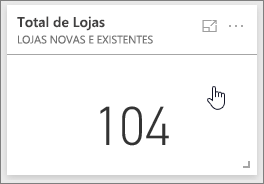
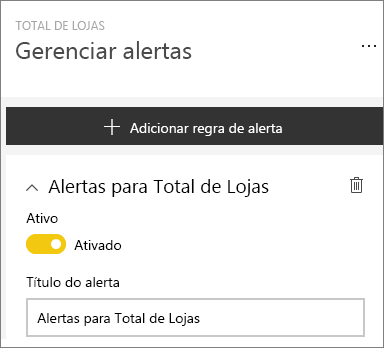
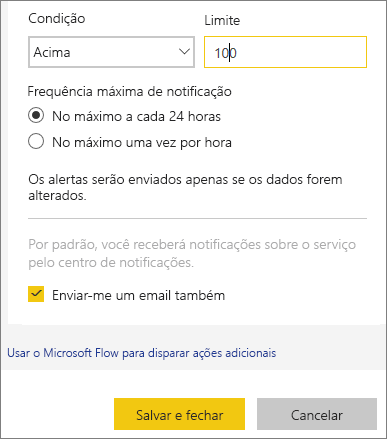
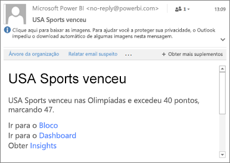
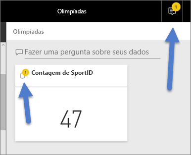
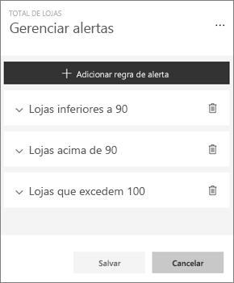
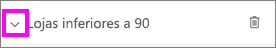
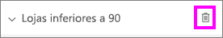
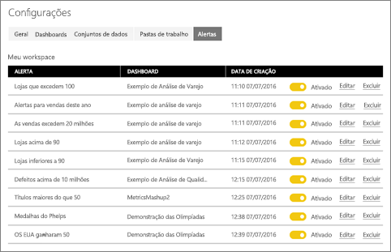

# Tutorial: definir alertas no serviço do Power BI
Defina alertas para notificá-lo quando os dados em seus dashboards forem alterados além dos limites definidos por você. 

Será possível definir alertas em blocos se você tiver uma licença do Power BI Pro ou se um dashboard tiver sido compartilhado com você em uma [capacidade Premium](../service-premium.md). Os alertas só podem ser definidos em blocos fixos de visuais de relatório e apenas em medidores, KPIs e cartões. Os alertas podem ser definidos em visuais criados de conjuntos de dados de streaming que foram fixados de um relatório para um dashboard, mas não podem ser definidos em blocos de streaming criados diretamente no dashboard usando **Adicionar bloco** > **Dados de streaming personalizados**. 

Apenas você poderá ver os alertas que definir, mesmo se compartilhar seu dashboard. Os alertas de dados são totalmente sincronizados nas plataformas; defina e exiba alertas de dados [nos aplicativos móveis do Power BI](mobile/mobile-set-data-alerts-in-the-mobile-apps.md) e no serviço do Power BI. 

> [!WARNING]
> Notificações de alerta controladas por dados fornecem informações sobre seus dados. Se você exibir os dados do Power BI em um dispositivo móvel e esse dispositivo for roubado, será recomendável usar o serviço do Power BI para desligar todas as regras de alerta controladas por dados.
> 

Este tutorial aborda o seguinte.
> [!div class="checklist"]
> * Quem pode definir alertas
> * Quais visuais são compatíveis com alertas
> * Quem pode ver meus alertas
> * Se os alertas funcionam no Power BI Desktop e Mobile
> * Como fazer para criar um alerta
> * Onde os alertas serão recebidos

Se você não estiver inscrito no Power BI, [inscreva-se para uma avaliação gratuita](https://app.powerbi.com/signupredirect?pbi_source=web) antes de começar.

## Defina alertas de dados no serviço do Power BI
Veja Amanda adicionando alguns alertas a blocos em seu dashboard. Em seguida, siga as instruções passo a passo abaixo do vídeo para testá-la por conta própria.

<iframe width="560" height="315" src="https://www.youtube.com/embed/JbL2-HJ8clE" frameborder="0" allowfullscreen></iframe>

Este exemplo usa um bloco de cartão do dashboard do [exemplo Análise de varejo](http://go.microsoft.com/fwlink/?LinkId=529778).

1. Em um medidor, KPI ou bloco de cartão do dashboard, selecione as reticências.
   
   
2. Selecione o ícone de sino  ou **Gerenciar alertas** para adicionar um ou mais alertas para **Total de lojas**.
   
1. No painel **Gerenciar alertas**, selecione **+ Adicionar regra de alerta**.  Verifique se o controle deslizante está definido como **Ligado** e dê um título ao seu alerta. Os títulos ajudam a reconhecer facilmente seus alertas.
   
   
4. Role para baixo e insira os detalhes do alerta.  Neste exemplo, criaremos um alerta que nos notifica uma vez por dia caso o número do total de repositórios ultrapasse 100. Os alertas serão exibidos em nossa Central de Notificações. Além disso, o Power BI vai nos enviar um email.
   
   
5. Selecione **Salvar e fechar**.

## Recebendo alertas
Quando os dados que estão sendo controlados atingem um dos limites que você definiu, várias coisas acontecerão. Primeiro, o Power BI verifica se passou mais de uma hora ou mais de 24 horas (dependendo da opção selecionada) desde o envio do último alerta. Enquanto os dados estiverem acima do limite, você receberá um alerta.

Em seguida, o Power BI enviará um alerta para o centro de notificações e, como opção, para o email. Cada alerta contém um link direto com seus dados. Selecione o link para ver o bloco relevante.  

1. Se tiver definido que o alerta deve lhe enviar um email, você verá algo parecido com isto na Caixa de Entrada.
   
   
2. O Power BI adiciona uma mensagem à sua **Central de Notificações** e adiciona um novo ícone de alerta no bloco aplicável.
   
   
3. Abra a Central de Notificações para ver os detalhes do alerta.
   
    
   
   > [!NOTE]
   > Os alertas funcionam somente em dados que estão atualizados. Depois que os dados são atualizados, o Power BI verifica se foi definido um alerta para esses dados. Se os dados atingirem um limite de alerta, um alerta será disparado.
   > 
   > 

## Gerenciando alertas
Existem várias maneiras de gerenciar seus alertas: no próprio bloco do painel, no menu Configurações do Power BI ou em um bloco individual no [Aplicativo móvel do Power BI no iPhone](mobile/mobile-set-data-alerts-in-the-mobile-apps.md) ou no [aplicativo móvel do Power BI para Windows 10](mobile/mobile-set-data-alerts-in-the-mobile-apps.md).

### No próprio bloco
1. Se você precisar alterar ou remover um alerta para um bloco, abra novamente a janela **Gerenciar alertas** selecionando o ícone de sino . Todos os alertas definidos para esse bloco são exibidos.
   
    .
2. Para modificar um alerta, selecione a seta à esquerda do nome do alerta.
   
    .
3. Para excluir um alerta, selecione a lixeira à direita do nome do alerta.
   
      

### No menu de configurações do Power BI
1. Selecione o ícone de engrenagem na barra de menus do Power BI.
   
    .
2. Em **Configurações**, selecione **Alertas**.
   
    
3. Aqui, é possível ativar e desativar alertas, abrir a janela **Gerenciar alertas** para fazer alterações ou excluir o alerta.

## Dicas e solução de problemas
* Atualmente, não há suporte para alertas para blocos do Bing ou blocos de cartões com medidas de data/hora.
* Os alertas funcionam apenas com tipos de dados numéricos.
* Os alertas funcionam somente em dados que estão atualizados. Eles não funcionam em dados estáticos.
* Os alertas só funcionarão em conjuntos de dados de streaming se você criar um visual de relatório de KPI/cartão/medidor e fixá-lo no dashboard.

## Limpar recursos
Instruções para excluir alertas são explicadas acima. Resumindo, selecione o ícone de engrenagem na barra de menus do Power BI. Em **Configurações**, selecione **Alertas** e exclua o alerta.

> [!div class="nextstepaction"]
> [Definir alertas de dados no seu dispositivo móvel](mobile/mobile-set-data-alerts-in-the-mobile-apps.md)

