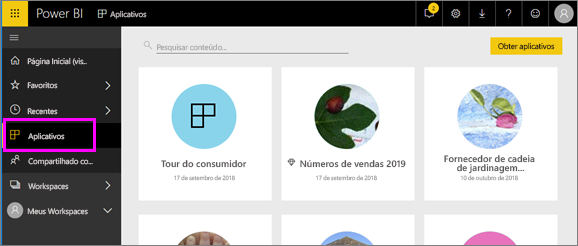

# Aplicativos no Power BI
## O que é um aplicativo do Power BI?
Um *aplicativo* é um tipo de conteúdo do Power BI que combina dashboards e relatórios relacionados em um só lugar. Um aplicativo pode ter um ou mais dashboards e um ou mais relatórios, todos agrupados. Os aplicativos são criados por *designers* do Power BI que distribuem e compartilham os aplicativos com *consumidores* como você. 

Seus aplicativos são organizados na lista de conteúdo **Aplicativos**.

> [!NOTE]
> O uso de recurso dos aplicativos exige uma licença do Power BI Pro. <!-- add link to how to figure out your license -->

## ***Designers*** de aplicativo e ***consumidores*** de aplicativo
Dependendo da sua função, você pode ser alguém que cria aplicativos (*designer*) para seu próprio uso ou para compartilhar com colegas. Ou, você pode ser alguém que recebe e downloads de aplicativos (*consumidor*) criados por outras pessoas. Este artigo é para *consumidores* de aplicativos.

## Vantagens dos aplicativos
Os aplicativos são fáceis de encontrar e de instalar no serviço do Power BI ([https://powerbi.com](https://powerbi.com)) e no seu dispositivo móvel. Depois de instalar um aplicativo, não será necessário lembrar os nomes dos muitos dashboards diferentes, uma vez que eles são reunidos no aplicativo, no navegador ou no dispositivo móvel.

Com os aplicativos, sempre que o autor do aplicativo liberar atualizações, você verá automaticamente as alterações. O autor também controla a frequência com a qual os dados são atualizados, de forma que você não precisa se preocupar em manter-se atualizado. 

<!-- add conceptual art -->
## Obter um novo aplicativo
Você pode obter aplicativos de algumas maneiras diferentes. 
- O autor do aplicativo pode instalar o aplicativo automaticamente em sua conta do Power BI e, na próxima vez que você abrir o Power BI, você verá o novo aplicativo na lista de conteúdo **Aplicativos**. 
- O autor do aplicativo pode enviar por email um link direto para um aplicativo. Selecionar o link abre o aplicativo no Power BI.
- Você pode pesquisar aplicativos no AppSource, no qual você vê todos os aplicativos que pode acessar. O AppSource contém aplicativos publicados por designers de relatório dentro e fora de sua empresa. Por exemplo, você pode encontrar um aplicativo no AppSource para um serviço que você já usa, como Google Analytics, GitHub ou Microsoft Dynamics. 
- No Power BI em seu dispositivo móvel, você só pode instalar um aplicativo de um link direto, e não do AppSource. Se o autor do aplicativo instalar o aplicativo automaticamente, você o verá na sua lista de aplicativos.

## Próxima etapa
* [Abrir e interagir com um aplicativo](end-user-app-view.md)

