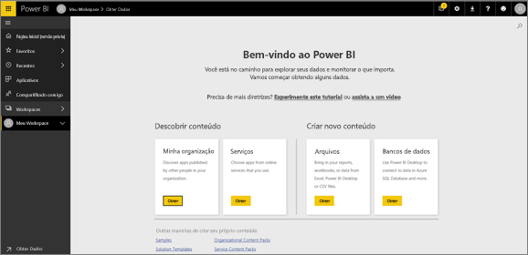
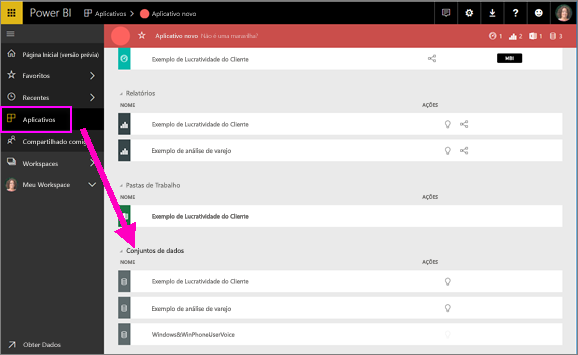
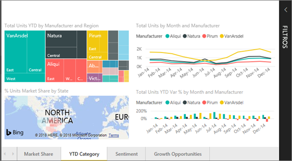
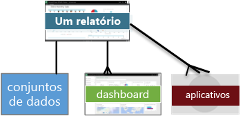
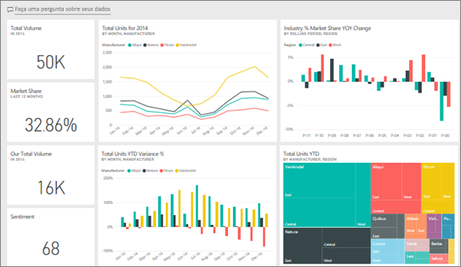
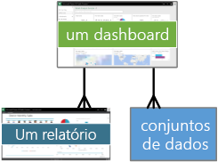
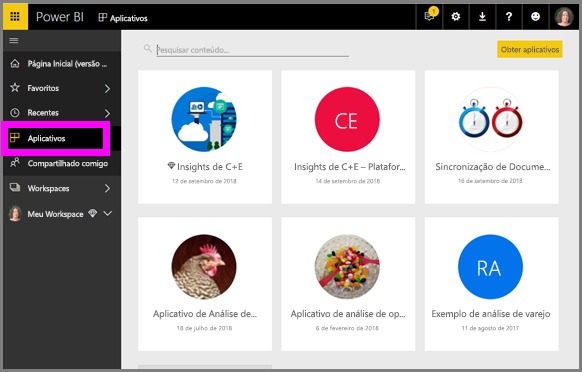
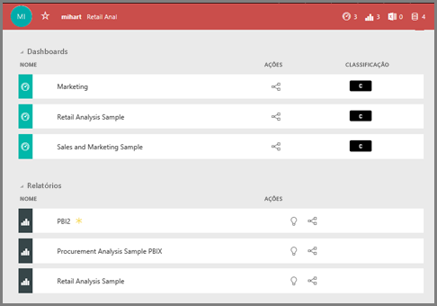

# Power BI – conceitos básicos para ***consumidores*** do serviço do Power BI

## *Consumidores* e *designers* do Power BI
Este artigo pressupõe que você já tenha lido a [Visão geral do Power BI](../power-bi-overview.md) e tenha se identificado como um ***consumidor*** do Power BI. Os consumidores recebem o conteúdo do Power BI, como dashboards e relatórios, de seus colegas. Os consumidores usam o serviço do Power BI, que é a versão baseada em site do Power BI. 

Você ouvirá, sem dúvida, o termo "Power BI Desktop" ou simplesmente "Desktop", e isso é uma ferramenta autônoma usada pelos *designers* que criam e compartilham relatórios e dashboards com você. É importante saber que há outras ferramentas do Power BI disponíveis, mas enquanto você for um consumidor, trabalhará apenas com o serviço do Power BI. E este artigo se aplica apenas ao serviço do Power BI. 

## Terminologia e conceitos
Este artigo não é um tour visual do Power BI, nem um tutorial prático. Em vez disso, ele é um artigo de visão geral que esperamos que deixe você confortável com a terminologia e os conceitos do Power BI. Meio que ensinar a você o jargão e como são as coisas. Para fazer um tour do serviço do Power BI e sua navegação, visite [Faça um tour](end-user-experience.md).

## Abrir o serviço do Power BI pela primeira vez
A maioria dos consumidores do Power BI obtém o serviço do Power BI porque 1) sua empresa compra licenças e 2) um administrador atribui essas licenças a funcionários como você. 

Para começar, basta abrir um navegador e digitar **app.powerbi.com**. Na primeira vez em que você abrir o serviço do Power BI, verá algo assim.

Conforme usar o Power BI, você personalizará o que vê ao abrir o site a cada vez.  Por exemplo, algumas pessoas gostam que o Power BI abra na home page, enquanto outras têm um dashboard favorito que desejam ver primeiro. Não se preocupe, ensinaremos você a como fazer isso. 
- [Visualização da página inicial](https://powerbi.microsoft.com/en-us/blog/introducing-power-bi-home-and-global-search)    
- [Definir o conteúdo como **em destaque**](end-user-featured.md) 

Mas, antes de avançarmos mais, vamos voltar e falar sobre os blocos de construção que compõem o serviço do Power BI.

## ***Conteúdo*** do Power BI
### Introdução aos blocos de construção
Para um consumidor do Power BI, os 5 blocos de construção são: ***visualizações***, ***dashboards***, ***relatórios***, ***aplicativos*** e ***conjuntos de dados***. Às vezes, eles são chamados de ***conteúdo*** do *Power BI*. E o *conteúdo* existe em ***workspaces***. Um fluxo de trabalho típico envolve todos esses blocos de construção: *designer* do Power BI (amarelo no diagrama abaixo) coleta dados de *conjuntos de dados*, os traz para o Power BI para análise, cria *relatórios* repletos de *visualizações* que realçam fatos e insights interessantes, fixa visualizações de relatórios em um dashboard e compartilha os relatórios e dashboards com *consumidores* como você (preto no diagrama abaixo) na forma de *aplicativos* ou outros tipos de conteúdo compartilhado. 

Em sua forma mais básica. 
*  Uma ***visualização*** (ou *visual*), é um tipo de gráfico criado pelos *designers* do Power BI usando os dados presentes nos *relatórios* e *conjuntos de dados*. Normalmente, os *designers* criam os visuais no Power BI Desktop. 

    Para obter mais informações, confira [Visualizações para *consumidores* do Power BI](end-user-visualizations.md)

*  Um *conjunto de dados* é o contêiner de dados. Por exemplo, pode ser um arquivo do Excel da Organização Mundial de Saúde, um banco de dados de clientes de propriedade da empresa ou um arquivo do Salesforce.  

*  Um *dashboard* é uma única tela com textos, grafos e visuais interativos. Um dashboard coleta suas métricas mais importantes, em uma única tela, para contar uma história ou responder a uma pergunta. O conteúdo do dashboard vem de um ou mais relatórios e um ou mais conjuntos de dados.

    Para obter mais informações, confira [Dashboards para *consumidores* do Power BI](end-user-dashboards.md)

*  Um *relatório* é uma ou mais páginas texto, grafos e visuais interativos que juntos constituem um único relatório. Um relatório é baseado em um único conjunto de dados. Muitas vezes, as páginas do relatório são organizadas de tal forma que cada uma aborda uma área de interesse central ou responde a uma única pergunta.

    Para obter mais informações, confira [Relatórios para *consumidores* do Power BI](end-user-reports.md)

*  Um *aplicativo* é uma maneira de os *designers* agruparem e compartilharem dashboards e relatórios relacionados em conjunto. Os *consumidores* recebem alguns aplicativos automaticamente, mas podem pesquisar outros aplicativos criados por colegas ou pela comunidade. Por exemplo, os serviços externos que talvez você já use, como o Google Analytics e o Microsoft Dynamics CRM, oferecem aplicativos do Power BI.

Para ser claro, se você for um novo usuário e tiver feito logon no Power BI pela primeira vez, ainda não terá nenhum dashboard, aplicativo ou relatório. 
_______________________________________________________

## Conjuntos de dados
Um *conjunto de dados* é uma coleção de dados que os *designers* importam ou à qual se conectam para criar relatórios e dashboards. Como consumidor, você não interage diretamente com conjuntos de dados, mas é bom entender como eles se encaixam no panorama geral.  

Cada conjunto de dados representa uma fonte de dados única, por exemplo, uma pasta de trabalho do Excel no OneDrive, um conjunto de dados de tabela SSAS local ou um conjunto de dados do Salesforce. Há várias fontes de dados diferentes compatíveis.

Quando um designer compartilha um aplicativo com você, é possível ver quais conjuntos de dados estão incluídos com o aplicativo. 

**UM** conjunto de dados...

* pode ser usado repetidas vezes, indefinidamente
* pode ser usado em vários relatórios diferentes
* As visualizações desse único conjunto de dados podem ser exibidas em vários dashboards diferentes
  
  

Para o próximo bloco de construção – visualizações.
__________________________________________________________

## Visualizações
Visualizações (também conhecidas como visuais) exibem informações que foram descobertas nos dados. Visualizações tornam mais fácil interpretar o insight, porque seu cérebro pode compreender uma imagem mais rápido do que uma planilha de números, por exemplo.

Alguns exemplos das visualizações que você encontrará no Power BI são: cascata, faixa de opções, mapa de árvore, pizza, funil, cartão, dispersão e medidor. Confira a [lista completa de visualizações incluídas com o Power BI](../power-bi-visualization-types-for-reports-and-q-and-a.md).

   

As visualizações também são disponibilizadas pela comunidade e são chamadas *visuais personalizados*. Se você receber um relatório com um visual que não reconhece, provavelmente será um visual personalizado. Se precisar de ajuda para interpretar o visual personalizado, <!--[look up the name of the report or dashboard *designer*](end-user-owner.md)-->pesquise o nome do *designer* do relatório ou do dashboard e entre em contato com ele.

**UMA** visualização em um relatório...

* pode ser usada repetidamente no mesmo relatório usando os recursos copiar/colar.
* pode ser exibida em vários dashboards diferentes
__________________________________________________
## Relatórios
Um relatório do Power BI é composto por uma ou mais páginas de visualizações, grafos e texto. Todas as visualizações em um relatório vêm de um único conjunto de dados. Os *designers* compartilham relatórios com *consumidores* que [interagem com os relatórios na *Exibição de Leitura*](end-user-reading-view.md).

**UM** relatório...

* pode ser associado a vários painéis (blocos anexados por meio desse relatório podem aparecer em vários painéis).
* é criado usando os dados de apenas um conjunto de dados.  
* pode fazer parte de vários aplicativos
  
  

________________________________________________

## Dashboards
Um dashboard representa uma exibição personalizada de algum subconjunto dos conjuntos de dados subjacentes. Os *designers* criam dashboards e os compartilham com os *consumidores*, individualmente ou como parte de um aplicativo. Um dashboard é uma única tela que contém *blocos*, grafos e texto. 

  

Um bloco é uma renderização de um visual que um *designer* *fixa*, por exemplo, de um relatório em um dashboard.  Cada bloco fixado exibe uma [visualização](end-user-visualizations.md) que foi criada com base em um conjunto de dados e fixada a esse dashboard. Um bloco também pode conter uma página inteira do relatório e dados de transmissão ao vivo ou um vídeo. Há várias maneiras de os *designers* adicionarem blocos aos dashboards, muitas maneiras para serem abordadas neste tópico de visão geral. Para saber mais, veja [Blocos do painel no Power BI](end-user-tiles.md). 

Do ponto de vista do consumidor, os dashboards não podem ser editados. No entanto, você pode adicionar comentários, exibir os dados relacionados, defini-lo como favorito, assinar e muito mais. 

Quais são algumas das finalidades dos dashboards?  Aqui estão algumas:

* para ver rapidamente todas as informações necessárias para tomar decisões
* para monitorar as informações mais importantes sobre seus negócios
* para garantir que todos os colegas estejam na mesma página, visualizando e usando as mesmas informações
* para monitorar a integridade uma empresa, produto, unidade de negócios, campanha de marketing, etc.
* para criar uma exibição personalizada de um painel maior – todas as métricas que importam para você

**UM** painel...

* pode exibir visualizações de vários conjuntos de dados diferentes
* pode exibir visualizações de vários relatórios diferentes
* pode exibir visualizações fixadas de outras ferramentas (por exemplo, Excel)
  
  

________________________________________________

## Aplicativos
Essas coleções de dashboards e relatórios organizam o conteúdo relacionado em conjunto em um único pacote. Os *designers* do Power BI os criam e compartilham com pessoas, grupos uma organização inteira ou com o público. Como um consumidor, você pode ter certeza de que você e seus colegas estão trabalhando com os mesmos dados, uma única versão confiável da verdade. 

Os aplicativos são fáceis de encontrar e de instalar no serviço do Power BI (https://powerbi.com)) e no seu dispositivo móvel. Depois de instalar um aplicativo, não será necessário lembrar os nomes dos muitos dashboards diferentes, uma vez que eles são reunidos no aplicativo, no navegador ou no dispositivo móvel. 

Esse aplicativo tem três dashboards relacionados e três relatórios relacionados que compõem um único aplicativo.

Com os aplicativos, sempre que o autor do aplicativo liberar atualizações, você verá automaticamente as alterações. O autor também controla a frequência com a qual os dados são atualizados, de forma que você não precisa se preocupar em manter-se atualizado.

Você pode obter aplicativos de algumas maneiras diferentes. O designer de aplicativo pode instalá-lo automaticamente na conta do Power BI ou lhe enviar um link direto para um aplicativo, ou você pode pesquisar no Microsoft AppSource, no qual você vê todos os aplicativos que pode acessar. No Power BI em seu dispositivo móvel, você só pode instalar aplicativos de um link direto e não do AppSource. Se o designer de aplicativo instalar o aplicativo automaticamente, você o verá na sua lista de aplicativos.

Depois que o aplicativo é instalado, basta selecioná-lo na sua lista de Aplicativos e selecionar qual dashboard ou relatório abrir e explorar primeiro.   

Espero que este artigo tenha fornecido uma compreensão dos blocos de construção que compõem o serviço do Power BI para os consumidores. 

## Próximas etapas
- Analise e marque o [Glossário](end-user-glossary.md)    
- Faça um [tour pelo serviço do Power BI](end-user-experience.md)
- Leia a [visão geral do Power BI escrita especialmente para os consumidores](end-user-consumer.md)    
- Assista a um vídeo em que Will analisa os conceitos básicos e oferece um tour pelo serviço do Power BI. <iframe width="560" height="315" src="https://www.youtube.com/embed/B2vd4MQrz4M" frameborder="0" allowfullscreen></iframe>