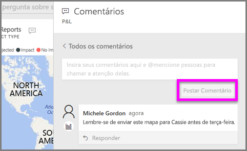
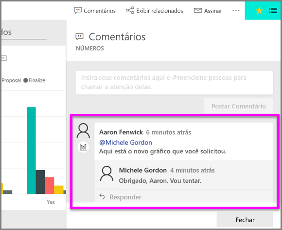

# Adicionar comentários a uma visualização
Adicione um comentário pessoal ou inicie uma conversa sobre uma visualização com seus colegas. O recurso de **comentário** é apenas uma das maneiras de um *consumidor* interagir com uma visualização. 

## Como usar o recurso de comentário

1. Focalize a visualização e selecione o as reticências (...).    
2. No menu suspenso, selecione **Adicionar um comentário**.

      

3.  Digite seu comentário e selecione **Postar comentário**. Esse é um comentário para mim mesmo, incluindo um erro de ortografia.

      

4. Esta é uma conversa que estou tendo com o *designer* da visualização. Ele usa o símbolo @ para garantir que eu veja o comentário. Eu sei que esse comentário é para mim. Ao abrir o dashboard do aplicativo no Power BI, eu seleciono **Comentários** no cabeçalho. O painel **Comentários** exibe nossa conversa. 

      

5. Clique em **Fechar** para voltar para o dashboard ou relatório.

## Próximas etapas
Voltar para as [visualizações para consumidores](end-user-visualizations.md)    
<!--[Select a visualization to open a report](end-user-open-report.md)-->