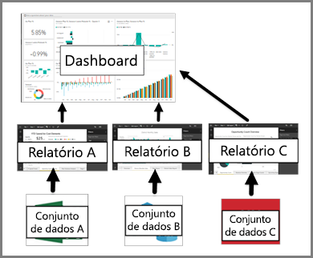

# Dashboards para consumidores de serviço do Power BI

Um ***dashboard*** do Power BI é uma página única, geralmente chamada de tela, que usa as visualizações para contar uma história. Como ele é limitado a uma página, um dashboard bem projetado contém apenas os elementos mais importantes da história.

As visualizações exibidas no dashboard são chamadas de *blocos* e são *fixadas* ao dashboard por Designers de Relatórios. Quando seleciona um bloco, você é levado para a página do relatório em que a visualização foi criada. Se for novo no Power BI, você poderá obter uma boa base lendo [Conceitos básicos do Power BI](end-user-basic-concepts.md).

> [!NOTE]
> Os dashboards podem ser [exibidos e compartilhados em dispositivos móveis](mobile/mobile-apps-view-dashboard.md).
>
> É necessário ter o Power BI Pro para exibir um dashboard que tenha sido compartilhado com você.
> 

As visualizações em um dashboard vêm de relatórios e cada relatório é baseado em um conjunto de dados. Na verdade, uma maneira de pensar em um dashboard é como uma porta de entrada para os relatórios e os conjuntos de dados subjacentes. Selecionar uma visualização leva você para o relatório (e o conjunto de dados) que foi usado para criá-lo.

## Vantagens dos dashboards
Os dashboards são uma ótima maneira de monitorar seus negócios, procurar respostas e ver todas as métricas mais importantes rapidamente. As visualizações em um dashboard podem vir de um conjunto de dados subjacente, ou de muitos, e de um relatório subjacente, ou de muitos. Um dashboard pode combinar dados locais e na nuvem, proporcionando uma exibição consolidada independentemente do local em que os dados residem.

Um dashboard não é apenas uma imagem bonita. Ele é altamente interativo e personalizável e os blocos são atualizados à medida que os dados subjacentes são alterados.

## Dashboards versus relatórios para ***consumidores*** do Power BI
Os relatórios geralmente são confundidos com os dashboards, já que eles também são telas preenchidas com visualizações. Mas existem algumas diferenças relevantes de ponto de vista entre os *consumidores* do Power BI.

| **Funcionalidade** | **Dashboards** | **Relatórios** |
| --- | --- | --- |
| Páginas |Uma página |Uma ou mais páginas |
| Fontes de dados |Um ou mais relatórios e um ou mais conjuntos de dados por dashboard |Um único conjunto de dados por relatório |
| Assinar |Pode assinar um dashboard de emails |Pode assinar páginas de relatório de emails |
| Filtragem |Não é possível filtrar ou fatiar |Diferentes maneiras de filtrar, realçar e fatiar |
| Definir alertas |Pode criar alertas para enviar por email quando determinadas condições forem atendidas |Não |
| Em destaque |Pode definir um dashboard como o dashboard "em destaque" |Não é possível criar um relatório em destaque |
| Consultas de linguagem natural |Disponível no dashboard |Não está disponível nos relatórios |
| Pode ver campos e tabelas do conjunto de dados subjacentes |Não. Pode exportar dados, mas não consegue ver tabelas e campos no dashboard de controle em si. |Sim. Pode ver as tabelas de conjunto de dados e os campos e valores. |

## Criadores de dashboard e consumidores de dashboard
Como ***consumidor*** do Power BI, você recebe dashboards de *criadores*. Saiba mais sobre dashboards nos seguintes tópicos:

* [Exibir um dashboard](end-user-dashboard-open.md)
* Saiba mais sobre [blocos de dashboard](end-user-tiles.md) e o que acontece quando você seleciona um.
* Deseja acompanhar um bloco de dashboard individual e receber um email quando ele alcançar um certo limite? [Criar alertas em blocos](end-user-alerts.md).
* Divirta-se fazendo perguntas ao seu dashboard. Aprenda como usar o [Power BI Q&A](end-user-q-and-a.md) para fazer perguntas sobre os dados e receba uma resposta na forma de uma visualização.

> [!TIP]
> Se você não encontrar o que está procurando aqui, use o Sumário à esquerda.
> 

## Próximas etapas
[Exibir um dashboard](end-user-dashboard-open.md) 