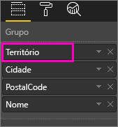
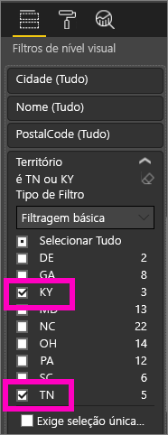
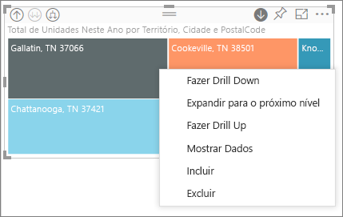
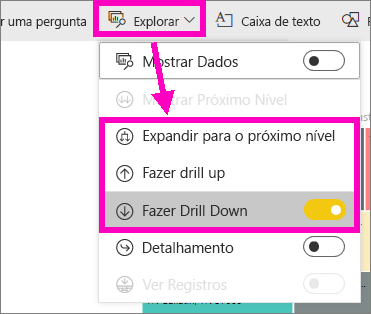
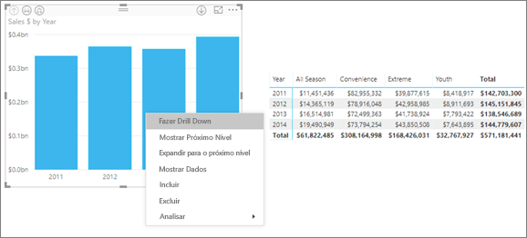
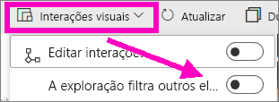
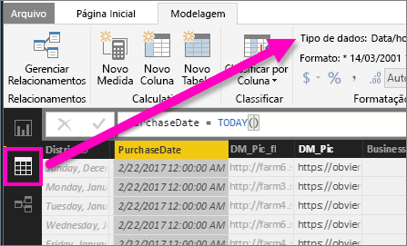

# Modo de análise em uma visualização do Power BI

Este artigo mostra como fazer drill down em uma visualização no serviço do Microsoft Power BI e no Power BI Desktop. Os relatórios do Power BI permitem que várias hierarquias de dados forneçam a você o máximo de informações sobre seus dados. Usando análise detalhada em seus pontos de dados, você pode explorar seus dados com ainda mais profundidade. Você ainda pode tirar proveito dele mesmo no fator forma pequeno de seus dispositivos móveis.

## Uma análise exige uma hierarquia

Quando uma visualização tem uma hierarquia, você pode fazer drill down para revelar detalhes adicionais. Por exemplo, você pode ter uma visualização que examina a contagem de medalhas Olímpicas por uma hierarquia composta de esportes, disciplina e eventos. Por padrão, a visualização mostraria a contagem de medalhas por esporte – ginástica, esqui, esportes aquáticos e assim por diante. Mas como ela tem uma hierarquia, selecionar um dos elementos de visualização (como uma barra, linha ou bolhas), exibiria um quadro cada vez mais detalhado. Selecione o elemento **esportes aquáticos** para ver os dados por natação, mergulho e polo aquático.  Selecione o elemento **mergulho** para ver detalhes de trampolim, plataforma e eventos de mergulho sincronizado.

É possível adicionar hierarquias aos seus relatórios, mas não aos relatórios compartilhados com você.
Você não sabe quais visualizações do Power BI contém uma hierarquia? Passe o mouse sobre uma visualização. Se você ver esses controles de análise nos cantos superiores, a visualização tem uma hierarquia.

    
   

As datas são um tipo exclusivo de hierarquia. Quando você adiciona um campo de data a uma visualização, o Power BI adiciona automaticamente uma hierarquia de tempo que contém ano, trimestre, mês e dia. Para saber mais informações, confira [Hierarquias de visualização e comportamento de análise](../guided-learning/visualizations.yml?tutorial-step=18) ou assista ao vídeo abaixo.

<iframe width="560" height="315" src="https://www.youtube.com/embed/MNAaHw4PxzE?list=PL1N57mwBHtN0JFoKSR0n-tBkUJHeMP2cP" frameborder="0" allowfullscreen></iframe>

> [!NOTE]
> Para saber como criar hierarquias usando o Power BI Desktop, assista ao vídeo [Como criar e adicionar hierarquias](https://youtu.be/q8WDUAiTGeU).

## Pré-requisitos

1. No serviço do Power BI ou no Desktop, a análise exige uma visualização com uma hierarquia.

1. Para acompanhar, abra o [exemplo Análise de Varejo](../sample-datasets.md). Criar uma visualização de **Treemap** que pareça com o seguinte:

    | Contêiner | Campo |
    | ---- | ----- |
    | Valor |Vendas \|\_ Total de Unidades Neste Ano |
    | Grupo | Store \|\_ Território \|\_ Cidade \|\_ CEP \|\_ Nome

    O mapa de árvore tem uma hierarquia composta por região, cidade, CEP e nome de cidade. Cada região tem uma ou mais cidades, cada cidade tem um ou mais códigos postais e assim por diante. Por padrão, a visualização mostra somente os dados da região, porque *Região* aparece em primeiro na lista.

    

1. Aprender como os ícones de análise diferentes funcionam juntos pode ser confuso. Vamos filtrar o mapa de árvore para mostrar apenas duas das regiões menores: **KY** e **TN**. Selecione o mapa de árvore em **Filtros de nível visual**, expanda **Região** e selecione **KY** e **TN**.

    

    Agora, apenas duas regiões são exibidas no mapa de árvore.

    

## Três maneiras de usar os recursos de análise

Existem várias opções para acessar os recursos de drill down, drill up e expandir nas visualizações que têm hierarquias. Este artigo mostra como usar a primeira opção abaixo. Depois de aprender as noções básicas de análise e expansão, você saberá como usar todos os três. Todas elas realizam as mesmas coisas. Experimente e escolha o que você gostar mais.

- Passe o mouse sobre uma visualização para ver e usar os ícones.  

    

- Clique com o botão direito do mouse em uma visualização e use o menu.

    

- Na barra de menus do Power BI, clique no botão **Explorar**.

   

## Caminhos de análise

### Fazer drill down

Existem diversas maneiras de analisar uma visualização. **Fazer drill down** leva você até o próximo nível na hierarquia. Se você está analisando o nível **Território**, é possível fazer drill down para o nível da cidade, depois, para o nível do CEP e, finalmente, para o nível do nome. Cada etapa do caminho mostra novas informações.

### Expandir

**Expandir** adiciona outro nível de hierarquia à exibição atual. Portanto, se você está analisando o nível **Território**, é possível expandir e adicionar detalhes de cidade, CEP e nome ao mapa de árvore. Cada etapa do caminho mostra as mesmas informações e adiciona um nível de novas informações.

Também é possível escolher entre fazer drill down ou expandir um campo de cada vez ou todos os campos de uma vez.

## Fazer drill down de todos os campos de uma vez

1. Inicie no nível superior do mapa de árvore que mostra os dados de KY e TN. Amplie o mapa de árvore selecionando uma das alças e arrastando para a direita.

    

1. Para fazer drill down de *todos os campos de uma só vez*, selecione a seta dupla no canto superior esquerdo da visualização . Agora, o mapa de árvore mostra dados de cidade para o Kentucky e o Tennessee.

    

1. Faça drill down mais uma vez para o nível de CEP da hierarquia.

    

1. Para fazer drill up de volta, selecione a seta para cima no canto superior esquerdo da visualização .

## Fazer drill down de um campo de cada vez

Esse método usa o ícone de fazer drill down que aparece no canto superior direito da própria visualização.

1. Selecione esse ícone para ativá-lo .

    Agora, você tem a opção de fazer drill down de **um campo de cada vez**.

    

    Se você não ativar a busca detalhada, selecionar um elemento de visualização (como uma barra, bolhas ou folha) não fará a busca detalhada. Em vez disso, ele fará uma filtragem cruzada de outros gráficos na página do relatório.

1. Selecione a folha para **TN**. Agora, o mapa de árvore mostra todas as cidades no Tennessee que têm uma loja.

    

1. Neste ponto, você pode:

    1. Continuar fazendo uma busca detalhada para Tennessee.

    1. Fazer busca detalhada para uma cidade específica no Tennessee.

    1. Ou expandir (veja **Expandir todos os campos de uma só vez** abaixo).

    Vamos continuar fazendo drill down de um campo de cada vez.  Selecione **Knoxville, TN**. O mapa de árvore agora mostra o CEP da loja em Knoxville.

    

    Observe que o título se altera conforme você faz drill down e drill up novamente.

## Expandir tudo e expandir um campo de cada vez

Ter um mapa de árvore que mostra apenas um CEP não é informativo.  Então, expanda para um nível abaixo na hierarquia.  

1. Com o mapa de árvore ativo, clique no ícone *expandir para baixo* . Agora, o mapa de árvore mostra dois níveis de hierarquia: CEP e nome da loja.

    

1. Para ver todos os quatro níveis de hierarquia dos dados para o Tennessee, selecione a seta de drill up até chegar ao segundo nível do mapa de árvore, **Total de unidades deste ano por território e cidade**.

    

1. Verifique se a análise ainda está ativada,  e selecione o ícone *expandir para baixo* . Agora, o mapa de árvore mostra detalhes adicionais. Em vez de exibir apenas a cidade e o estado, ele também mostra o CEP.

    

1. Selecione o ícone *expandir para baixo* mais uma vez para exibir todos os quatro níveis de hierarquia de detalhes para o Tennessee no mapa de árvore. Passe o mouse sobre uma folha para ver ainda mais detalhes.

    

## O drilling filtra outros visuais

Ao trabalhar no modo de análise, você precisa decidir como fazer drill down e expandir afetam outras visualizações na página.

Por padrão, a análise não filtra outros visuais em um relatório. Você pode habilitar esse recurso no Power BI Desktop e no serviço do Power BI.

1. No Desktop, selecione a guia **Formatar** e marque a caixa de seleção **Filtros detalhados de outros elementos visuais**.

    

1. Agora, ao fazer drill down, drill up ou expandir em uma visualização com uma hierarquia, essa ação filtrará os outros visuais da página.

    

    

> [!NOTE]
> Para habilitar esse recurso no serviço do Power BI, na barra de menus superior, selecione **Interações visuais** > **Filtros detalhados de outros elementos visuais**.
>
> 

## Saiba como usar o eixo de hierarquia e o grupo de hierarquias

É possível pensar no eixo de hierarquia e no grupo de hierarquias como os mecanismos que podem ser usados para aumentar e diminuir a granularidade dos dados que você deseja exibir. Todos os dados que você puder organizar em categorias e subcategorias serão qualificados como tendo uma hierarquia, incluindo datas e horários.

É possível criar uma visualização no Power BI para ter uma hierarquia selecionando um ou mais campos de dados a serem adicionados ao contêiner **Eixo** ou ao contêiner **Grupo**. Em seguida, adicione os dados que você deseja examinar como campos de dados no contêiner **Valores**. Você saberá se seus dados são hierárquicos se os ícones de *Modo de análise* são exibidos nos cantos superiores esquerdo e direito de sua visualização.

Essencialmente, é conveniente pensar em dois tipos de dados hierárquicos:

- Dados de data e hora – se você tiver um campo de dados com um tipo de dados DateTime, já terá os dados hierárquicos. O Power BI cria automaticamente uma hierarquia para qualquer campo de dados. Você pode analisar os valores em uma estrutura [DateTime](https://msdn.microsoft.com/library/system.datetime.aspx). Só é necessário adicionar um campo DateTime ao contêiner **Eixo** ou **Grupo**.

- Dados categóricos: se o Power BI derivar seus dados de coleções que contenham subcoleções ou, caso contrário, tenham linhas de dados que compartilham valores comuns, você terá dados hierárquicos.

O Power BI permite expandir em um subconjunto ou em todos. É possível fazer drill down em seus dados para ver um subconjunto único em cada nível ou para ver todos os subconjuntos simultaneamente em cada nível. Por exemplo, é possível fazer drilldown de um ano específico ou ver todos os resultados de cada ano à medida que você percorre a hierarquia.

Também é possível fazer drill up da mesma maneira.

As seções a seguir descrevem como fazer drill down do modo de exibição mais alto, médio e mais baixo.

### Dados hierárquicos e dados de tempo

Para este exemplo:

1. Acompanhe o [exemplo de Análise de varejo](../sample-datasets.md) e crie uma visualização de gráfico de colunas empilhadas que examina:

    | Contêiner | Campo |
    | ---- | ----- |
    | Eixo | Hora \|\_ Mês |
    | Valores | Vendas \|\_ TotalSales |

    Embora o campo de dados Eixo seja **Mês**, ele ainda cria uma categoria **Ano** no contêiner **Eixo**. Isso ocorre, porque o Power BI fornece a estrutura DateTime completa para todos os valores que ela lê. A parte superior da hierarquia mostra os dados do ano.

    

1. Com o modo de análise ativo, selecione a barra no gráfico para descer um nível da hierarquia. Você verá três barras para os dados dos trimestres disponíveis.

1. Em seguida, nos ícones do canto superior esquerdo, escolha **Expandir todo o campo um nível abaixo na hierarquia**.

1. Faça isso mais uma vez para obter o nível mais baixo da hierarquia, que mostra os resultados para cada mês.

    

Além da visualização, é possível ver a hierarquia refletida nos dados renderizados para cada relatório. No canto superior direito, selecione as reticências e, em seguida, selecione **Mostrar Dados**. A tabela a seguir mostra os resultados da análise detalhada de um único mês ou de todos os meses:

|Modo de expansão|Ano|Trimestre|Mês|Dia|
| --- |:---:|:---:|:---:|---|
|Único|||||
|Todos|||||

Observe que os dados são os mesmos para relatórios **trimestrais** e **anuais**. Depois de fazer drill down para o nível de detalhe especificado para **Valores**, será possível ver como o único relatório fica mais específico e como o relatório de "todos os meses" tem mais dados.

### Dados de categoria hierárquica

Os dados que foram modelados de coleções e subcoleções são hierárquicos.

Um bom exemplo disso são os dados de localização. Considere uma tabela em uma fonte de dados cujas colunas são País, Estado, Cidade e CEP. Dados que compartilham o mesmo País, Estado e Cidade são hierárquicos.

Para este exemplo:

1. Acompanhe o [exemplo de Análise de varejo](../sample-datasets.md). Criar uma visualização de gráfico de colunas empilhadas da seguinte maneira:

    | Contêiner | Campo |
    | ---- | ----- |
    | Valor |Vendas \|\_ Total de Unidades Neste Ano |
    | Eixo | Store \|\_ Território \|\_ Cidade - talvez seja necessário arrastar a cidade do contêiner **Legenda** além do contêiner **Eixo**. \|\_ CEP \|\_ Nome |

    

1. Com o modo de análise ativo, nos ícones do canto superior esquerdo, escolha **Expandir todos um nível abaixo na hierarquia** três vezes.

    Você deve estar no nível mais baixo da hierarquia, que mostra os resultados de Território, Cidade e CEP.

    

Além da visualização, é possível ver a hierarquia refletida nos dados renderizados para cada relatório. No canto superior direito, selecione as reticências e, em seguida, selecione **Mostrar Dados**. A tabela a seguir mostra os resultados de analisar um único território ou de todos os territórios.

| Modo de expansão|Território|Cidade|CEP|Nome|
| ---|:---:|:---:|:---:|---|
|Único|||||
|Todos|||||

 À medida que você faz drill down, é possível ver como o **único** relatório fica mais específico e como o relatório de **All** os territórios tem mais dados.

## Considerações e limitações

Se a adição de um campo de data a uma visualização não criar uma hierarquia, pode ser que o campo data não esteja realmente salvo como uma data. Se você possui o conjunto de dados:

1. Abra-o na exibição de *Dados* no Power BI Desktop.

1. Selecione a coluna que tem a data.

1. Na guia **Modelagem**, altere o **Tipo de Dados** para **Data** ou **Data/Hora**.

Se o relatório foi compartilhado com você, entre em contato com o proprietário para solicitar a alteração.

## Próximas etapas

[Visualizações em relatórios do Power BI](../visuals/power-bi-report-visualizations.md)

[Relatórios do Power BI](end-user-reports.md)

[Power BI – conceitos básicos](end-user-basic-concepts.md)

Mais perguntas? [Experimente a Comunidade do Power BI](http://community.powerbi.com/)
