# Guia de Início Rápido – Explorando o serviço do Power BI

Agora que você conhece os conceitos básicos do Power BI, vamos dar uma olhada no **serviço do Power BI**. Como já mencionado, alguém da sua equipe pode ficar o tempo todo no **Power BI Desktop**, combinando dados e criando relatórios para outras pessoas. Mas, por outro lado, você pode gastar todo o seu tempo no serviço do Power BI, exibindo e interagindo com o conteúdo criado por outros (**consumindo** experiência). Neste guia de início rápido você importará dados de exemplo e os usará para aprender a explorar o serviço do Power BI. 
 
## Pré-requisitos

- Se você não estiver inscrito no Power BI, [inscreva-se para uma avaliação gratuita](https://app.powerbi.com/signupredirect?pbi_source=web) antes de começar.

- Leia os [Conceitos básicos do serviço de Power BI](end-user-basic-concepts.md)

## Abra o serviço do Power BI e obtenha alguns dados
Vamos obter alguns dados de exemplo a serem usados em nosso tour do serviço do Power BI. Há inúmeros tipos de dados de exemplo que podemos fornecer para você explorar e, desta vez, usaremos os dados sobre lojas de varejo.    
1. Abra app.powerbi.com e selecione o link de **Exemplos**. 

    

2. Selecione **Exemplo de Análise de Varejo > Conectar**.

    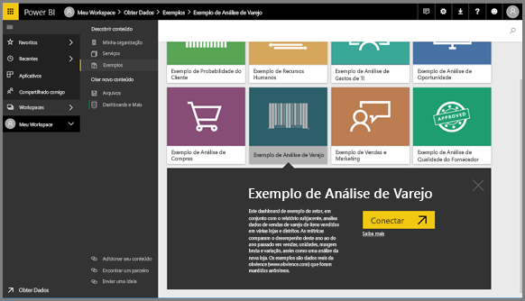

    O serviço do Power BI importa o exemplo e exibe o dashboard. Dashboards são uma coisa que diferencia o serviço do Power BI de Power BI Desktop. O exemplo também inclui um relatório e um conjunto de dados, que veremos mais tarde.

    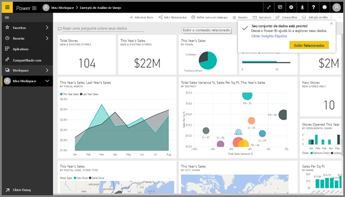

Acompanhe Amanda em um tour sobre a experiência de navegação de serviço do Power BI.  Em seguida, siga as instruções passo a passo embaixo do vídeo para explorar por conta própria.

<iframe width="560" height="315" src="https://www.youtube.com/embed/G26dr2PsEpk" frameborder="0" allowfullscreen></iframe>

## Exibir conteúdo (dashboards, relatórios, pastas de trabalho, conjuntos de dados, workspaces, aplicativos)
Vamos começar observando como o conteúdo básico (dashboards, relatórios, conjuntos de dados e pastas de trabalho) está organizado. O conteúdo é exibido dentro do contexto de um workspace. Neste ponto, há apenas um workspace e ele se chama **Meu Workspace**. Normalmente, os consumidores não precisamos nem usam outros workspaces. Meu Workspace armazena todo o conteúdo que você tem. Pense nele como sua área restrita pessoal ou como área de trabalho para seu próprio conteúdo. Meu workspace é o local em que a amostra de Análise de Varejo que você acaba de baixar é salva. 

Dentro do Meu Espaço de Trabalho, seu conteúdo é organizado em quatro guias: Painéis, Relatórios, Pastas de trabalho e Conjuntos de dados.

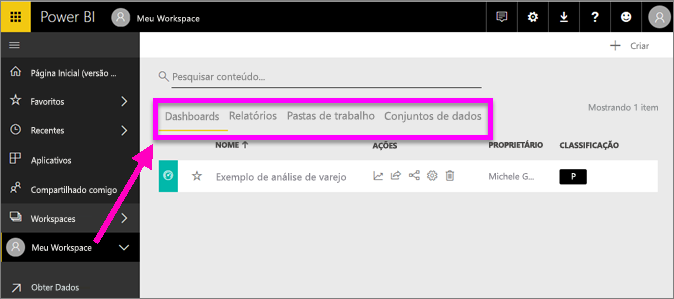

Selecione um workspace no painel de navegação à esquerda (painel nav. esq.) e as guias do conteúdo associado (painéis, relatórios, pastas de trabalho e conjuntos de dados) preencherão a tela do Power BI à direita.

Se você for um novo usuário, haverá somente um workspace – **Meu Workspace**.

Dentro dessas guias (também conhecidas como *exibições de conteúdo*), você verá informações sobre o conteúdo, bem como as ações que podem ser executadas com esse conteúdo.  Por exemplo, na guia Dashboards, você pode abrir um dashboard, pesquisar, classificar e muito mais.

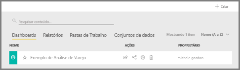

Abra o dashboard, selecionando o nome do dashboard.

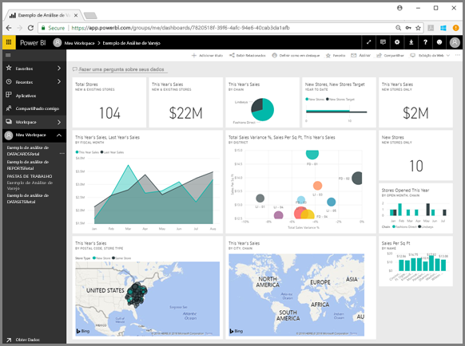

## Adicione um dashboard e um relatório a Favoritos
Os **Favoritos** permitem acessar rapidamente o conteúdo que é mais importante para você.  

1. Com o dashboard aberto, selecione **Favoritos** no canto superior direito.
   
   
   
   **Adicionar a Favoritos** muda para **Remover de Favoritos** e o ícone de estrela se torna amarelo.
   
   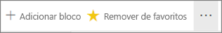

2. Para exibir uma lista de todo o conteúdo adicionados aos favoritos, no painel de navegação à esquerda, selecione a seta para a direita de **Favoritos**. Como o painel de navegação esquerdo é um recurso permanente do serviço do Power BI, você tem acesso a essa lista em qualquer lugar do serviço do Power BI.
   
    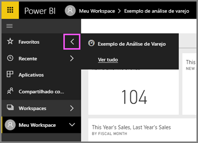
   
    Há somente um favorito até o momento. Os favoritos podem ser dashboards, relatórios ou aplicativos.  

1. Outra maneira de marcar um dashboard ou um relatório como favorito é da guia de exibição de conteúdo **Dashboards** ou **Relatórios**.  Abra a guia **Relatórios** e selecione o ícone de estrela à esquerda do nome do relatório.
   
   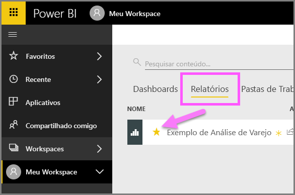

3. Abra o *painel* **Favoritos**, selecionando **Favoritos** no painel de navegação esquerdo ou selecionando o ícone de estrela .
   
   
   
   Agora há dois Favoritos, um dashboard e um relatório. Aqui você pode abrir, pesquisar, remover de Favoritos ou compartilhar conteúdo com seus colegas.

4. Selecione o nome do relatório para abri-lo no editor de relatórios.

    

Para saber mais, consulte [Favoritos](end-user-favorite.md)

## Localize o conteúdo mais recente

1. De forma semelhante aos Favoritos, veja rapidamente o último conteúdo acessado de qualquer lugar no serviço do Power BI, selecionando a seta ao lado de **Recente** no painel de navegação esquerdo.

   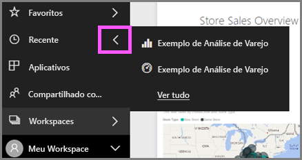

    No submenu, selecione o conteúdo a ser aberto.

2. Às vezes, você não deseja simplesmente abrir o conteúdo recente, mas deseja exibir informações ou executar outras ações, como exibir Insights ou exportar para o Excel. Em casos como esses, abra o painel **Recentes** selecionando **Recente** ou seu ícone no painel de navegação esquerdo. Se você tiver mais de um workspace, essa lista incluirá o conteúdo de todos os seus workspaces.

   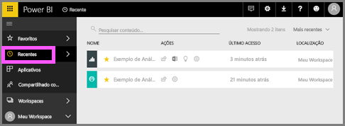

Para obter mais informações, consulte [Recentes no Power BI](end-user-recent.md)

### Pesquisar e classificar conteúdo
A exibição de conteúdo torna mais fácil pesquisar, filtrar e classificar seu conteúdo. Para procurar um dashboard, relatório ou pasta de trabalho, digite na área de pesquisa. O Power BI filtra somente o conteúdo que tenha sua cadeia de caracteres de pesquisa como parte do nome.

Como há apenas uma amostra, não é necessário pesquisar e classificar.  Mas quando houver listas longas de dashboards, relatórios, pastas de trabalho e conjuntos de dados, a pesquisa e a classificação serão extremamente úteis.

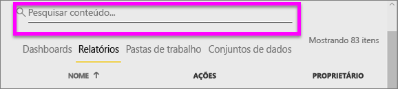

Você também pode classificar o conteúdo por nome ou por proprietário. Observe a seta para cima à direita de **Nome**. No momento, estamos classificando 83 itens em ordem alfabética por nome, em ordem crescente. Para alterar a ordem de classificação para decrescente, selecione **Nome**. A seta para cima muda para uma seta para baixo.

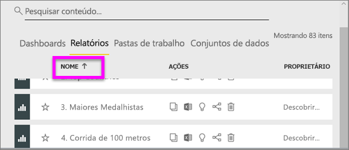

Nem todas as colunas podem ser classificadas. Passe o mouse sobre os cabeçalhos de coluna para descobrir quais podem ser classificados.

Para saber mais, confira [Navegação do Power BI: pesquisar e classificar](end-user-search-sort.md)

## Limpar recursos
Depois de concluir este início rápido, você poderá excluir o dashboard, o relatório e o conjunto de dados de exemplo de Análise de Varejo, se desejar.

1. Abra o serviço do Power BI (app.powerbi.com) e entre.    
2. No painel de navegação esquerdo, selecione **Workspaces &gt; Meu Workspace**.  
    Está vendo a estrela amarela indicando que é um favorito?    
3. Na guia **Dashboards**, selecione o ícone de lata de lixo para **Excluir** ao lado do dashboard Análise de Varejo.    

    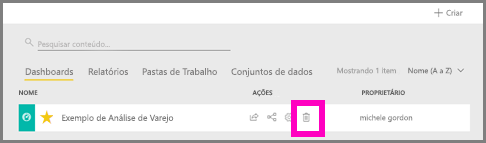

4. Selecione a guia **Relatórios** e faça o mesmo com o relatório de Análise de Varejo.
1. Selecione a guia **Conjuntos de Dados** e faça o mesmo com o conjunto de dados de Análise de Varejo.

## Próximas etapas

> [!div class="nextstepaction"]
> [Exibição de leitura no serviço do Power BI](end-user-reading-view.md)