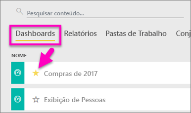
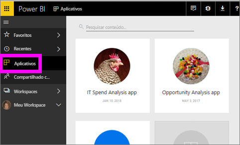
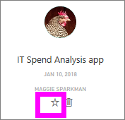
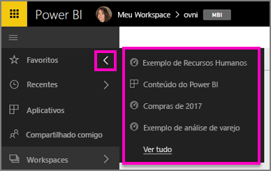
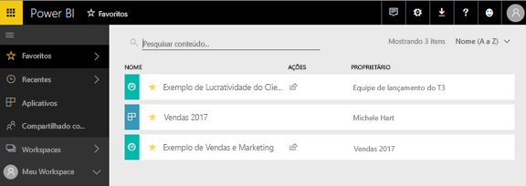
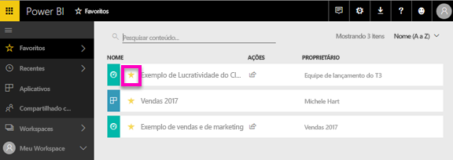

# Adicione painéis, relatórios e aplicativos aos favoritos no serviço do Power BI
Quando você adicionar um conteúdo a *Favoritos*, poderá acessá-lo de todos os workspaces.  Os favoritos normalmente são o conteúdo que você visita com mais frequência.

> [!NOTE]
> Este tópico se aplica ao serviço do Power BI, e não ao Power BI Desktop.
> 
> 

Você também pode selecionar um único painel como um [painel em destaque](end-user-featured.md) no serviço do Power BI.

## Adicionar um painel ou relatório como um *favorito*
Assista à Amanda adicionar favoritos ao seu workspace e, em seguida, siga as instruções passo a passo abaixo do vídeo para testar por conta própria.

<iframe width="560" height="315" src="https://www.youtube.com/embed/G26dr2PsEpk" frameborder="0" allowfullscreen></iframe>

1. Abra um painel ou relatório que você usa com frequência. Até mesmo o conteúdo que foi compartilhado com você pode ser um *favorito*.
2. No canto superior direito do serviço do Power BI, selecione **Favorito** ou o ícone de estrela .
   
   
   
   Também é possível adicionar um painel ou relatório como favorito da guia de exibição de conteúdo de **Painéis** ou **Relatórios** do seu workspace.
   
   

## Adicionar um aplicativo como *favorito*

1. No painel de navegação esquerdo, selecione **Aplicativos**.

   

2. Passe o mouse sobre um aplicativo para exibir mais detalhes.  Selecione o ícone de   estrela para definir como um favorito.
   
   

## Trabalhando com *favoritos*
1. Para acessar os favoritos, em qualquer espaço de trabalho, selecione a seta do submenu à direita de **Favoritos**.  Deste local, você pode selecionar um favorito para abri-lo. Apenas cinco favoritos são listados (em ordem alfabética). Se você tiver mais de cinco, selecione **Ver todos** para abrir a tela Favoritos (consulte o item 2 abaixo). 
   
   
2. Para ver **todo** o conteúdo que você adicionou como favoritos, no painel de navegação esquerdo, selecione **Favoritos** ou o ícone de Favoritos .  
   
    
   
   Aqui, você pode executar uma ação: abrir, identificar os proprietários e, até, compartilhar com seus colegas.

## Remover conteúdo dos favoritos
Você não usa mais um relatório com tanta frequência como costumava?  É possível removê-los de Favoritos. Quando você remove um conteúdo dos favoritos, ele é removido de sua lista de Favoritos, mas não do Power BI.

1. No painel de navegação esquerdo, selecione **Favoritos** para abrir a tela **Favoritos**.
   
   
2. Selecione a estrela amarela ao lado do conteúdo para removê-lo dos favoritos.

> **OBSERVAÇÃO**: Também pode remover um painel, um relatório ou o próprio aplicativo dos favoritos. Basta abrir e desmarcar o ícone amarelo.   
> 
> 

## Próximas etapas
[O que é o Power BI?](../power-bi-overview.md)

[Power BI – conceitos básicos](end-user-basic-concepts.md)

Mais perguntas? [Experimente a Comunidade do Power BI](http://community.powerbi.com/)

