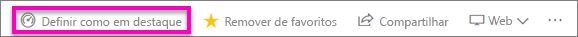
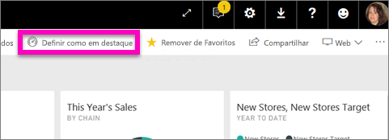
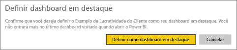
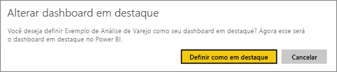
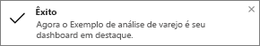
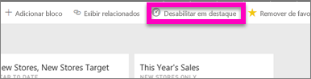

# Painéis em destaque no serviço do Power BI
## Criar um Dashboard em destaque
Muitos de nós temos um painel que é visitado mais do que qualquer outro.  Pode ser o painel que usamos para administrar nossos negócios, ou talvez um que contenha uma agregação de blocos de vários painéis e relatórios diferentes.

Ao selecionar um dashboard como *em destaque*, todas as vezes que você abrir o serviço do Power BI, ele será aberto com esse dashboard exibido.  

Você também pode selecionar alguns painéis e defini-los como *favoritos*. Veja [Dashboards favoritos](end-user-favorite.md).

> [!NOTE] 
>Este tópico se aplica ao serviço do Power BI, e não ao Power BI Desktop.

Se você ainda não tiver definido um painel como em destaque, o Power BI será aberto no último painel que foi usado.  

### Para definir um painel como **em destaque**
Veja Amanda criar um dashboard em destaque e depois siga as instruções abaixo do vídeo para testá-lo por conta própria.

<iframe width="560" height="315" src="https://www.youtube.com/embed/G26dr2PsEpk" frameborder="0" allowfullscreen></iframe>

1. Abra o dashboard que você deseja definir como *Em destaque*. 
2. Na barra de menus superior, você verá **Definir como em destaque** ou apenas o ícone em destaque . Selecione um.
   
    
3. Confirme a seleção.
   
    

## Alterar o painel em destaque
É claro que, se mudar de ideia mais tarde, você poderá definir um novo dashboard como o dashboard em destaque.

1. Siga as etapas 1 e 2 acima.
   
    
2. Selecione **Definir como em destaque**. Remover o destaque de um dashboard não o remove do workspace.  
   
    

## Remover o painel em destaque
Se você decidir que não deseja nenhum dashboard definido como em destaque, aqui está como remover a definição em destaque de um dashboard.

1. Abra o dashboard que está definido atualmente como em destaque.
2. Na barra de menu superior, selecione **Desabilitar em destaque**.
   
    

Agora o Power BI será aberto para o último painel que você usou.  

## Próximas etapas
[Adicionar um dashboard como favorito](end-user-favorite.md)

Mais perguntas? [Experimente a Comunidade do Power BI](http://community.powerbi.com/)

