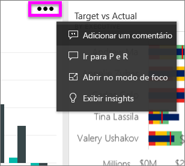
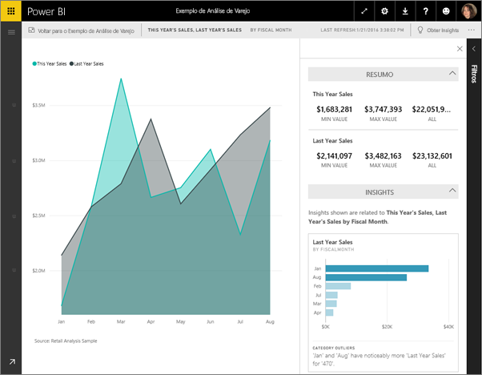
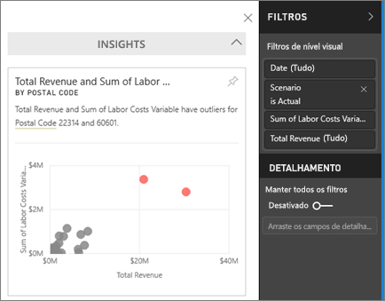
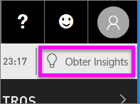
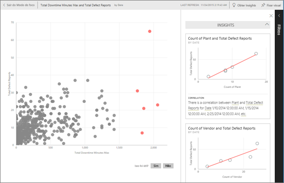

# Exibir insights de dados em blocos do painel com o Power BI
Cada bloco de visualização em seu dashboard é uma porta de entrada para exploração de dados. Quando você seleciona um bloco, ele abre um relatório em que você pode filtrar, classificar e examinar o conjunto de dados do relatório. E quando você executa insights, o Power BI faz a exploração de dados para você.

Execute insights rápidos para gerar visualizações interativas e interessantes com base em seus dados. Insights rápidos podem ser executados em um bloco de dashboard específico, e você pode até mesmo executar insights em um insight!

O recurso de insights tem como base um crescente [conjunto de algoritmos analíticos avançados](end-user-insight-types.md) desenvolvido em conjunto com a Microsoft Research, os quais continuaremos a utilizar para permitir que mais pessoas encontrem informações em seus dados de maneiras novas e intuitivas.

## Executar insights em um bloco do painel
Quando você executar insights em um bloco do dashboard, o Power BI pesquisa apenas os dados usados para criar esse bloco de dashboard único. 

1. [Abra um dashboard](end-user-dashboards.md).
2. Passe o mouse sobre um bloco. Selecione as reticências (...) e escolha **Exibir insights**. 

    

3. O bloco é aberto no [modo de foco](end-user-focus.md) com os cartões de insights exibidos à direita.    
   
        
4. Algum insight desperta seu interesse? Selecione esse cartão de insights para se aprofundar ainda mais. O insight selecionado aparece à esquerda e novos insights, com base apenas nos dados daquele único insight, são exibidos à direita.    

 ## Interagir com os cartões de insights
Depois que você tiver um insight aberto, continue a explorar.

   * Filtre esse visual na tela.  Para exibir os filtros, no canto superior direito, selecione a seta para expandir o painel Filtros.

     
   
   * Execute insights no cartão de insight em si. Isso é conhecido como **insights relacionados**. No canto superior direito, selecione o ícone de lâmpada  ou **Obter insights**.
     
     
     
     O insight é exibido à esquerda e novos cartões, com base apenas nos dados daquele único insight, são exibidos à direita.
     
     

Para retornar à tela original de insights, no canto superior esquerdo, selecione **Sair do modo de foco**.

## Considerações e solução de problemas
- **Exibir insights** não funciona com DirectQuery; ele só funciona com os dados carregados no Power BI.
- **Exibir insights** não funciona com todos os tipos de bloco do dashboard. Por exemplo, ele não está disponível para visuais personalizados.<!--[custom visuals](end-user-custom-visuals.md)-->

## Próximas etapas
Saiba mais sobre os [tipos de Insights Rápidos disponíveis](end-user-insight-types.md)

