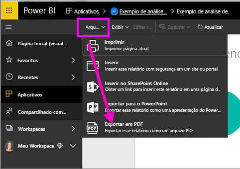
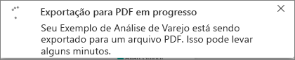
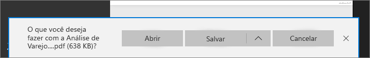

# Exportar relatórios do Power BI para PDF
Com o Power BI, você pode publicar seu relatório em formato PDF e criar facilmente um documento baseado no relatório do Power BI. Quando você **exportar para PDF**, cada página no relatório do Power BI se torna uma página individual no seu documento PDF.

## Como exportar um relatório do Power BI para o PDF
No serviço do Power BI, selecione um relatório para exibi-lo na tela. Você também pode selecionar um relatório na Página Inicial, Aplicativos ou em qualquer outra seção no painel de navegação esquerdo.

1. Selecione **Arquivo** > **Exportar para PDF** na barra de menus.

    

    Um pop-up será exibido, em que você tem a opção de selecionar **Exibição atual** ou **Exibição padrão**.  A **Exibição atual** exporta o relatório no estado atual, que inclui as alterações ativas feitas nos valores de segmentação e filtro.  A maioria dos usuários seleciona essa opção.  Alternativamente, a seleção da **Exibição padrão** exporta o relatório em seu estado original (como o autor o compartilhou) e não reflete as alterações feitas no estado original.
    
    Além disso, há uma caixa de seleção para marcar se você deseja ou não exportar as guias ocultas de um relatório.  Basta marcar essa caixa se desejar exportar somente as guias de relatório visíveis para você no navegador.  Se preferir obter todas as guias ocultas como parte da exportação, deixe-a desmarcada.  Se a caixa de seleção estiver esmaecida, não haverá guias ocultas no relatório.  Depois de fazer as seleções, clique no botão Exportar para continuar.
    
    É exibida uma barra de progresso no canto superior direito. Exportar pode levar alguns minutos e você pode continuar a trabalhar no Power BI enquanto o relatório está sendo exportado.

    

    Depois de concluído, o banner de notificação muda para informá-lo de que o serviço do Power BI terminou o processo de exportação.

2. O arquivo estará disponível quando o navegador exibir os arquivos baixados. Na imagem a seguir, ele é mostrado como uma faixa de download na parte inferior da janela do navegador.

    

E isso é tudo para ele. Você pode baixar o arquivo e abri-lo com qualquer visualizador de PDF, como o disponível no Microsoft Edge.

## Limitações e considerações
Há algumas considerações e limitações para ter em mente ao trabalhar com o recurso **Exportar para o PDF**.

* No momento, não há suporte para **visuais do R**. No PDF, esses elementos visuais estarão em branco e exibirão uma mensagem de erro.  

* Há suporte para **visuais personalizados** que foram **certificados**. Para obter mais informações sobre visuais personalizados certificados, incluindo como obter um visual personalizado certificado, consulte [Certificando um visual personalizado](../power-bi-custom-visuals-certified.md). Não há suporte para visuais personalizados que não tenham sido certificados. No PDF, eles serão exibidos com uma mensagem de erro.   

* No momento, não é possível exportar relatórios com mais de 30 páginas de relatório.

* O processo de exportar o relatório para o PDF pode levar alguns minutos para ser concluído, seja paciente. Os fatores que podem afetar o tempo necessário incluem a estrutura do relatório e a carga atual no serviço do Power BI.

* Se o item de menu **Exportar para o PDF** não estiver disponível no serviço do Power BI, provavelmente será porque seu administrador de locatários desabilitou o recurso. Entre em contato com seu administrador de locatários para obter detalhes.

* As imagens da tela de fundo serão cortadas com a área delimitadora do gráfico. É altamente recomendável que você remova as imagens de tela de fundo antes de exportar para o PDF.

* Os relatórios que são propriedade de um usuário fora de seu domínio de locatário do Power BI (como um relatório de alguém fora de sua organização e compartilhado com você) não podem ser publicados no PDF.

* Se você compartilhar um dashboard com alguém fora de sua organização (e, portanto, um usuário que não está em seu locatário do Power BI), esse usuário não poderá exportar os relatórios associados ao painel compartilhado para o PDF. Por exemplo, se você for aaron@contoso.com, poderá compartilhar com cassie@cohowinery.com. No entanto, cassie@cohowinery.com não poderá exportar os relatórios associados para o PDF.

* O serviço Power BI usa a configuração de idioma do Power BI como o idioma para a exportação do PDF. Para obter ou definir sua preferência de idioma, selecione o ícone de engrenagem **Configurações** > **Geral** > **Idioma**.

## Próximas etapas
[Imprimir um relatório](end-user-print.md)
