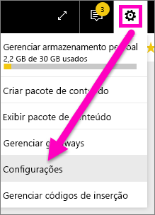
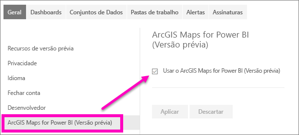

# Aceitar recursos de visualização do serviço do Power BI
## O que é a *versão prévia dos recursos*?
À medida que fizermos melhorias no serviço do Power BI, lançaremos novas funcionalidades como *versão prévia dos recursos*. A versão prévia dos recursos pode ser ligada e desligada, oferecendo a você a oportunidade de experimentá-la.

> [!TIP]
> Os recursos de visualização também estão disponíveis para o Power BI Desktop. Para saber mais, [visite o Fórum da comunidade do Power BI Desktop](https://community.powerbi.com/t5/Desktop/bd-p/power-bi-designer).
> 
> 

## Localizar visualizações e ligá-las (e desligá-las)
1. Abra o menu Configurações selecionando o ícone de engrenagem no canto superior direito da tela do Power BI e escolhendo **Configurações**.
   
   .
2. Selecione a guia **Geral**. Se existirem visualizações, você verá uma opção para **Visualizar recursos** ou você verá um recurso de visualização listado à esquerda.  Neste exemplo, há uma visualização listada para Mapas ArcGIS. 
   
   
3. Selecione o botão de opção **Ativar** ou marque a caixa de seleção para experimentar a nova experiência. Em seguida, selecione **Aplicar**.
4. Para desativar os recursos de visualização, siga as etapas de 1 a 3 acima e, na etapa 3, selecione **Desativar**, ou remova a marca de seleção e selecione **Aplicar**.

Tem dúvidas ou comentários? [Acesse o fórum da comunidade do Power BI](http://community.powerbi.com/t5/Navigation-Preview-Forum/bd-p/NavigationPreview).

