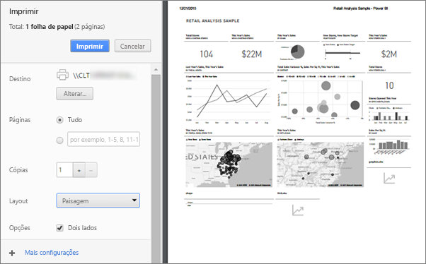

# Imprimir a partir de serviço do Power BI
Imprima um dashboard inteiro, um bloco do dashboard, uma página de relatório ou um visual de relatório do serviço do Power BI. Relatórios podem ser impressos somente com uma página por vez – não é possível imprimir o relatório inteiro ao mesmo tempo.

   > [!NOTE]
   > A caixa de diálogo de impressão que você verá depende do navegador que está usando.
   > 
## Imprimir um painel
1. Abra o dashboard que você deseja imprimir.
2. No canto superior esquerdo, selecione Exportar e escolha **imprimir esta página**.
   
    
3. A janela Imprimir do navegador é aberta. Escolha as configurações e o destino de impressão, então selecione **Imprimir**.
   

   
    

## Imprimir um bloco do dashboard
1. Abrir o painel no [modo de tela inteira](end-user-focus.md) selecionando o ícone de tela inteira  na barra de menus superior.
3. [Abra o bloco no modo de foco](end-user-focus.md) passando o mouse para revelar as reticências (...) e escolhendo **aberto no modo de foco** ou no ícone de foco .
   
    
4. Focalize o bloco para revelar o menu Opções.
   
    
4. Selecione o ícone de Impressão .     
   

## Imprima uma página de relatório
Somente uma página de relatório pode ser impressa por vez.

1. Abra o relatório e selecione **exportar** > **imprimir** para imprimir a página de relatório atual.
   
    
3. A janela Imprimir do navegador é aberta.
   

## Imprimir um visual de relatório
1. [Abra o visual no Modo de foco](end-user-focus.md) passando o mouse sobre o bloco e selecionando o ícone de Foco  no canto superior direito.

2. No canto superior esquerdo, selecione **exportar** > **imprimir** para imprimir o visual.

    

## Considerações e solução de problemas

* P: Não consigo imprimir todas as páginas do relatório de uma vez.    
* R: Isso está correto. As páginas do relatório só podem ser impressas uma página por vez.
* P: Não consigo imprimir em PDF.    
* R: Você só verá essa opção se já tiver configurado o driver de PDF em seu navegador.    
* P: O que vejo quando seleciono **Imprimir** não corresponde ao que é mostrado aqui.    
* R: As telas Imprimir variam de acordo com o navegador e a versão do software.
* P: Minha cópia impressa não está dimensionada corretamente.  Meu dashboard não se ajusta à página. Outras perguntas sobre escala e orientação.    
* R: Não podemos garantir que a cópia impressa seja exatamente a mesma como ele aparece no serviço do Power BI. Itens como escala, margens, detalhes visuais, orientação e tamanho não são controlados pelo Power BI. Para obter ajuda com problemas como esse, consulte a documentação de seu navegador específico.      

## Próximas etapas
[Compartilhar relatórios e dashboards com seus colegas e outras pessoas](../service-share-dashboards.md)

Mais perguntas? [Experimente a Comunidade do Power BI](http://community.powerbi.com/)

