<!-- once the sample apps are live, change this so consumers can follow along -->
# Início Rápido: saiba mais sobre as funcionalidades do Power BI para ***consumidores***
Neste início rápido, você aprenderá como interagir com o Power BI para descobrir informações de negócios controladas por dados. Este artigo não visa ser um aprofundamento do tema, mas sim uma passagem rápida por muitas das ações disponíveis para **consumidores** do Power BI.

Se você não estiver inscrito no Power BI, [inscreva-se para uma avaliação gratuita](https://app.powerbi.com/signupredirect?pbi_source=web) antes de começar.

## Pré-requisitos
- Serviço do Power BI (app.powerbi.com)
<!-- app from AppSource -->

## Exibição de leitura
O Modo de Exibição de Leitura está disponível no serviço do Power BI para *consumidores* de relatório. Quando um colega compartilhar um relatório com você, o Modo de Exibição de Leitura será sua maneira de explorar e interagir com o relatório. 

O outro modo de relatório do serviço do Power BI é o [Modo de Exibição de Edição](../service-interact-with-a-report-in-editing-view.md), que está disponível para *designers* de relatório.  

O Modo de Exibição de Leitura é uma maneira poderosa e segura de explorar seus dashboards e relatórios. Enquanto você divide e organiza os dashboards e relatórios compartilhados com você, os conjuntos de dados subjacentes permanecem intactos e inalterados. 

No Modo de Exibição de Leitura, você pode fazer coisas como filtrar e destacar de maneira cruzada os visuais de uma página.  Basta realçar ou selecionar um valor em um visual para ver imediatamente seu impacto sobre os outros visuais. Use o painel Filtrar para adicionar e modificar filtros em uma página de relatório e alterar a maneira como os valores são classificados em uma visualização. Esses são apenas algumas das funcionalidades do *consumidor* no Power BI.  Continue lendo para saber mais sobre essas e muitas outras.

 
### Exibir um aplicativo
No Power BI, os *aplicativos* reúnem os dashboards e os relatórios relacionados em um só local.

1. Selecione **Aplicativos**  > **Obter aplicativos**. 
   
     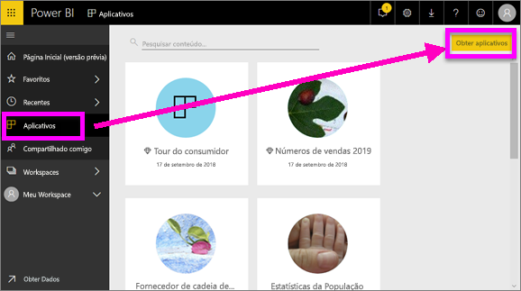
2. No AppSource, em **Minha organização**, pesquise para restringir os resultados e localize o aplicativo que você está procurando.
   
     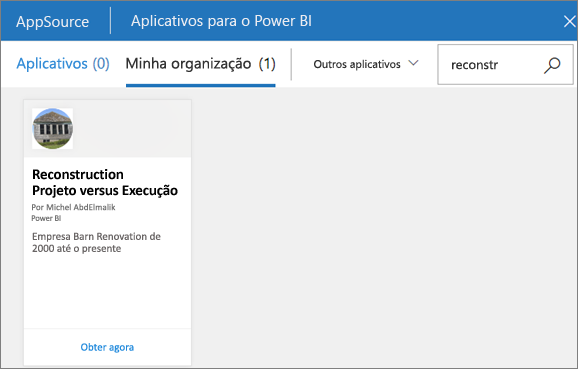
3. Selecione **Obter agora** para adicioná-lo ao seu Contêiner de aplicativos. 

### Exibir um dashboard
Este aplicativo é aberto em um dashboard. Um ***dashboard*** do Power BI é uma página única, geralmente chamada de tela, que usa as visualizações para contar uma história. Como ele é limitado a uma página, um dashboard bem projetado contém apenas os elementos mais importantes da história.

As visualizações que você vê no dashboard são chamadas de *blocos* e são *fixadas* ao dashboard de relatórios.

### Assine um dashboard (ou relatório)
Não é necessário abrir o Power BI para monitorar um dashboard.  Você pode assiná-lo em vez disso, e o Power BI enviará um email com um instantâneo de dashboard conforme agendado por você. 

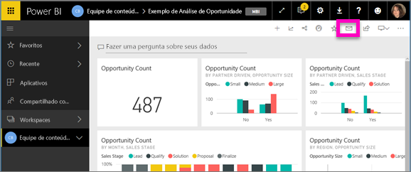.

1. Na barra de menus superior, selecione **Assinar** ou selecione o ícone de envelope .
   
   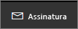

3. Use o controle deslizante amarelo para ativar e desativar a assinatura.  Outra opção é preencher os detalhes da mensagem de email. 

    Nas capturas de tela abaixo, observe que quando você assina um relatório, na verdade, você está assinando uma *página* de relatório.  Para assinar mais de uma página em um relatório, selecione **Adicionar outra assinatura** e selecione uma página diferente. 
      
   
   
    Atualizar a página de relatório não atualiza o conjunto de dados. Somente o proprietário do conjunto de dados pode atualizá-lo manualmente. Para pesquisar o nome dos conjuntos de dados subjacentes, selecione **Exibir relacionados** na barra de menus superior.

### Exibir conteúdo relacionado
O painel **Conteúdo relacionado** mostra como o conteúdo do serviço do Power BI (dashboards, relatórios e conjuntos de dados) está interconectado. O painel não apenas exibe o conteúdo relacionado, mas também permite que você tenha controle sobre o conteúdo e navegue facilmente entre o conteúdo relacionado.

Em um dashboard ou relatório, selecione **Exibir relacionados** na barra de menus superior.

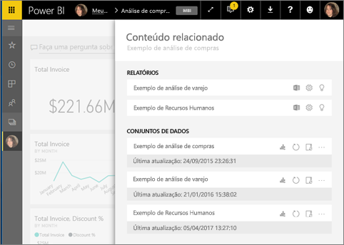

### Usar P e R para fazer perguntas usando idioma natural
Às vezes, a maneira mais rápida de obter uma resposta de seus dados é fazer uma pergunta usando o idioma natural. A caixa de perguntas de P e R está disponível na parte superior do seu dashboard. Por exemplo, “mostre-me a contagem de grandes oportunidades por estágio de vendas como um funil”. 

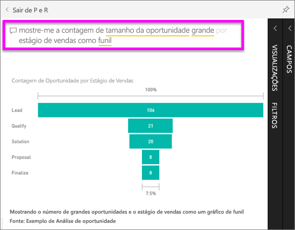

### Adicionar um dashboard como favorito
Quando você adicionar um conteúdo a um *favorito*, poderá acessá-lo da barra de navegação esquerda. A barra de navegação esquerda fica visível de praticamente qualquer área do Power BI. Os favoritos normalmente são os dashboards, páginas de relatório e aplicativos que você visita com mais frequência.

1. Saia da P e R para retornar a um dashboard.    
2. No canto superior direito do serviço do Power BI, selecione **Favorito** ou o ícone de estrela .
   
   

### Abrir e exibir um relatório e páginas de relatório
Um relatório é uma ou mais páginas de visuais. Os relatórios são criados por *designers de relatório* do Power BI e [compartilhados com *consumidores* diretamente](end-user-shared-with-me.md) ou como parte de um [aplicativo](end-user-apps.md). 

Relatórios podem ser abertos de um dashboard. A maioria dos blocos de dashboard são *fixados* de relatórios. Selecionar um bloco abre o relatório que foi usado para criá-lo. 

1. Em um dashboard, selecione um bloco. Neste exemplo, selecionamos o bloco do gráfico de colunas “Receita”.

    

2.  O relatório associado é aberto. Observe que estamos na página “Visão geral da receita”. Essa é a página de relatório que contém o gráfico de colunas que selecionamos por meio do dashboard.

    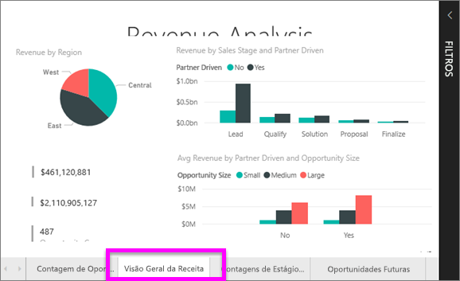

### Ajustar as dimensões da exibição
Os relatórios são exibidos em vários dispositivos diferentes, com diferentes tamanhos de tela e taxas de proporção.  O processamento padrão pode não ser o que você deseja ver em seu dispositivo.  

1. Para ajustar selecione **Exibição** na barra de menus superior.

    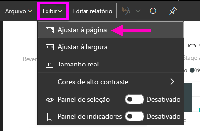

2.  Escolha uma das opções de exibição. Neste exemplo, optamos por **Ajustar à página**.

    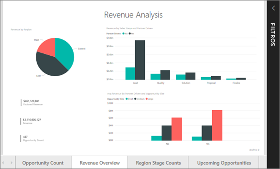    

### Usar o painel Filtros do relatório
Se o autor do relatório adicionar filtros a uma página em um relatório, você poderá interagir com eles e salvar as alterações com o relatório.

1. Selecione o ícone de **Filtro** no canto superior direito.
   
   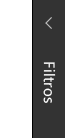  

2. Selecione um visual para ativá-lo. Você verá todos os filtros que foram aplicados a esse visual (Filtros no nível do visual), em toda a página do relatório (Filtros no nível da página) e no relatório inteiro (Filtros no nível do relatório).
   
   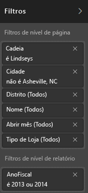

3. Passe o mouse sobre um filtro e expanda-o, selecionando a seta para baixo.
   
   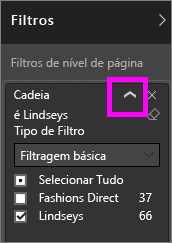

4. Altere os filtros e veja como os elementos visuais são afetados.  
   
     
     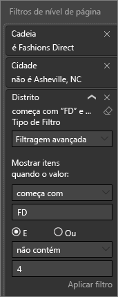

### Veja como os visuais em uma página são interconectados
Destacar e filtrar de maneira cruzada as visualizações relacionadas em uma página. As visualizações em uma página de relatório único são "conectadas" umas às outras.  Isso significa que, se você selecionar um ou mais valores em uma visualização, outras visualizações que usam o mesmo valor serão alteradas com base na sua seleção.

> 
### Exibir detalhes em uma visualização
Focalizar os elementos visuais para ver detalhes

### Classificar uma visualização
Os visuais em uma página de relatório podem ser classificadas e salvas com as alterações aplicadas. 

1. Passe o mouse sobre um visual para ativá-lo.    
2. Selecione as reticências (...) para abrir as opções de classificação.

     

###  Abra o painel **Seleção**
Navegue facilmente entre as visualizações na página do relatório. 

1. Selecione **Exibição > Painel de seleção** para abrir o painel Seleção. Alterne o **Painel de seleção** para Ativado.

    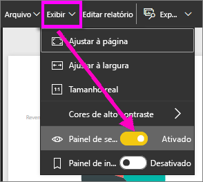

2. O painel Seleção é aberto na tela do relatório. Selecione um visual da lista para ativá-lo.

    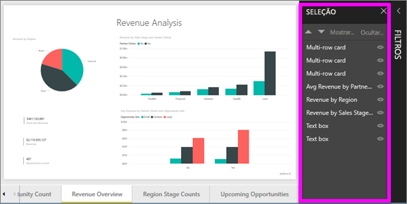

### Ampliar elementos visuais individuais
Focalize um visual e selecione o ícone do **modo Foco**. Quando você exibe uma visualização no modo de Foco, ela se expande para preencher toda a tela do relatório, conforme mostrado abaixo.

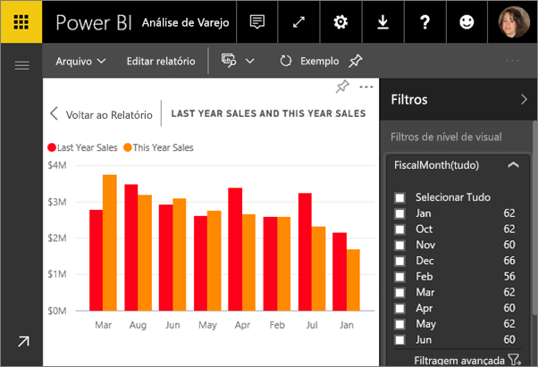

Para exibir a mesma visualização sem a distração das barras de menu, do painel de filtros e de outros detalhes, selecione o ícone **Tela Inteira** na barra de menus superior .

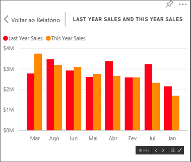

### Mostrar os dados usados para criar uma visualização
Uma visualização do Power BI é construída usando dados dos conjuntos de dados subjacentes. Se você estiver interessado em ver o que acontece nos bastidores, o Power BI permitirá *exibir* os dados usados para criar o visual. Ao selecionar **Mostrar Dados**, o Power BI exibirá os dados abaixo (ou ao lado) da visualização.

1. No serviço do Power BI, abra um relatório e selecione um visual.  
2. Para exibir os dados por trás do visual, selecione as reticências (...) e escolha **Mostrar dados**.
   
   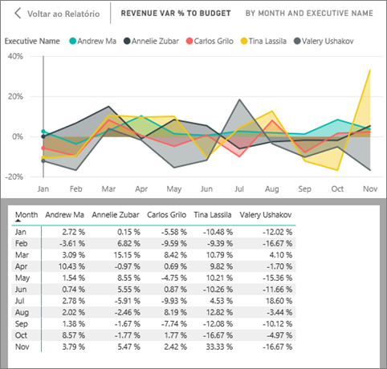

Essa foi uma visão geral rápida de apenas algumas das coisas que os **consumidores** podem fazer com o serviço do Power BI.  

## Limpar recursos
- Se você se conectou a um aplicativo, na barra de navegação esquerda, selecione **Aplicativos** para abrir a lista de conteúdo de Aplicativos. Passe o mouse sobre o aplicativo a ser excluído e selecione o ícone de lixeira.

- Caso tenha importado ou conectado-se a um relatório de exemplo do Power BI, na barra de navegação esquerda, abra **Meu workspace**. Usando as guias na parte superior, localize o dashboard, relatório e conjunto de dados e selecione o ícone de lixeira para cada um.

## Próximas etapas

