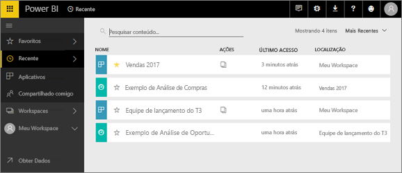
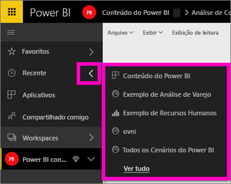
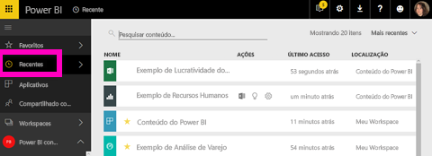

# Conteúdo **recente** no serviço do Power BI
Conteúdo recente são os últimos itens que você visitou no serviço do Power BI, até um máximo de 20 itens.  Isso inclui: painéis, relatórios, aplicativos e pastas de trabalho em todos os seus workspaces.

Veja Amanda demonstrar como as listas de conteúdo **Recente** do serviço do Power BI são preenchidas e, em seguida, siga as instruções passo a passo abaixo do vídeo para testar por conta própria.

<iframe width="560" height="315" src="https://www.youtube.com/embed/G26dr2PsEpk" frameborder="0" allowfullscreen></iframe>

## Exibir conteúdo recente
Para ver seus cinco itens visitados mais recentemente, no menu de navegação à esquerda, selecione a seta à direita de **Recente**.  Nesse local você pode selecionar o conteúdo recente para abri-lo. Apenas os cinco itens mais recentes são listados.

Se você tem mais de cinco itens recentemente visitados, selecione **Ver todos** para abrir a tela Recente (veja abaixo). Também é possível selecionar **Recente**, ou o ícone , no menu de navegação esquerdo.

Aqui você pode ser interagir com o conteúdo como faria individual [ **painéis**](end-user-dashboards.md), [ **relatórios**](end-user-reports.md), e  **Pastas de trabalho** guias e de aplicativos <!--[**Apps**](end-user-apps.md)--> tela.

## Próximas etapas
<!--[Power BI service Apps](end-user-apps.md)-->

Mais perguntas? [Experimente a Comunidade do Power BI](http://community.powerbi.com/)

