# Faça um tour pelo painel Filtros do relatório
Este artigo oferece uma visão geral do painel Filtros do relatório no serviço do Power BI.

Há muitas maneiras diferentes de filtrar dados no Power BI. Recomendamos que você leia [Sobre filtros e realce](../power-bi-reports-filters-and-highlighting.md) primeiro.

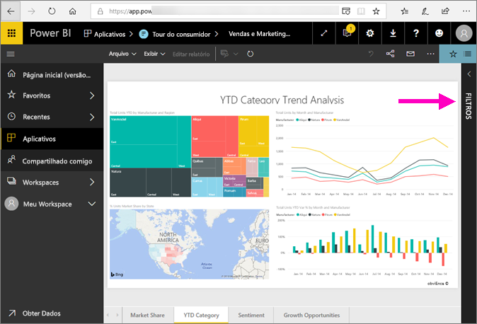

## Trabalhar com o painel de Filtros do relatório
Quando um colega compartilhar um relatório com você, não se esqueça de examinar o painel **Filtros**. Às vezes, ele está recolhido na borda direita do relatório. Selecione-o para expandi-lo.   

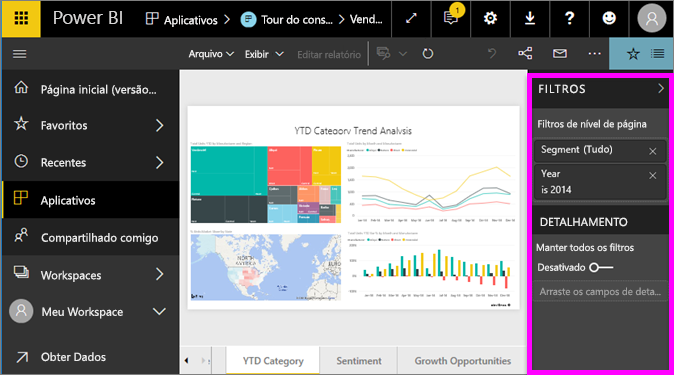

O painel Filtros contém os filtros que foram adicionados ao relatório pelo *designer* do relatório. *Consumidores* como você podem interagir com os filtros e salvar suas alterações, mas não podem adicionar novos filtros ao relatório. Por exemplo, na captura de tela acima, o designer adicionou dois filtros de nível de página: Segmento e Ano. Você pode interagir e alterar esses filtros, mas não pode adicionar um terceiro filtro no nível de página.

No Serviço do Power BI, relatórios retêm as alterações feitas no painel Filtros e essas alterações são repassadas para a versão móvel do relatório. Para redefinir o painel Filtro para os padrões do designer, selecione **Redefinir para padrão** na barra de menus superior.     

## Abrir o painel Filtros
Quando um relatório é aberto, o painel Filtros é exibido no lado direito da tela do relatório. Caso não veja o painel, selecione a seta no canto superior direito para expandi-lo.  

Neste exemplo, selecionamos um visual que tem 6 filtros. A página de relatório também tem filtros, listados sob o título **Filtros de nível de página**. Há um [filtro Detalhamento](../power-bi-report-add-filter.md) e o relatório inteiro também tem um filtro:  **FiscalYear** é 2013 ou 2014.

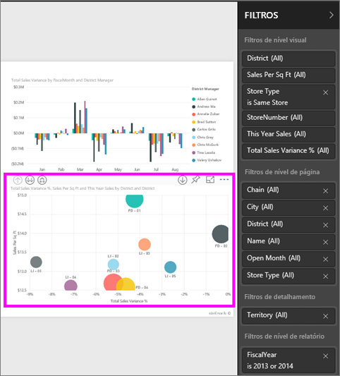

Alguns filtros têm a palavra **Todos** ao seu lado, o que significa que todos os valores estão sendo incluído no filtro.  Por exemplo, **Chain(All)** na captura de tela acima informa que essa página de relatório inclui dados sobre cadeias de armazenamento.  Por outro lado, o filtro de nível de relatório ou **FiscalYear é 2013 ou 2014** informa que o relatório inclui somente dados para os anos fiscais de 2013 e 2014.

Qualquer pessoa que exibir este relatório pode interagir com esses filtros.

- Pesquise na página, no visual, no relatório e em filtros de detalhamento para localizar e selecionar o valor desejado. 

    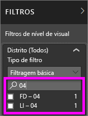

- Veja os detalhes do filtro focalizando e selecionando a seta ao lado do filtro.
  
   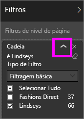
* Altere o filtro, por exemplo, altere **Lindseys** para **Fashions Direct**.
  
     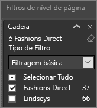

* Redefina os filtros para seu estado original selecionando **Redefinir para padrão** na barra de menus superior.    
    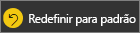
    
* Exclua o filtro selecionando o **x** ao lado do nome do filtro.
  
    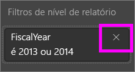

  A exclusão de um filtro o remove da lista, mas não exclui os dados do relatório.  Por exemplo, se você excluir o filtro **Ano Fiscal é 2013 ou 2014**, os dados do ano fiscal ainda permanecerão no relatório, mas ele não será mais filtrado para mostrar somente 2013 e 2014; mostrará todos os anos fiscais contidos nos dados.  No entanto, depois de excluir o filtro, você não poderá modificá-lo novamente, já que ele é removido da lista. Uma opção melhor é limpar o filtro selecionando o ícone de borracha .
  
  

## Limpar um filtro
 No modo de filtragem avançada ou básica, selecione o ícone de borracha   para limpar o filtro. 

## Tipos de filtros: filtros de campo de texto
### Modo de lista
Marcar uma caixa de seleção ou selecionar ou demarcar o valor. A caixa de seleção **Todos** pode ser usada para alternar o estado de todas as caixas de seleção ativadas ou desativadas. As caixas de seleção representam todos os valores disponíveis para esse campo.  À medida que você ajusta o filtro, o ajuste é atualizado para refletir suas escolhas. 

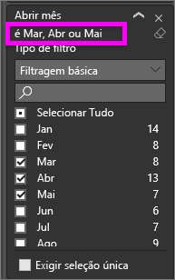

Observe como a reformulação agora diz "é Mar, Abr ou Mai".

### Modo avançado
Selecione **Filtragem avançada** para alternar para o modo avançado. Use as caixas de texto e controles de lista suspensa para identificar quais campos serão incluídos. Escolhendo entre **E** e **Ou**, você pode criar expressões de filtro complexas. Selecione o botão **Aplicar filtro** ao definir os valores desejados.  

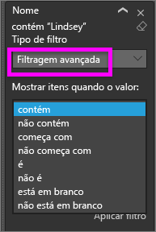

## Tipos de filtros: filtros de campo numérico
### Modo de lista
Se os valores são finitos, selecionar o nome do campo exibe uma lista.  Veja **Filtros de campo de texto** &gt; **Modo de lista** acima para obter ajuda sobre como usar caixas de seleção.   

### Modo avançado
Se os valores são infinitos ou representam um intervalo, selecionar o nome do campo abre o modo de filtro avançado. Use a lista suspensa e as caixas de texto para especificar um intervalo de valores que você deseja ver. 

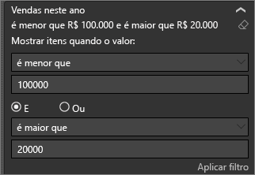

Escolhendo entre **E** e **Ou**, você pode criar expressões de filtro complexas. Selecione o botão **Aplicar filtro** ao definir os valores desejados.

## Tipos de filtros: data e hora
### Modo de lista
Se os valores são finitos, selecionar o nome do campo exibe uma lista.  Veja **Filtros de campo de texto** &gt; **Modo de lista** acima para obter ajuda sobre como usar caixas de seleção.   

### Modo avançado
Se os valores de campo representam a data ou hora, você pode especificar uma hora de início/término quando usar os filtros de data/hora.  

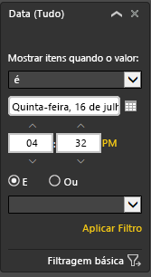

## Próximas etapas
[Saiba como e por que os visuais executam filtro cruzado e realce cruzado entre si em uma página de relatório](end-user-interactions.md)