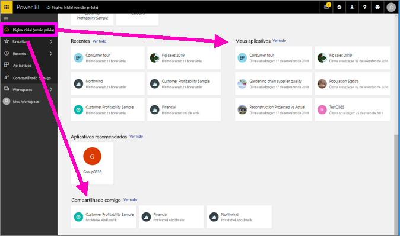
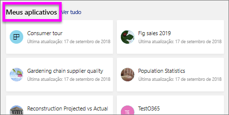

# Exibir um relatório no serviço do Power BI para os *consumidores*
Um relatório é uma ou mais páginas de visuais. Os relatórios são criados pelo Power BI *designers* e [compartilhado com *consumidores* diretamente](end-user-shared-with-me.md) ou como parte de um [aplicativo](end-user-apps.md). 

Há muitas maneiras diferentes para abrir um relatório e mostraremos duas delas: abra em casa e abra em um painel. 

<!-- add art-->

## Abrir um relatório do Power BI Home
Vamos abrir um relatório que foi compartilhado com você diretamente e, em seguida, abrir um que foi compartilhado como parte de um aplicativo.

   

### Abrir um relatório que foi compartilhado com você
Power BI *designers* podem compartilhar um relatório diretamente com você. Conteúdo que é compartilhado dessa forma aparece na **compartilhado comigo** contêiner em sua barra de navegação da barra e, nas **compartilhado comigo** seção da sua tela inicial.

1. Abra o serviço do Power BI (app.powerbi.com).

2. Na barra de navegação, selecione **Home** para exibir a tela inicial.  

   
   
3. Role para baixo até ver **Compartilhado comigo**. Procure o ícone de relatório . Nesta captura de tela, nós temos um painel e um relatório chamado *exemplo de vendas e marketing*. 
   
   

4. Basta selecionar o relatório *cartão* para abrir o relatório.

   

5. Observe as guias no lado esquerdo.  Cada guia representa uma *página* do relatório. No momento, temos a *oportunidade de crescimento* página aberta. Selecione o *categoria Acumulada* tab para abrir essa página de relatório em vez disso. 

   

6. Agora, estamos vendo a página inteira do relatório. Para alterar a exibição (zoom) da página, selecione o menu suspenso de exibição do canto superior direito ( **>** ) e escolha **tamanho real**.

   

   

### Abra um relatório que faz parte de um aplicativo
Se você já recebeu a aplicativos de seus colegas ou do AppSource, esses aplicativos estão disponíveis no início e do **aplicativos** contêiner em sua barra de navegação. Uma [aplicativo](end-user-apps.md) é um pacote de dashboards e relatórios.

1. Volte à página inicial, selecionando **Home** na barra de navegação.

7. Role para baixo até ver **Meus aplicativos**.

   

8. Selecione um dos aplicativos para abri-lo. Dependendo das opções definidas pelo *designer* de aplicativo, o aplicativo abrirá um painel, um relatório ou uma lista de conteúdo de aplicativo. Se selecionar o aplicativo:
    - abrir um relatório, está tudo pronto.
    - abrir um dashboard, confira ***Abrir um relatório de um dashboard***, abaixo.
    - abre a lista de conteúdo de aplicativo, em **Relatórios**, selecione o relatório para abri-lo.

## Abrir um relatório por meio de um dashboard
Relatórios podem ser abertos de um dashboard. A maioria dos blocos de dashboard são *fixados* de relatórios. Selecionar um bloco abre o relatório que foi usado para criá-lo. 

1. Em um dashboard, selecione um bloco. Neste exemplo, selecionamos o bloco do gráfico de colunas “Total de Unidades Acumuladas no Ano...”.

    

2.  O relatório associado é aberto. Observe que estamos na página “Categoria de Acumulado no Ano”. Essa é a página de relatório que contém o gráfico de colunas que selecionamos por meio do dashboard.

    

> [!NOTE]
> Nem todos os blocos levam a um relatório. Se você selecionar um bloco que foi [criado com a P e R](end-user-q-and-a.md), a tela da P e R será aberta. Se você selecionar um bloco que foi [criado usando o widget de painel **Adicionar Bloco**](../service-dashboard-add-widget.md), várias coisas poderão acontecer.  

##  Outras maneiras de abrir um relatório
Conforme você se sentir mais confortável navegando no serviço do Power BI, você descobrirá os fluxos de trabalho que funcionam melhor para você. Algumas outras maneiras de acessar relatórios:
- Na barra usando a barra de navegação **Favoritos** e **recentes**    
- Usando [Exibição relacionada](end-user-related.md)    
- Em um email, quando alguém [compartilha com você](../service-share-reports.md) ou [define um alerta](end-user-alerts.md)    
- No [Centro de notificações](end-user-notification-center.md)    
- e muito mais

## Próximas etapas
Há [muitas maneiras de interagir com um relatório](end-user-reading-view.md).  Comece a explorar selecionando cada guia ao lado da tela do relatório.

