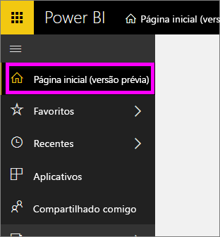
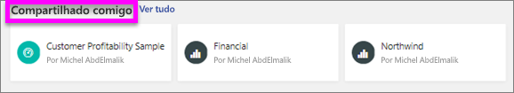
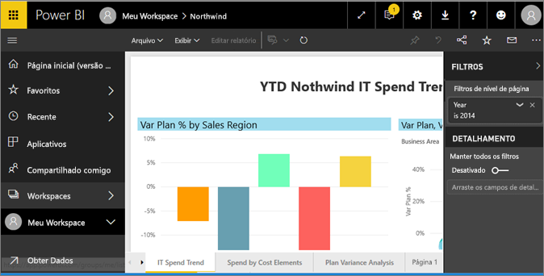
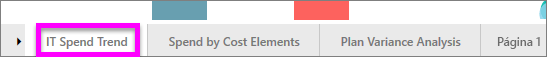
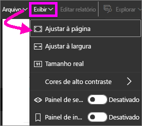
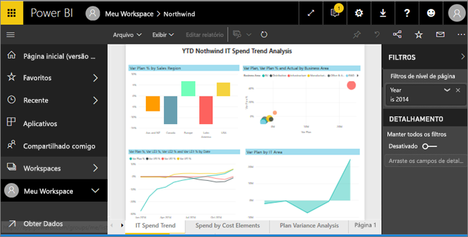
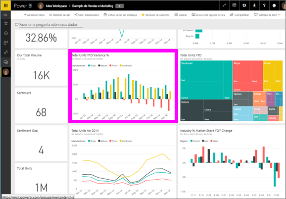
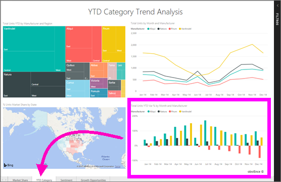

# Exibir um relatório no serviço do Power BI (app.powerbi.com)
Um relatório é uma ou mais páginas de visuais. Os relatórios são criados pelo por *designers de relatório* e do Power BI e [compartilhados com você diretamente](end-user-shared-with-me.md) ou como parte de um [aplicativo](end-user-apps.md). 

Há muitas maneiras diferentes de abrir um relatório e mostraremos duas delas: abrir na Home page e em um dashboard. 

<!-- add art-->

## Abrir um relatório na sua Home page
Vamos abrir um relatório que foi compartilhado com você diretamente e, em seguida, abrir um que foi compartilhado como parte de um aplicativo.

   

### Abrir um relatório que foi compartilhado com você
Os *designers* do Power BI podem compartilhar um relatório diretamente com você clicando em um botão **Compartilhar** na barra de menus superior. O conteúdo que é compartilhado dessa forma aparece no contêiner **Compartilhado comigo** em sua barra de navegação esquerda e na seção **Compartilhado comigo** da sua Home page.

1. Abra o serviço do Power BI (app.powerbi.com).

2. Na barra de navegação à esquerda, selecione **Home (Visualização)** para abrir sua Home page.  

   
   
3. Role para baixo até ver **Compartilhado comigo**. Procure o ícone de relatório . Nesta captura de tela, temos dois relatórios: *Financial* e *Northwind*. 
   
   

4. Basta selecionar um dos cartões de relatório para abrir o relatório.

   

5. Observe as guias na parte inferior. Cada guia representa uma *página* do relatório. Agora, a página *Análise de Gastos com TI* está aberta. Selecione uma guia diferente para abrir essa página do relatório. 

   

6. Agora podemos ver apenas uma parte da página do relatório. Para alterar a exibição (zoom) da página, selecione **Exibição** > **Ajustar à página**.

   

   

### Abra um relatório que faz parte de um aplicativo
Se você já tiver recebido aplicativos de seus colegas ou do AppSource, esses aplicativos estarão disponíveis em sua Home page e no contêiner **Aplicativos** na sua barra de navegação à esquerda. Uma [aplicativo](end-user-apps.md) é um pacote de dashboards e relatórios.

1. Volte para a Home page selecionando **Home (Visualização)** na barra de navegação à esquerda.

7. Role para baixo até ver **Meus aplicativos**.

   

8. Selecione um dos aplicativos para abri-lo. Dependendo das opções definidas pelo *designer* de aplicativo, o aplicativo abrirá um dashboard ou um relatório. Se selecionar o aplicativo:
    - abrir um relatório, está tudo pronto.
    - abrir um dashboard, confira [Abrir um relatório de um dashboard](#Open-a-report-from-a-dashboard), abaixo.

## Abrir um relatório por meio de um dashboard
Relatórios podem ser abertos de um dashboard. A maioria dos blocos de dashboard são *fixados* de relatórios. Selecionar um bloco abre o relatório que foi usado para criá-lo. 

1. Em um dashboard, selecione um bloco. Neste exemplo, selecionamos o bloco do gráfico de colunas “Total de Unidades Acumuladas no Ano...”.

    

2.  O relatório associado é aberto. Observe que estamos na página “Categoria de Acumulado no Ano”. Essa é a página de relatório que contém o gráfico de colunas que selecionamos por meio do dashboard.

    

> [!NOTE]
> Nem todos os blocos levam a um relatório. Se você selecionar um bloco que foi [criado com a P e R](../service-dashboard-pin-tile-from-q-and-a.md), a tela da P e R será aberta. Se você selecionar um bloco que foi [criado usando o widget de dashboard **Adicionar bloco**](../service-dashboard-add-widget.md), o assistente **Editar bloco** será aberto.  

##  Outras maneiras de abrir um relatório
Conforme você ficar mais familiarizado com a navegação no serviço do Power BI, descobrirá os fluxos de trabalho que funcionam melhor para você. Algumas outras maneiras de acessar relatórios:
- No painel de navegação esquerdo usando **Favoritos** e **Recentes**    
- Usando [Exibição relacionada](end-user-related.md)    
- Em um email, quando alguém [compartilha com você](../service-share-reports.md) ou [define um alerta](../service-set-data-alerts.md)    
- No seu [Centro de notificações]    (end-user-notificação-center.md)    
- e muito mais

## Próximas etapas
Há [muitas maneiras de interagir com um relatório](end-user-reading-view.md).  Comece a explorar selecionando cada guia na parte inferior da tela de relatório.

