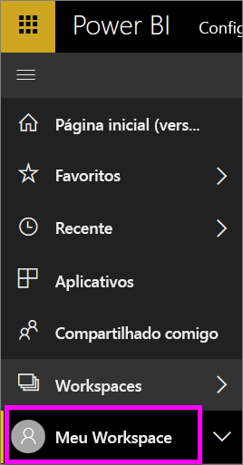
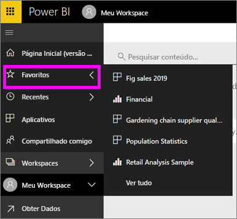

# Navegação: pesquisando, buscando e classificando seu conteúdo no serviço do Power BI
Há muitas maneiras de navegar pelo seu conteúdo no serviço do Power BI. O conteúdo é organizado em entre workspaces por tipo: painéis, relatórios, pastas de trabalho e conjuntos de dados.  E o conteúdo também é organizado por uso: favoritos, recentes, aplicativos, compartilhado comigo e em destaque. Para uma parada de navegação, a Home page organiza o conteúdo todo em uma única página. Esses caminhos diferentes em seu conteúdo permitem que você localize rapidamente aquilo de que precisa no serviço do Power BI.  

## Navegação em workspaces

*Consumidores* do Power BI normalmente têm apenas um espaço de trabalho: **Meu Espaço de Trabalho**. O **Meu workspace** somente terá conteúdo se você tiver baixado os exemplos da Microsoft ou criado ou baixado conteúdo próprio.  

No **Meu workspace**, o serviço do Power BI separa seu conteúdo por tipo: dashboards, relatórios, pastas de trabalho e conjuntos de dados. Você verá essa organização quando selecionar um workspace. Neste exemplo, o **Meu workspace** contém um dashboard, dois relatórios, nenhuma pasta de trabalho e dois conjuntos de dados.

________________________________________

## Navegação usando a barra de navegação esquerda
A barra de navegação esquerda classifica seu conteúdo de modo a tornar ainda mais fácil encontrar rapidamente aquilo que você precisa.  

- O conteúdo que é compartilhado com você está disponível em **Compartilhado comigo**.
- Seu conteúdo exibido mais recentemente está disponível em **Recentes**. 
- Seus aplicativos podem ser encontrados selecionando **Aplicativos**.
- **Home** é uma exibição de página única do seu conteúdo mais importante e o conteúdo e fontes de aprendizado sugeridas.

Além disso, você pode marcar o conteúdo como [favorito](end-user-favorite.md) e [em destaque](end-user-featured.md). Escolha qual painel você deseja exibir com mais frequência e defina-o como seu painel *em destaque*. Cada vez que você abrir o serviço do Power BI, seu dashboard em destaque será exibido primeiro. Você tem uma série de dashboards e aplicativos que visita com frequência? Ao defini-los como favoritos, eles ficarão sempre disponíveis na sua barra de navegação à esquerda.

.

## Considerações e solução de problemas
* Para conjuntos de dados, a opção **Classificar por** não está disponível pelo proprietário.

## Próximas etapas
[Power BI – conceitos básicos](end-user-basic-concepts.md)

Mais perguntas? [Experimente a Comunidade do Power BI](http://community.powerbi.com/)