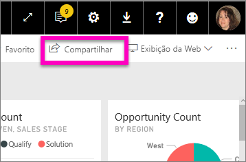
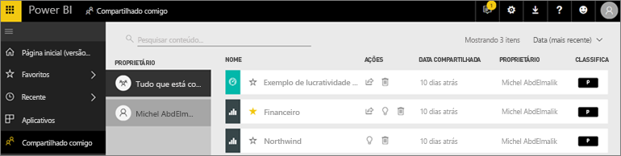
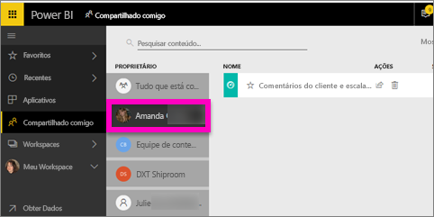

# Exibir os dashboards e relatórios que foram compartilhados comigo
## Compartilhado comigo

Quando um colega compartilhar conteúdo com você usando o botão **Compartilhar**, ele aparecerá no seu contêiner **Compartilhado comigo**. O dashboard ou relatório só estará disponível em **Compartilhado comigo** e não em **Aplicativos**.

Assista à Amanda explicar a lista de conteúdo **Compartilhado comigo** e demonstrar como navegar na lista e filtrá-la. Em seguida, siga as instruções passo a passo abaixo do vídeo para testá-la por conta própria. Para poder exibir os dashboards que são compartilhados com você, você precisa ter uma licença do Power BI Pro. Leia [O que é o Power BI Premium?](../service-premium-what-is.md) para obter detalhes.

<iframe width="560" height="315" src="https://www.youtube.com/embed/G26dr2PsEpk" frameborder="0" allowfullscreen></iframe>

Você terá várias opções para interagir com os dashboards e os relatórios, dependendo das permissões que o designer lhe conceder. Isso inclui ser capaz de fazer cópias do dashboard, abrir o relatório [no Modo de exibição de leitura](end-user-reading-view.md) e compartilhar novamente com outras colegas.

## Ações disponíveis no contêiner **Compartilhado comigo**
* Selecionar o ícone de estrela para [Adicionar um dashboard ou relatório a Favoritos](end-user-favorite.md).
* Remover um dashboard ou relatório  
* Alguns dashboards e relatórios podem ser compartilhados novamente  
* Além disso, se suas listas se tornarem longas, [use o campo de pesquisa e a classificação para encontrar o que você precisa](end-user-search-sort.md).
  
  > [!NOTE]
  > Para obter informações sobre classificações EGRC, selecione o botão de classificação ou [visite a Classificação de dados no dashboard](../service-data-classification.md).
  > 
  > 
* Selecione o nome de um dashboard para abri-lo e explorá-lo. Depois de abrir o dashboard compartilhado, você pode usar P e R para fazer perguntas sobre os dados subjacentes ou selecionar um bloco para abrir e interagir com o relatório no Modo de exibição de leitura.

## Filtrar os dashboards compartilhados por proprietário
O conteúdo na tela **Compartilhado comigo** pode ser adicionalmente filtrado por proprietário do conteúdo. Por exemplo, se eu selecionar **Amanda**, verei somente o dashboard que a Amanda compartilhou comigo.

