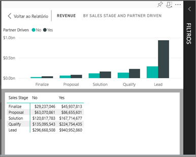
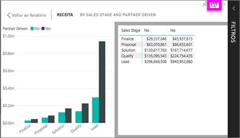

# Mostrar dados que foram usados para criar a visualização
## Mostrar dados no Modo de Exibição de Leitura
Uma visualização do Power BI é construída usando dados dos conjuntos de dados subjacentes. Se você estiver interessado em ver o que acontece nos bastidores, o Power BI permitirá *exibir* os dados usados para criar o visual. Ao selecionar **Mostrar Dados**, o Power BI exibirá os dados abaixo (ou ao lado) da visualização.

## Usando *Mostrar Dados* no Modo de Exibição de Leitura no serviço do Power BI
1. No serviço do Power BI, abra um relatório (no Modo de Exibição de Leitura) e selecione um visual.  
2. Para exibir os dados por trás do visual, selecione as reticências (...) e escolha **Mostrar dados**.
   
   
3. Por padrão, os dados são exibidos abaixo do visual.
   
   

4. Para alterar a orientação, selecione o layout vertical  no canto superior direito da visualização.
   
   

## Próximas etapas
[Visualizações em relatórios do Power BI](../visuals/power-bi-report-visualizations.md)    
[Relatórios do Power BI](end-user-reports.md)    
