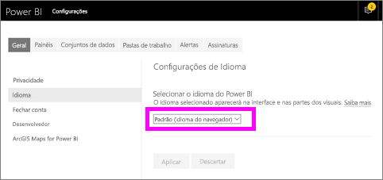
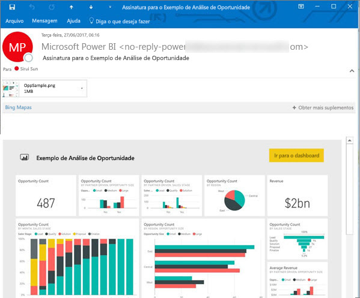
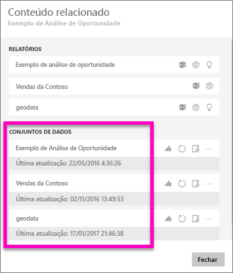
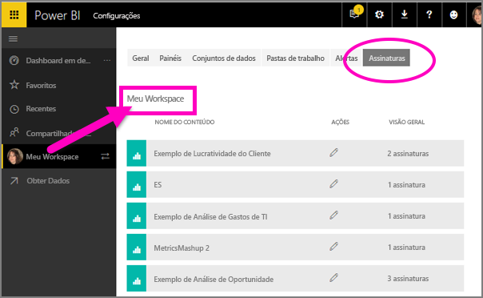

# Assinar um relatório ou dashboard no serviço do Power BI 
Nunca foi tão fácil manter-se atualizado sobre seus dashboards e relatórios mais importantes. Assine os dashboards e as páginas de relatório mais importantes para você e o Power BI enviará um email com um instantâneo para sua caixa de entrada. Informe ao Power BI a frequência com que deseja receber os emails: de uma vez por dia a uma vez por semana. 

O instantâneo e o email usarão o idioma definido nas configurações do Power BI (confira [Idiomas e países/regiões com suporte para o Power BI](../supported-languages-countries-regions.md)). Se nenhum idioma for definido, o Power BI usará o idioma de acordo com a configuração de localidade no navegador atual. Para obter ou definir sua preferência de idioma, selecione o ícone de engrenagem  > **Configurações > Geral > Idioma**. 

Quando você receber o email, ele incluirá um link para "Acessar o relatório ou o dashboard". Em dispositivos móveis com aplicativos do Power BI instalados, a seleção desse link iniciará o aplicativo (ao contrário da ação padrão de abrir o relatório ou o dashboard no site do Power BI).

## Requisitos
- A **Criação** de assinaturas é um recurso do Power BI Pro. 
- Como os emails da assinatura são enviados somente quando um conjunto de dados subjacente é alterado ou atualizado, as assinaturas não funcionam em conjuntos de dados que não são alterados nem atualizados.

## Assine um dashboard ou uma página de relatório
Se você estiver assinando um dashboard ou um relatório, o processo será muito semelhante. O mesmo botão permite que você assine os dashboards e relatórios do serviço do Power BI.
 
.

1. Abra o dashboard ou o relatório.
2. Na barra de menus superior, selecione **Assinar** ou selecione o ícone de envelope .
   
   

3. Use o controle deslizante amarelo para ativar e desativar a assinatura.  Definir o controle deslizante como Desativado não excluirá a assinatura. Para excluir a assinatura, selecione o ícone de cesto de lixo.

4. Outra opção é preencher os detalhes da mensagem de email. 

    Nas capturas de tela abaixo, observe que quando você assina um relatório, na verdade, você está assinando uma *página* de relatório.  Para assinar mais de uma página em um relatório, selecione **Adicionar outra assinatura** e selecione uma página diferente. 
      
   

5. Selecione **Salvar e fechar** para salvar a assinatura. Você receberá um email e um instantâneo do dashboard ou da página de relatório sempre que um dos conjuntos de dados subjacentes for alterado. Se o dashboard ou o relatório for atualizado mais de uma vez por dia, o email será enviado apenas após a primeira atualização.  
   
   
   
Atualizar a página de relatório não atualiza o conjunto de dados. Somente o proprietário do conjunto de dados pode atualizá-lo manualmente. Para pesquisar o nome dos conjuntos de dados subjacentes, selecione **Exibir relacionados** na barra de menus superior.
   

## Como o cronograma de email é determinado
A tabela a seguir descreve com que frequência você receberá um email. Tudo depende do método de conexão do conjunto de dados no qual se baseia o dashboard ou o relatório (DirectQuery, Conexão dinâmica, importado para o Power BI ou arquivo do Excel no OneDrive ou no SharePoint Online) e das opções de assinatura disponíveis e selecionadas (diária, semanal ou nenhuma).

|  | **DirectQuery** | **Live Connect** | **Atualização agendada (importar)** | **Arquivo do Excel no OneDrive /SharePoint Online** |
| --- | --- | --- | --- | --- |
| **Com que frequência o relatório/dashboard é atualizado?** |A cada 15 min |O Power BI verifica a cada 15 minutos e, se o conjunto de dados tiver mudado, o relatório será atualizado. |O usuário seleciona nenhuma, diária ou semanal. Diária pode ser até oito vezes ao dia. Semanal é, na verdade, um cronograma semanal que o usuário cria e define a atualização para apenas uma vez por semana ou para até uma vez por dia. |Uma vez a cada hora |
| **Quanto controle o usuário tem sobre o cronograma do email de assinatura?** |As opções são: diária ou semanal |Não há opções: os usuários receberão um email se o relatório for atualizado, mas não mais do que uma vez por dia. |Se o agendamento de atualização for diário, as opções serão diária e semanal.  Se o agendamento de atualização for semanal, a única opção será semanal. |Não há opções: usuário recebe um email sempre que o conjunto de dados for atualizado, mas não mais do que uma vez por dia. |

## Gerenciar suas assinaturas
Somente você pode gerenciar suas assinaturas. Selecione **Assinar** novamente e escolha **Gerenciar todas as assinaturas** (veja as capturas de tela abaixo da etapa 4, acima). 

Uma assinatura será encerrada se a licença Pro expirar, se o dashboard ou o relatório for excluído pelo proprietário ou se a conta de usuário usada para criar a assinatura for excluída.

## Considerações e solução de problemas
* Para assinaturas de email do dashboard, se algum bloco tiver a RLS (Segurança em Nível de Linha) aplicada, esse bloco não será exibido.  Para assinaturas de email do relatório, se o conjunto de dados usar a RLS, não será possível criar uma assinatura.
* As assinaturas da página de relatório são vinculadas ao nome da página de relatório. Se você assinar uma página de relatório e ela for renomeada, será preciso recriar sua assinatura
* Determinadas configurações da sua organização podem ser definidas no Azure Active Directory que pode limitar a capacidade de usar assinaturas de email no Power BI.  Isso inclui, sem limitação, ter autenticação multifator ou restrições de intervalo de IP ao acessar recursos.
* Para assinaturas de email em conjuntos de dados de conexão dinâmica, você só receberá emails quando os dados mudarem. Assim, se ocorrer uma atualização, mas os dados não mudarem, o Power BI não enviará um email.
* Assinaturas de email não dão suporte à maioria dos [visuais personalizados](../power-bi-custom-visuals.md).  A única exceção é para os elementos visuais personalizados que foram [certificados](../power-bi-custom-visuals-certified.md).  
* No momento, as assinaturas de email não dão suporte a visuais personalizados da plataforma R.  
* Se algum bloco do dashboard tiver a RLS (Segurança em Nível de Linha) aplicada, esse bloco não será exibido.
* Assinaturas de email são enviadas com estados de segmentação e filtro padrão do relatório. As alterações feitas nos padrões após a assinatura não serão exibidas no email.    
* Ainda não há suporte para as assinaturas de email nas páginas de relatórios criadas pela conexão dinâmica do Power BI Desktop com o recurso de serviço.  
* Especificamente para assinaturas de dashboards, alguns tipos de blocos ainda não são compatíveis.  Eles incluem: blocos de streaming, blocos de vídeo, blocos de conteúdo da Web personalizado.     
* As assinaturas poderão falhar em dashboards ou relatórios com imagens extremamente grandes devido aos limites de tamanho de email.    
* O Power BI pausa a atualização automaticamente em conjuntos de dados associados a dashboards e relatórios que não foram visitados há mais de 2 meses.  No entanto, se você adicionar uma assinatura a um dashboard ou relatório, ele não ficará em pausa mesmo que não seja visitado.    

## Próximas etapas
* Mais perguntas? [Experimente perguntar à Comunidade do Power BI](http://community.powerbi.com/)    
* [Ler a postagem no blog](https://powerbi.microsoft.com/blog/introducing-dashboard-email-subscriptions-a-360-degree-view-of-your-business-in-your-inbox-every-day/)

