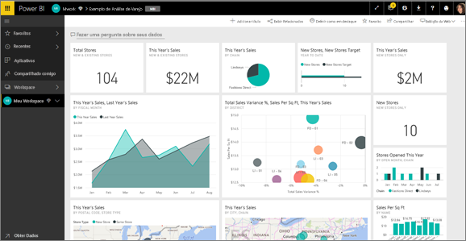
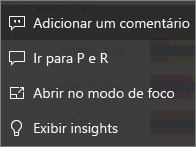
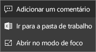
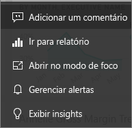

# Blocos de painel no Power BI
Um bloco é um instantâneo dos dados fixados no dashboard por um *designer*. Um bloco pode ser criado de relatórios, conjuntos de dados, dashboards, caixas de P e R, SSRS (SQL Server Reporting Services) e muito mais.  Essa captura de tela mostra vários blocos diferentes fixados a um dashboard.

Além dos blocos fixados de relatórios, os *designers* podem adicionar blocos autônomos diretamente no dashboard usando **Adicionar bloco**. Os blocos autônomos incluem: caixas de texto, imagens, vídeos, dados de streaming e conteúdo da Web.

Precisa de ajuda para compreender os blocos de construção que compõem o Power BI?  Veja [Power BI – Conceitos básicos](end-user-basic-concepts.md).

## Interagir com blocos em um painel

1. Passe o mouse sobre o bloco para exibir as reticências.
   
    
2. Selecione as reticências para abrir o menu de ação do bloco. As opções disponíveis variam de acordo com o tipo de visual e o método usado para criar o bloco. Aqui estão alguns exemplos do que pode ser visto.

    - bloco criado usando P e R
   
        

    - bloco criado de uma pasta de trabalho
   
        

    - bloco criado de um relatório
   
        
   
    A partir daqui, você pode:
   
   * [Abrir o relatório que foi usado para criar este bloco ](end-user-reports.md)   
   
   * [Abrir a pergunta do P e R que foi usada para criar o bloco ](end-user-reports.md)   
   

   * [Abrir a pasta de trabalho que foi usada para criar este bloco ](end-user-reports.md)   
    * [Exibir o bloco no modo de foco ](end-user-focus.md)   
     * [Executar insights ](end-user-insights.md) 
    * [Adicionar um comentário e iniciar uma discussão](end-user-comment.md) 

3. Para fechar o menu de ação, selecione uma área em branco na tela.

### Selecionar (clicar em) um bloco
Ao selecionar um bloco, o que ocorre em seguida depende de como o bloco foi criado e se ele tem um [link personalizado](../service-dashboard-edit-tile.md). Se ele tiver um link personalizado, a seleção do bloco levará você para esse link. Caso contrário, selecionar o bloco leva você para o relatório, pasta de trabalho do Excel Online, relatório SSRS local ou P & R que foi usada para criar o bloco.

> [!NOTE]
> Os blocos de vídeo criados diretamente no painel usando **Adicionar bloco** são a exceção. Selecionar um bloco de vídeo (que foi criado dessa forma) faz com que o vídeo seja reproduzido diretamente no dashboard.   
> 
> 

## Considerações e solução de problemas
* Se o relatório usado para criar a visualização não tiver sido salvo, então selecionar um bloco não produzirá nenhuma ação.
* Se o bloco tiver sido criado de uma pasta de trabalho em Excel Online e se você não tiver permissões pelo menos de Leitura para a pasta de trabalho, selecionar o bloco de dados não abrirá a pasta de trabalho no Excel Online.
* Para os blocos criados diretamente no dashboard usando a opção **Adicionar bloco**, se um hiperlink personalizado tiver sido definido, a seleção do título, subtítulo e/ou bloco abrirá essa URL.  Caso contrário, por padrão, a seleção de um desses blocos criados diretamente no dashboard de uma imagem, um código da Web ou uma caixa de texto não produz nenhuma ação.
* Se você não tiver permissão para o relatório no SSRS, selecionar um bloco criado do SSRS gerará uma página indicando que você não tem acesso (rsAccessDenied).
* Se você não tiver acesso à rede em que se encontra o servidor do SSRS, selecionar um bloco criado do SSRS produzirá uma página que indicará que ele não pode localizar o servidor (HTTP 404). O dispositivo deve ter acesso à rede para o servidor de relatório exibir o relatório.
* Se a visualização original usada para criar o bloco for alterada, o bloco não será alterado.  Por exemplo, se o *designer* fixar um gráfico de linhas de um relatório e, em seguida, alterar o gráfico de linhas para um gráfico de barras, o bloco do dashboard continuará mostrando um gráfico de linhas. Os dados são atualizados, mas o tipo de visualização não.

## Próximas etapas
[Atualização de dados](../refresh-data.md)

[Power BI – conceitos básicos](end-user-basic-concepts.md)
