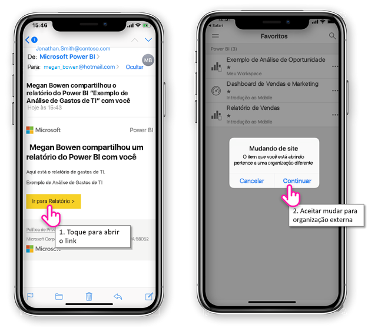
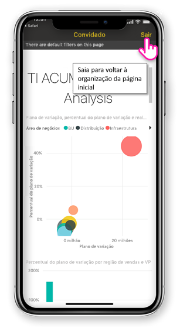
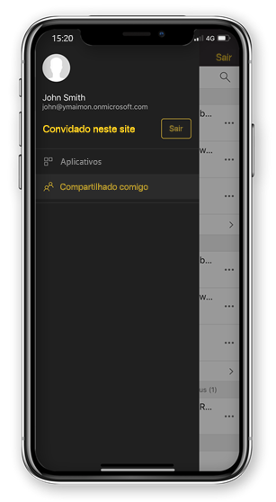

# Exibir o conteúdo do Power BI compartilhado com você de uma organização externa

Power BI é integrado com o Azure Active Directory business-to-business (Azure AD B2B) para permitir distribuição segura do conteúdo do Power BI para usuários convidados fora da sua organização. E usuários convidados externo podem usar o aplicativo móvel do Power BI para acessar o conteúdo do Power BI compartilhado com eles. 

Aplica-se a:

|  |  |  |  |
|:--- |:--- |:--- |:--- |
| iPhones |iPads |Telefones Android |Tablets Android |

## Acessando o conteúdo compartilhado

**Primeiro, você precisa que alguém de uma organização externa para compartilhar um item com você.** Quando alguém [compartilha um item com você](../../service-share-dashboards.md), da mesma organização ou de uma organização externa, você receberá um email com um link para que o item compartilhado. Esse link em seu dispositivo móvel a seguir abre o aplicativo móvel do Power BI. Se o aplicativo reconhece que o item foi compartilhado de uma organização externa, o aplicativo se reconecta a organização com sua identidade. O aplicativo, em seguida, carrega todos os itens que foram compartilhados com você da organização.

> [!NOTE]
> Se esse for o primeiro item compartilhado com você, como um usuário externo convidado, você deve solicitar o convite em um navegador. Você pode não é possível solicitar o convite no aplicativo do Power BI.

Desde que você está conectado a uma organização externa, um cabeçalho preto aparece no aplicativo. Esse cabeçalho indica que não está conectado à sua organização inicial. Para conectar-se de volta para sua organização inicial, saia do modo de convidado.

Mesmo que você precisa ter um link de artefato do Power BI para conectar-se para uma organização externa, depois que seu aplicativo muda, você pode acessar todos os itens compartilhados com você (não apenas o item que você abriu no email). Para exibir todos os itens que você pode acessar na organização externa, vá para o menu de aplicativo e selecione **compartilhado comigo**. Sob **aplicativos** você encontrar aplicativos que você pode usar também.

## Limitações

- Não há suporte para acesso condicional e outras políticas do Intune no Azure AD B2B e no Power BI móvel. Isso significa que o aplicativo impõe apenas doméstica políticas da organização, se eles existirem.
- Notificações por push são recebidas de somente o site de organização inicial (até mesmo quando o usuário está conectado como um convidado para uma organização externa). Abrindo a notificação se conectará novamente o aplicativo ao site de organização inicial do usuário.
- Se o usuário desliga o aplicativo, quando abertos novamente o aplicativo se conecta automaticamente a organização inicial do usuário.
- Quando conectado a uma organização externa, algumas ações estão desabilitadas: favorito itens, alertas de dados, fazer comentários e compartilhamento.
- Dados off-line não estão disponíveis enquanto estiver conectado a uma organização externa.
- Se você tiver o aplicativo de Portal da empresa instalado no seu dispositivo, seu dispositivo deve ser registrado.
