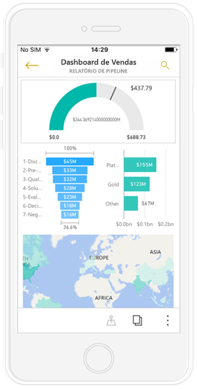
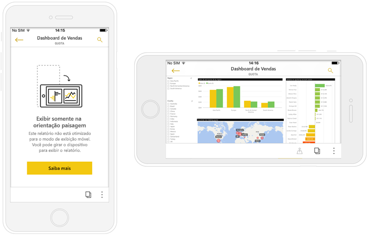
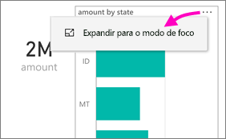
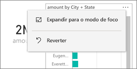
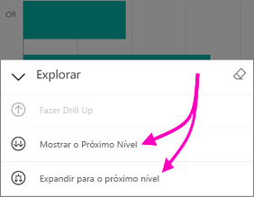
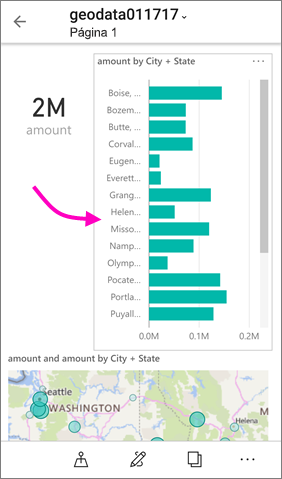

# Exibir relatórios do Power BI otimizados para seu telefone

Aplica-se a:

|  |  |
|:--- |:--- |
| iPhones |Telefones Android |

Quando você exibe um relatório do Power BI em seu telefone, o Power BI verifica se o relatório foi otimizado para telefones. Em caso afirmativo, o Power BI abre automaticamente o relatório otimizado no modo de exibição de retrato.

Se um relatório otimizado para telefone não existir, o relatório será aberto, mas no modo de exibição de paisagem não otimizada. Mesmo em um relatório otimizado para telefones, se você mudar a orientação do telefone, o relatório será aberto na exibição não otimizada com o layout original do relatório. Se somente algumas páginas forem otimizadas, você encontrará uma mensagem na exibição de retrato, indicando que o relatório está disponível em paisagem.

Todos os outros recursos de relatórios do Power BI ainda funcionam em relatórios otimizados para telefones. Leia mais sobre o que você pode fazer em:

* [Relatórios sobre iPhones](mobile-reports-in-the-mobile-apps.md). 
* [Relatórios sobre telefones Android](mobile-reports-in-the-mobile-apps.md).

## Filtrar a página de relatório em um telefone
Se um relatório otimizado para telefone tiver filtros definidos, quando ele for exibido em um telefone, será possível utilizar esses filtros. O relatório é aberto em seu telefone, filtrado para os valores que estão sendo filtrados no relatório na web. Você verá uma mensagem informando que existem filtros ativos na página. É possível alterar os filtros no seu telefone.

1. Toque no ícone de filtro  na parte inferior da página. 
2. Use a filtragem básica ou avançada para ver os resultados em que você está interessado.
   
    

## Elementos visuais com realce cruzado
Elementos visuais em Retrato de realce cruzado exibição funciona da forma que faz no serviço do Power BI e em telefones no modo paisagem: quando você seleciona dados em um visual, dados relacionados são realçados em outros visuais nessa página.

Leia mais sobre [filtragem e realce no Power BI](../../power-bi-reports-filters-and-highlighting.md).

## Selecionar elementos visuais
Em relatórios de telefone quando você seleciona um elemento visual, o relatório realça o elemento visual e foca nele, neutralizando gestos da tela.

Com o visual selecionado, você executar ações como rolar no elemento visual. Para cancelar a seleção de um elemento visual, basta tocar em qualquer parte fora da área do elemento visual.

## Abrir elementos visuais em modo de foco
Relatórios de telefone também oferecem um modo de foco: Você pode obter uma exibição maior de um único visual e explorá-lo mais facilmente.

* Em um relatório de telefone, toque no botão de reticências ( **...** ) no canto superior direito de um visual > **Expandir para o modo de foco**.
  
    

O que fazer no modo de foco é transportado para a tela de relatório e vice-versa. Por exemplo, se você realça um valor em um visual e depois retornar ao relatório inteiro, o relatório é filtrado para o valor realçado no visual.

Algumas ações somente são possíveis no modo de foco, devido às restrições de tamanho de tela:

* **Detalhar** as informações exibidas em um visual. Leia mais sobre como [fazer drill-down e up](mobile-apps-view-phone-report.md#drill-down-in-a-visual) em um relatório de telefone abaixo.
* **Classifique** os valores no elemento visual.
* **Reverter**: desmarque as etapas de exploração que você efetuou em um visual e reverta para a definição estabelecida quando o relatório foi criado.
  
    Para limpar toda a exploração de um visual, toque no botão de reticências ( **...** ) > **Reverter**.
  
    
  
    Reverter está disponível no nível do relatório, limpando a exploração de todos os elementos visuais, ou no nível de visual, limpando a exploração de visual selecionado.   

## Fazer drill down em um visual
Se os níveis hierárquicos forem definidos em um visual, você poderá fazer drill down nas informações detalhadas exibidas em um visual e, em seguida, fazer backup. [Adicione o drill-down em um visual](../end-user-drill.md) no serviço do Power BI ou no Power BI Desktop.

Há alguns tipos de drill-down:

### Fazer drill down em um valor
1. Toque longa (tap e hold) em um ponto de dados em um visual.
2. Dica de ferramenta será exibida, e se a hierarquia é definida, o rodapé da dica de ferramenta mostrará drill down e seta para cima.
3. Toque na seta para baixo para fazer drill down

    
    
4. Toque na seta para cima para fazer drill-up.

### Fazer drill para o próximo nível
1. Em um relatório em um telefone, toque no botão de reticências ( **...** ) no canto superior direito > **Expandir para o modo de foco**.
   
    
   
    Neste exemplo, as barras mostram os valores de estados.
2. Toque no ícone Explorar  no canto inferior esquerdo.
   
    
3. Toque em **Mostrar o próximo nível** ou em **Expandir para o próximo nível**.
   
    
   
    Agora as barras mostram os valores para as cidades.
   
    
4. Se você tocar na seta no canto superior esquerdo, você voltará ao relatório de telefone com os valores ainda expandidos para um nível inferior.
   
    
5. Para voltar ao nível original, toque no botão de reticências ( **...** ) novamente > **Reverter**.
   
    

## Detalhar de um valor
Drill-through conecta-se valores em uma página de relatório, com outras páginas do relatório. Quando você analisar por meio de um ponto de dados para outra página de relatório, os valores de ponto de dados são usados para filtrar o esburacado por meio da página, ou ele estará no contexto dos dados selecionados.
Os autores de relatório podem [definem o drill-through](https://docs.microsoft.com/power-bi/desktop-drillthrough) quando criam o relatório.

1. Toque longa (tap e hold) em um ponto de dados em um visual.
2. Dica de ferramenta aparecerá e se detalhamento for definido, o rodapé da dica de ferramenta mostrará drill-through seta.
3. Toque na seta para drill-through.

    

4. Escolha qual página de relatório para drill-through

    

5. Use o botão Voltar, o cabeçalho de aplicativo para voltar para a página a que partir do início.

## Próximas etapas
* [Criar relatórios otimizados para os aplicativos de telefone do Power BI](../../desktop-create-phone-report.md)
* [Criar uma exibição de telefone de um dashboard no Power BI](../../service-create-dashboard-mobile-phone-view.md)
* [Criar visuais responsivos otimizados para qualquer tamanho](../../visuals/desktop-create-responsive-visuals.md)
* Mais perguntas? [Experimente perguntar à Comunidade do Power BI](http://community.powerbi.com/)

