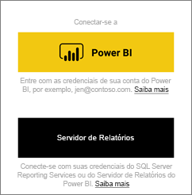
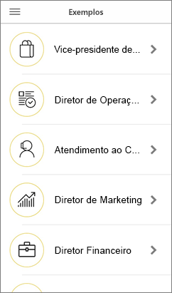
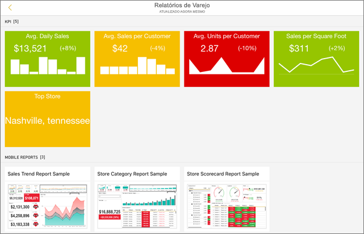
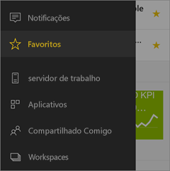
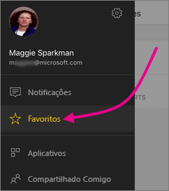
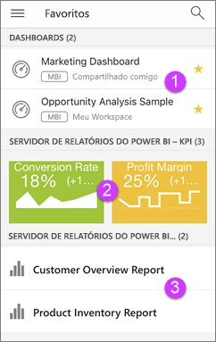

# Introdução ao aplicativo móvel do Power BI em dispositivos iOS
O aplicativo Microsoft Power BI para iOS no iPhone, iPad ou iPod Touch oferece a experiência móvel do BI para Power BI, Servidor de Relatórios do Power BI e Reporting Services. Exiba e interaja com os dashboards de sua empresa localmente e na nuvem em qualquer lugar, com acesso móvel dinâmico e habilitado para toque. Explore os dados em dashboards e compartilhe com seus colegas em mensagens de email ou de texto. Além disso, mantenha atualizado com seus dados mais recentes em seu [Apple Watch](mobile-apple-watch.md).  

Crie relatórios do Power BI no Power BI Desktop e publique-os:

* [Publique-os no serviço do Power BI](../../service-get-started.md) e crie dashboards.
* [Publique-os localmente no Servidor de Relatórios do Power BI](../../report-server/quickstart-create-powerbi-report.md).

Em seguida, no aplicativo móvel do Power BI para iOS, você interage com os dashboards e relatórios, localmente ou na nuvem.

Descubra as [novidades nos aplicativos móveis do Power BI](mobile-whats-new-in-the-mobile-apps.md).

## Baixar o aplicativo
[Baixe o aplicativo iOS](http://go.microsoft.com/fwlink/?LinkId=522062 "Baixe o aplicativo iOS") na Apple App Store para seu iPhone, iPad ou iPod Touch.

Você pode executar o aplicativo do Power BI para iOS no iPhone 5 e posterior, com iOS 10 ou posterior. Você também pode executá-lo em um iPad ou iPod Touch com iOS 10 ou posterior. 

## Inscreva-se no serviço do Power BI
Se ainda não se inscreveu, acesse [powerbi.com](https://powerbi.microsoft.com/get-started/) e, em **Power BI – Colaboração e compartilhamento em nuvem**, selecione **Experimentar gratuitamente**.

## Introdução ao aplicativo Power BI
1. Em seu dispositivo iOS, abra o aplicativo Power BI.
2. Para exibir painéis do Power BI, toque em **Power BI**.  
   Para exibir os relatórios móveis e KPIs do Reporting Services, toque em **SQL Server Reporting Services**.
   
   
   
   Quando estiver usando o aplicativo, basta tocar no botão de navegação global  no canto superior esquerdo para alternar entre os dois. 

## Experimente os exemplos do Power BI e Reporting Services
Mesmo sem se inscrever, você pode experimentar os exemplos do Power BI e Reporting Services. Depois de baixar o aplicativo, você pode exibir os exemplos ou começar. Volte para os exemplos sempre que quiser na navegação global.

### Exemplos do Power BI
Você pode exibir e interagir com os exemplos de dashboard do Power BI, mas há algumas coisas que você não pode fazer com eles. Você não pode abrir relatórios atrás dos dashboards, compartilhar os exemplos com outras pessoas ou adicioná-los aos seus favoritos.

1. Toque no botão de navegação global  no canto superior esquerdo.
2. Toque no ícone de engrenagem no canto superior direito  e, em seguida, toque em **Exemplos do Power BI**.
3. Escolha uma função e explore o dashboard de exemplo para essa função.  
   
   
   
   > [!NOTE]
   > Nem todos os recursos estão disponíveis nos exemplos. Por exemplo, você não pode exibir os relatórios de exemplo subjacentes aos painéis. 
   > 
   > 

### Exemplos de relatórios móveis do Reporting Services
1. Toque no botão de navegação global  no canto superior esquerdo.
2. Toque no ícone de engrenagem no canto superior direito  e, em seguida, toque em **Exemplos do Reporting Services**.
3. Abra a pasta Relatórios de Varejo ou Relatórios de Vendas para explorar seus KPIs e relatórios móveis.
   
   

## Encontre seu conteúdo nos aplicativos móveis do Power BI
Seus dashboards e relatórios são armazenados em locais diferentes nos aplicativos móveis do Power BI, dependendo de onde eles vieram. Leia sobre [finding your content in the mobile apps](mobile-apps-quickstart-view-dashboard-report.md) (localizando seu conteúdo em aplicativos móveis). Além disso, a qualquer momento, você pode pesquisar por qualquer coisa que você tenha nos aplicativos móveis do Power BI. 

Leia mais sobre [finding your content in the mobile apps](mobile-apps-quickstart-view-dashboard-report.md) (localizando seu conteúdo em aplicativos móveis).

## Exibir seus dashboards, KPIs e relatórios favoritos
Na página Favoritos nos aplicativos móveis, você verá todos os seus dashboards favoritos do Power BI, juntamente com os KPIs e relatórios do Servidor de Relatório do Power BI e do Reporting Services. Quando você torna um painel *favorito* no aplicativo móvel do Power BI, você pode acessá-lo de todos os seus dispositivos, incluindo o serviço do Power BI no seu navegador. 

* Toque em **Favoritos**.
  
   
  
   Você vê todos os seus favoritos juntos nesta página:
  
   
  
  1. Dashboards no serviço do Power BI
  2. KPIs no Servidor de Relatório do Power BI
  3. Relatórios do Power BI no Servidor de Relatório do Power BI

Leia mais sobre [favoritos nos aplicativos móveis do Power BI](mobile-apps-favorites.md).

## Suporte corporativo para aplicativos móveis do Power BI
As organizações podem usar o Microsoft Intune para gerenciar dispositivos e aplicativos, incluindo os aplicativos móveis do Power BI para Android e iOS.

O Microsoft Intune permite que as organizações controlem itens, como exigir um PIN de acesso, controlar como os dados serão manipulados pelo aplicativo e até mesmo criptografar dados de aplicativo quando ele não estiver em uso.

> [!NOTE]
> Se você usar o aplicativo móvel do Power BI em seu dispositivo iOS e sua organização tiver configurado o Microsoft Intune MAM, a atualização de dados em segundo plano será desabilitada. Na próxima vez que você entrar no aplicativo, o Power BI atualiza os dados do serviço do Power BI na Web.
> 

Leia mais sobre [Configurar aplicativos móveis do Power BI com o Microsoft Intune](../../service-admin-mobile-intune.md). 

## Próximas etapas

* [O que é o Power BI?](../../power-bi-overview.md)
* Dúvidas? [Experimente perguntar à Comunidade do Power BI](http://community.powerbi.com/)

