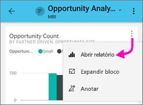

# Explorar relatórios nos aplicativos móveis do Power BI
Aplica-se a:

|  |  |  |  |  |
|:--- |:--- |:--- |:--- |:--- |
| iPhones |iPads |Telefones Android |Tablets Android |Dispositivos Windows 10 |

Um relatório do Power BI é uma exibição interativa de seus dados, com visuais representando diferentes descobertas e informações obtidas desses dados. A exibição de relatórios nos aplicativos móveis do Power BI é a terceira etapa de um processo de três etapas.

1. [Criar relatórios no Power BI Desktop](../../desktop-report-view.md). Você pode até mesmo [otimizar um relatório para telefones](mobile-apps-view-phone-report.md) no Power BI Desktop. 
2. Publique esses relatórios para o serviço do Power BI [(https://powerbi.com)](https://powerbi.com) ou [Servidor de Relatórios do Power BI](../../report-server/get-started.md).  
3. Em seguida, interagir com esses relatórios nos aplicativos móveis do Power BI.

## Abrir um relatório do Power BI no aplicativo móvel
Os relatórios do Power BI são armazenados em locais diferentes no aplicativo móvel, dependendo de onde eles foram obtidos. Eles podem estar em Aplicativos, Compartilhado comigo, Workspaces (incluindo Meu Workspace) ou em um servidor de relatório. Às vezes, você percorre um dashboard relacionado para obter um relatório e, às vezes, ele é listado.

Listas e menus, você encontrará um ícone ao lado de um nome de relatório, ajudando você a entender que este item é um relatório. 

 

Há dois ícones para relatórios nos aplicativos móveis do Power BI:

*  indica um relatório que será apresentado na orientação paisagem no aplicativo e terão a mesma aparência como ela aparece no navegador.

*  indica um relatório que tenha pelo menos uma página de relatório otimizado para telefone, que será apresentada em retrato. 

Observação: Com seu telefone em paisagem, você sempre obterá o layout de paisagem, mesmo se a página de relatório tem o layout do telefone. 

Para obter um relatório de um dashboard, toque nas reticências (...) no canto superior direito de um bloco > **abrir relatório**.
  
  
  
  Nem todos os blocos têm a opção de serem abertos em um relatório. Por exemplo, os blocos criados por meio de uma pergunta na caixa de P e R não abrem relatórios quando você toca neles. 
  
## Interagir com relatórios
Quando você tiver um relatório aberto no aplicativo, você pode começar a trabalhar com ele. Há muitas coisas que você pode fazer com seu relatório e seus dados. No rodapé do relatório, você encontrará as ações que você pode executar no relatório e tocar e os dados mostrados no relatório, você também pode fatiar e dividir os dados de um toque longo.

### Usando o toque e toque longa
Clique em toque igual a um mouse. Portanto, se você quiser realizar o realce cruzado do relatório com base em um ponto de dados, toque no ponto de dados.
Tocando em um valor de segmentação de dados, torna o valor selecionado e o restante do relatório de divisão por aquele valor. Tocando em um link, botão ou indicador será ativá-lo com base na ação definida pelo autor.

Você deve ter notado que quando você toca em um visual, uma borda é exibida. No canto superior direito da borda, não há botão de reticências (...). Tocar nele, trará um menu com as ações que você pode fazer no visual.

### Dica de ferramenta e simulação de ações

Quando você longa toca (tap e hold) um ponto de dados, uma dica de ferramenta aparecerá apresentar os valores que representa este ponto de dados. 

Os autores de relatório podem definir hierarquias dos dados e as relações entre as páginas do relatório. Hierarquia permite o detalhamento, análise e drill-through outra página de relatório de um visual e um valor. Dessa forma, quando você toca longa em um valor, além de dicas de ferramentas, as opções de análise relevante serão exibida no rodapé. 

Com o *detalhamento*, quando você toca em uma parte específica de um visual, o Power BI leva a uma página diferente no relatório, filtrada com o valor tocado.  O autor de um relatório pode definir uma ou mais opções de detalhamento, cada uma levando a uma página diferente. Nesse caso, você pode escolher para qual delas deseja exibir o detalhamento. O botão Voltar o levará de volta à página do relatório anterior.

Veja como [Adicionar o detalhamento no Power BI Desktop](../../desktop-drillthrough.md).
   
   > [!IMPORTANT]
   > No aplicativo móvel do Power BI, drill em visuais de matriz e tabela está habilitado por meio de um valor de célula e não por cabeçalhos de coluna e linha.
   
   
   
### Usando as ações no rodapé do relatório
O rodapé do relatório tem ações que você pode fazer na página do relatório atual ou em todo o relatório. O rodapé tem acesso rápido às ações mais úteis e todas as ações podem ser acessadas no botão de reticências (...).

As ações que você pode executar no rodapé são:
1) Redefina o filtro de relatório e seleções de volta ao estado original de realce cruzado.
2) Abra o painel de conversa para exibir ou adicionar comentários neste relatório.
3) Abra o painel de filtro para exibir e modificar o filtro aplicado no momento no relatório.
4) Liste todas as páginas neste relatório. Toque no nome da página carregará e apresentar nessa página.
Mover entre as páginas de relatório pode ser feito passando o dedo da borda da tela para o centro.
5) Exiba todas as ações de relatório.

#### Todas as ações de relatório
Tocando na... opção no rodapé do relatório, exibirá todas as ações que você pode executar em um relatório. 

Algumas das ações podem ser desabilitadas, pois são dependentes nos recursos de relatório específico.
Por exemplo:
1) **Filtrar por localização atual** estará habilitada se os dados em seu relatório foi categorizados pelo autor com dados geográficos. [Saiba como identificar dados geográficos em seu relatório](https://docs.microsoft.com/power-bi/desktop-mobile-geofiltering).
2) **Verificação para filtrar o relatório por código de barras** estará habilitada apenas se o conjunto de dados em seu relatório foi marcado como código de barras. [Como marcar códigos de barras no Power BI Desktop](https://docs.microsoft.com/power-bi/desktop-mobile-barcodes). 
3) **Convidar** estará habilitada apenas se você tem permissão para compartilhar este relatório com outras pessoas. Você terá permissão somente se você for o proprietário do relatório ou se você recebeu permissão de compartilhar novamente pelo proprietário.
4) **Anotar e compartilhar** pode ser disable se não houver uma [política de proteção Intune](https://docs.microsoft.com/intune/app-protection-policies) em sua organização que proibidos de compartilhamento do aplicativo móvel do Power BI. 

## Próximas etapas
* [Exibir e interagir com relatórios do Power BI otimizados para seu telefone](mobile-apps-view-phone-report.md)
* [Criar uma versão de um relatório otimizado para telefones](../../desktop-create-phone-report.md)
* Dúvidas? [Experimente perguntar à Comunidade do Power BI](http://community.powerbi.com/)

