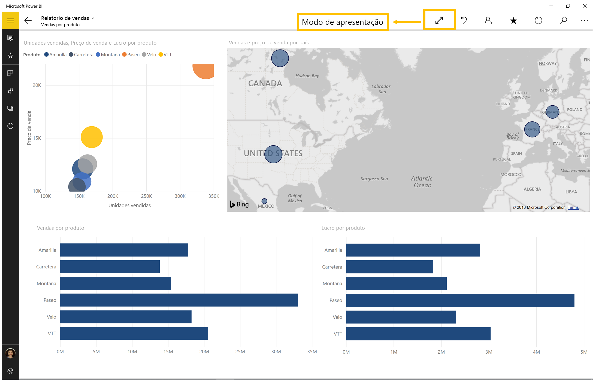
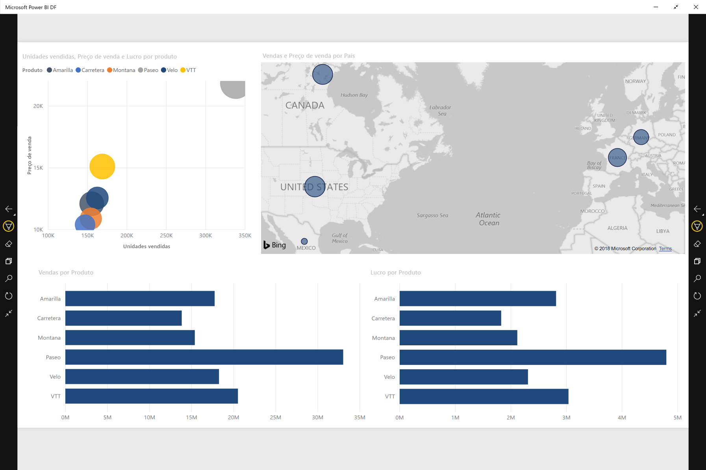
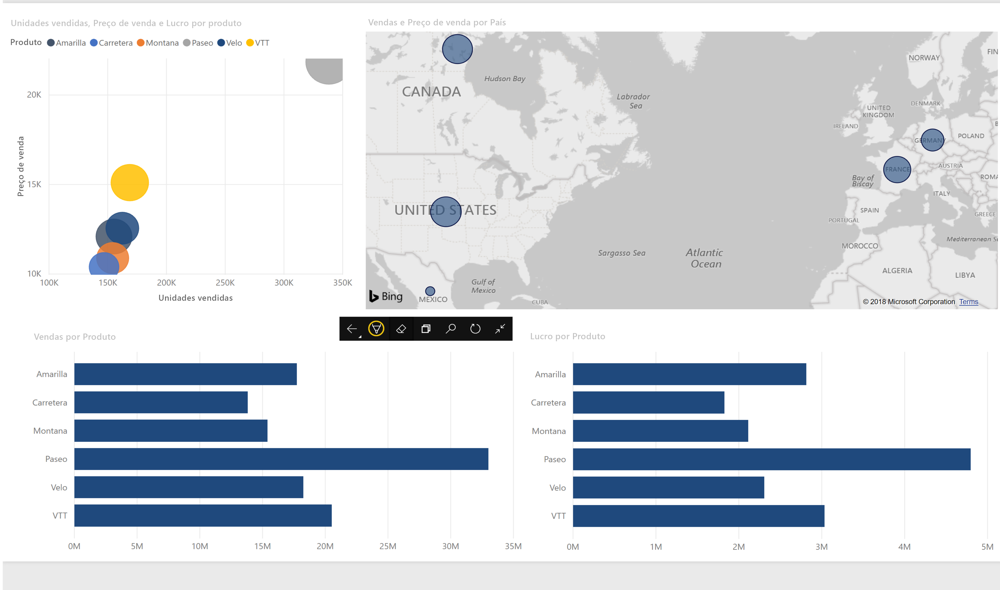

# Exibir relatórios e dashboards no modo de apresentação no Surface Hub e em dispositivos Windows 10
É possível usar o modo de apresentação para exibir relatórios e dashboards em tela inteira em dispositivos Windows 10 e no Surface Hub. 

O modo de apresentação é útil para a exibição do Power BI em uma reunião ou conferência ou em um projetor dedicado em um escritório, ou até mesmo para maximizar o espaço em uma tela pequena. 

No modo de apresentação no aplicativo móvel do Power BI para Windows 10, todos os "cromos", como as barras de navegação e de menus são removidos para permitir que você e os membros da sua equipe privilegiem os dados em seu relatório. Uma barra de ferramentas com ações será disponibilizada para você e permitirá que você interaja e colabore com seus dados enquanto você estiver no modo de apresentação.

Você também pode [exibir dashboards e relatórios no modo de tela inteira do serviço do Power BI](../end-user-focus.md) na Web.

> [!NOTE]
> O modo de apresentação é diferente do [modo de foco para blocos](mobile-tiles-in-the-mobile-apps.md).
> 
> 

## Usar modo de apresentação
No aplicativo móvel do Power BI, toque no ícone **Tela inteira** para ir para o modo de tela inteira.
 O cromo do aplicativo desaparecerá e uma barra de ferramentas será exibida na parte inferior da tela ou nos lados esquerdo e direito (depende do tamanho da tela).

Na barra de ferramentas, é possível executar as seguintes ações:

1. Tocar no ícone de voltar  para voltar à página anterior. Um toque longo no ícone exibirá as janelas de trilhas, permitindo que você navegue até a pasta do seu relatório ou do dashboard.
2. O ícone de tinta  permitirá escolher uma cor quando você usar a caneta de superfície para desenhar e anotar em sua página de relatório. 
3. Use o ícone de páginas  para substituir a página de relatório que no momento você está apresentando.
4. Toque no ícone de pesquisa  para procurar outros artefatos no Power BI.
5. Para sair do modo de apresentação, toque no ícone com duas setas voltadas para dentro  na barra de ferramentas.

É possível desencaixar a barra de ferramentas e arrastá-la para colocá-la em qualquer lugar da tela. Isso é útil para grandes telas, quando você desejar se concentrar em uma área específica em seu relatório e desejar ter as ferramentas disponíveis ao lado dela. Basta colocar o dedo na barra de ferramentas e passá-la para a tela de relatório.

## Próximas etapas
* [Exibir painéis e relatórios no modo de tela inteira do serviço do Power BI](../end-user-focus.md)
* Dúvidas? [Experimente perguntar à Comunidade do Power BI](http://community.powerbi.com/)

