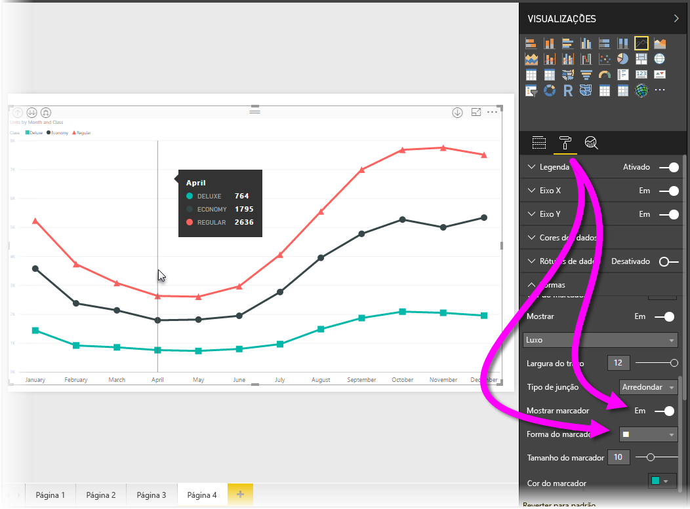
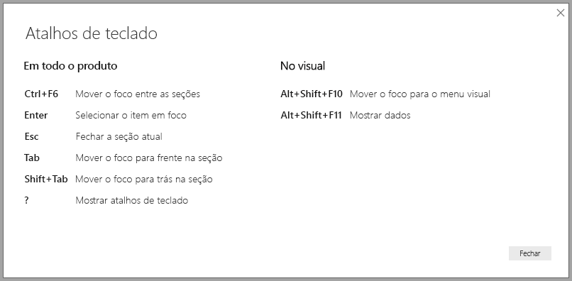
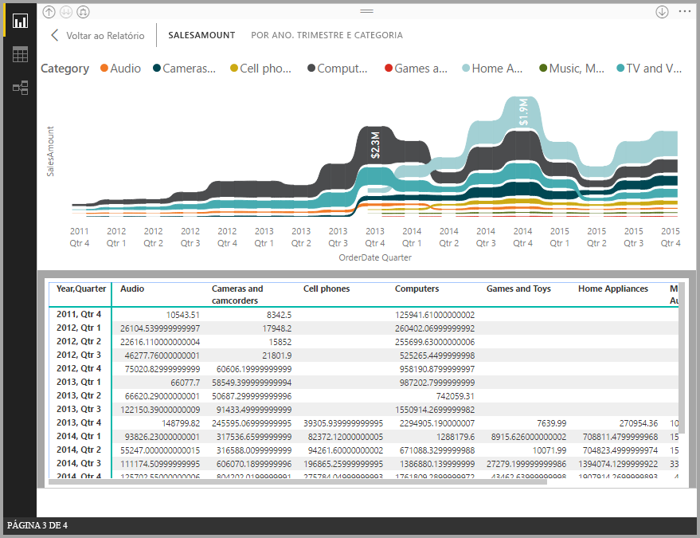
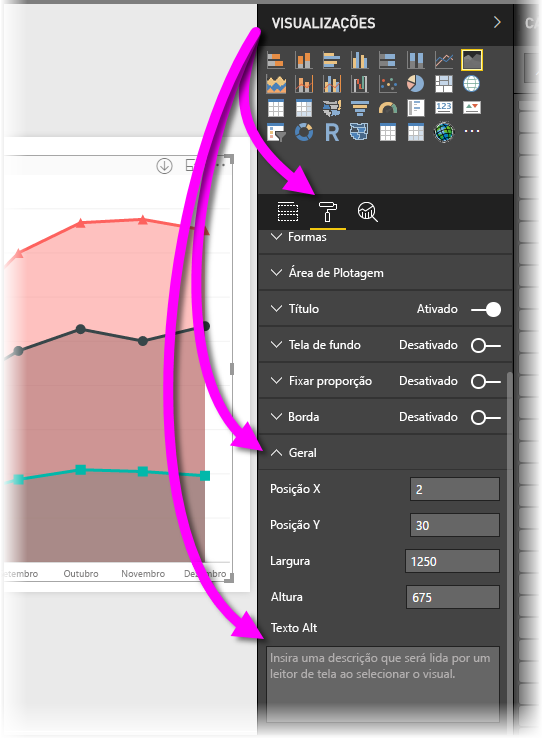

# Acessibilidade dos relatórios do Power BI Desktop
O Power BI tem recursos que permitem que pessoas com deficiências consumam e interajam mais facilmente com os relatórios do Power BI Desktop. Esses recursos incluem a capacidade de consumir um relatório usando o teclado ou um leitor de tela, usar a tabulação para focar em vários objetos em uma página e o uso cuidadoso de marcadores nas visualizações.

> [!NOTE]
> Esses recursos de acessibilidade estão disponíveis com a versão de junho de 2017 do **Power BI Desktop** e com versões posteriores. Funcionalidades de acessibilidade adicionais também estão planejadas para versões futuras.
> 
> 

## Consumir um relatório do Power BI Desktop com um leitor de tela ou um teclado
A partir da versão de setembro de 2017 do **Power BI Desktop**, você pode pressionar a tecla **?** para mostrar uma janela que descreve os atalhos de teclado de acessibilidade disponíveis no **Power BI Desktop**.

Com as melhorias de acessibilidade, você pode consumir um relatório do Power BI usando um teclado ou um leitor de tela com as seguintes técnicas:

Você pode alternar o foco entre as guias de páginas do relatório ou entre objetos em uma determinada página do relatório usando **Ctrl+F6**.

* Quando o foco estiver nas *guias de páginas do relatório*, use as teclas *Tab* ou de *Seta* para mover o foco de uma página de relatório para a próxima. O título da página do relatório e se ele está selecionada, é lida pelo leitor de tela. Para carregar a página do relatório que está em foco, use a tecla *Enter* ou *Espaço*.
* Quando o foco estiver em uma *página de relatório* carregada, use a tecla *Tab* para alternar o foco para cada objeto em uma página, o que inclui todas as caixas de texto, imagens, formas e gráficos. O leitor de tela lê o tipo de objeto, o título do objeto, quando há, e uma descrição desse objeto, quando o autor do relatório fornece. 

Ao navegar entre os visuais, se você quiser interagir mais com eles, pressione **Alt + Shift + F10** para mover o foco para o cabeçalho do visual, que contém várias opções, incluindo classificação, exportação dos dados por trás do gráfico e modo de foco. 

Você pode pressionar **Alt + Shift + F11** para apresentar uma versão acessível da janela *Mostrar dados*. Isso permitirá que você explore os dados usados no Visual em uma tabela HTML, usando os mesmos atalhos de teclado que normalmente são usados com o leitor de tela. 

> [!NOTE]
> O recurso Mostrar dados somente pode ser acessado em um leitor de tela com esse atalho de teclado. Se você abrir Mostrar dados por meio da opção no cabeçalho do visual, ele não poderá ser acessado em um leitor de tela.

A partir da versão de julho de 2018 do **Power BI Desktop**, as segmentações de dados também passam a ter a funcionalidade de acessibilidade interna. Para ajustar o valor de uma segmentação de dados quando esta estiver selecionada, use Ctrl+Seta para a direita (tecla Control e seta para a direita) para percorrer os vários controles na segmentação de dados. Por exemplo, ao pressionar inicialmente Ctrl+Seta para a direita, o foco ficará na borracha. Pressionar a Barra de espaços equivale a clicar no botão da borracha, que apaga todos os valores na segmentação de dados. 

Você pode percorrer os controles em uma segmentação de dados pressionando a tecla Tab. Pressionar a tecla Tab estando na borracha move para o botão suspenso; pressionar Tab outra vez move para o primeiro valor de segmentação de dados (se houver vários valores para a segmentação de dados, como um intervalo). 

Essas adições de acessibilidade foram criadas para permitir que os usuários consumam por completo os relatórios do Power BI usando um leitor de tela e a navegação do teclado.

## Dicas para criar relatórios acessíveis
As dicas a seguir podem ajudá-lo a criar relatórios do **Power BI Desktop** que são mais acessíveis.

* Para visuais de **Linha**, **Área** e **Combinação**, bem como para visuais de **Dispersão** e de **Bolha**, ative os marcadores e use uma *Forma de marcador* diferente para cada linha.
  
  * Para ativar os *Marcadores*, selecione a seção **Formato** no painel **Visualizações**, expanda a seção **Formas** e, em seguida, role para baixo até encontrar a tecla de alternância **Marcadores** e posicione-a em *Ativado*.
  * Em seguida, selecione o nome de cada linha (ou área, se estiver usando um gráfico de **Área**) na caixa suspensa na seção **Formas**. Abaixo da lista suspensa, você pode ajustar vários aspectos do marcador usado para a linha selecionada, incluindo seu tamanho, cor e forma.
  
  
  
  * Usar uma *Forma de marcador* diferente para cada linha torna mais fácil para os consumidores do relatório diferenciar as linhas (ou áreas) umas das outras.
* Como um lembrete do marcador anterior, não confie na cor para transmitir informações. Além de usar formas em gráficos de dispersão e de linha, não confie na formatação condicional para fornecer insights em tabelas e matrizes. 
* Escolha uma ordem de classificação intencional para cada visual em seu relatório. Quando os usuários de leitores de tela navegarem nos dados por trás do gráfico, ele selecionará a mesma ordem de classificação que o visual.
* Selecione um *tema* que tenha alto contraste e que seja amigável para pessoas daltônicas na Galeria de temas e importe-o usando o recurso de versão prévia [**Temas**](desktop-report-themes.md).
* Para cada objeto em um relatório, forneça um *Texto Alt*. Isso garante que os consumidores de seu relatório entendam o que você está tentando comunicar com um visual, mesmo que eles não possam ver o visual, imagem, forma ou caixa de texto. Você pode fornecer um *Texto Alt* para qualquer objeto em um relatório do **Power BI Desktop** selecionando o objeto (como um visual, forma e assim por diante) e, no painel **Visualizações**, selecionando a seção **Formato**, expandindo **Geral** e rolando para baixo e preenchendo a caixa de texto **Texto Alt**.
  
  
* Verifique se os relatórios têm contraste suficiente entre o texto e as cores da tela de fundo. Há várias ferramentas, como o [Analisador de Contraste de Cores](https://developer.paciellogroup.com/resources/contrastanalyser/), que você pode usar para verificar as cores do relatório. 
* Use fontes e tamanhos de texto que podem ser facilmente lidos. Um tamanho de texto pequeno, ou fontes que podem ser difíceis de serem lidas, não serão úteis para acessibilidade.
* Inclua um título, rótulos de eixo e rótulos de dados em todos os visuais.
* Use títulos significativos para todas as páginas de relatório.
* Evite formas e imagens decorativas em seu relatório, se possível, pois elas são incluídas na ordem de tabulação do relatório. Se você precisar incluir objetos decorativos em seu relatório, atualize o texto Alt do objeto para informar aos usuários de leitores de tela que eles são decorativos.

## Suporte para alto contraste em relatórios

Quando você usa os modos de alto contraste no Windows, essas configurações e a paleta selecionada também são aplicadas aos relatórios no **Power BI Desktop**. 

O **Power BI Desktop** detecta automaticamente qual tema de alto contraste está sendo usado no Windows e aplica essas configurações em seus relatórios. Essas cores de alto contraste continuam no relatório quando ele é publicado no serviço do Power BI ou em outro lugar.

O serviço do Power BI também tenta detectar as configurações de alto contraste selecionadas para o Windows, mas o grau de eficácia e precisão dessa detecção depende do navegador usado para o serviço do Power BI. Se você deseja definir o tema manualmente no serviço do Power BI, selecione **Exibição > Cores de alto contraste** e, em seguida, selecione o tema que deseja aplicar ao relatório.

Quando estiver no **Power BI Desktop**, observe que algumas áreas, como os campos **Visualizações** e **Campos** não refletem a seleção de esquema de cores de alto contraste do Windows.

## Considerações e limitações
Há alguns problemas conhecidos e algumas limitações com os recursos de acessibilidade, descritos na seguinte lista:

* Ao usar leitores de tela com o **Power BI Desktop**, a experiência será melhor se você abrir o leitor de tela de sua preferência antes de abrir um arquivo no Power BI Desktop.
* Se você estiver usando o Narrator, haverá algumas limitações ao navegar em Mostrar dados como uma tabela HTML.

## Próximas etapas
* [Usar Temas de Relatório no Power BI Desktop (Versão prévia)](desktop-report-themes.md)

