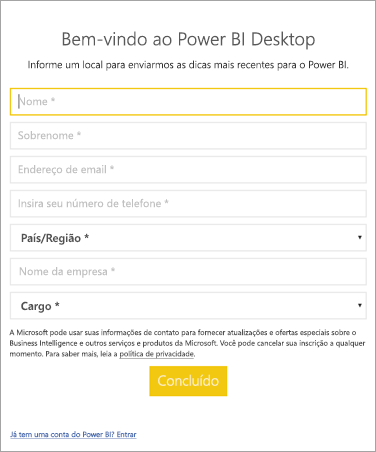

# <a name="how-administrators-can-manage-the-power-bi-desktop-sign-in-form"></a>Como os administradores podem gerenciar o formulário de entrada do Power BI Desktop
Na primeira vez em que o Power BI Desktop é iniciado, é exibido um formulário de entrada. As informações podem ser preenchidas ou entre no Power BI para continuar. Os administradores gerenciam este formulário usando uma chave do Registro. 



Os administradores usam a seguinte chave do Registro para desabilitar o formulário de entrada. Isso também pode ser enviado por push para toda a organização usando políticas globais.

```
Key: HKEY_CURRENT_USER\SOFTWARE\Policies\Microsoft\Microsoft Power BI Desktop
valueName: ShowLeadGenDialog
```
Você também pode experimentar a seguinte chave tiver sido bem-sucedida para alguns clientes com base em suas configurações:

```
Key: HKEY_CURRENT_USER\SOFTWARE\Microsoft\Microsoft Power BI Desktop
valueName: ShowLeadGenDialog
```

Um valor de 0 desabilitará a caixa de diálogo.


Mais perguntas? [Experimente perguntar à Comunidade do Power BI](http://community.powerbi.com/)

