# Agregações no Power BI Desktop (versão prévia)

O uso de **agregações** no Power BI permite a análise interativa em Big Data de formas que anteriormente não eram possíveis. As **agregações** podem reduzir drasticamente o custo de usar grandes conjuntos de dados para a tomada de decisão.

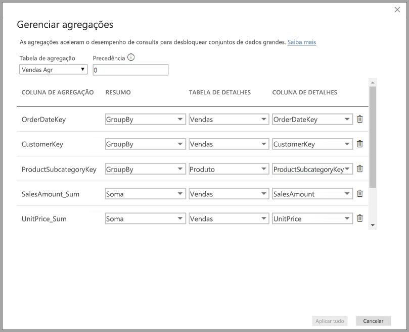

A lista a seguir oferece as vantagens de usar **agregações**:

* **Desempenho de consulta em grandes conjuntos de dados** – conforme os usuários interagem com visuais nos relatórios do Power BI, as consultas DAX são enviadas ao conjunto de dados. Impulsione velocidades de consulta armazenando os dados em cache no nível agregado, usando uma fração dos recursos necessários no nível de detalhe. Use Big Data de uma forma que não seria possível de outra maneira.
* **Otimização da atualização de dados** – reduza os tamanhos de cache e tempos de atualização armazenando os dados em cache no nível agregado. Acelere o tempo para disponibilizar dados para os usuários.
* **Obter arquiteturas equilibradas** – permita que o cache na memória do Power BI lide com consultas agregadas, o que ele faz com eficiência. Limite as consultas enviadas à fonte de dados no modo DirectQuery, ajudando a ficar dentro dos limites de simultaneidade. As consultas que passam tendem a ser filtradas, consultas de nível da transação, com as quais os data warehouses e sistemas de Big Data normalmente lidam bem.

### Armazenamento em nível de tabela
Normalmente, o armazenamento em nível de tabela é usado com o recurso de agregações. Consulte o artigo [Modo de armazenamento no Power BI Desktop (versão prévia)](desktop-storage-mode.md) para obter mais informações.

### Tipos de fontes de dados
As agregações são usadas com fontes de dados que representam modelos dimensionais, como data warehouses e data marts, assim como fontes de Big Data baseadas no Hadoop. Este artigo descreve as diferenças de modelagem típicas no Power BI para cada tipo de fonte de dados.

Todas as fontes DirectQuery e de Importação do Power BI (não multidimensionais) trabalham com agregações.

## Habilitando a versão prévia do recurso de agregações

O recurso de **agregações** está em versão prévia e deve ser habilitado no **Power BI Desktop**. Para habilitar **agregações**, selecione **Arquivo > Opções e Configurações > Opções > Recursos de Visualização** e marque as caixas de seleção **modelos de composição** e **Gerenciar agregações**. 

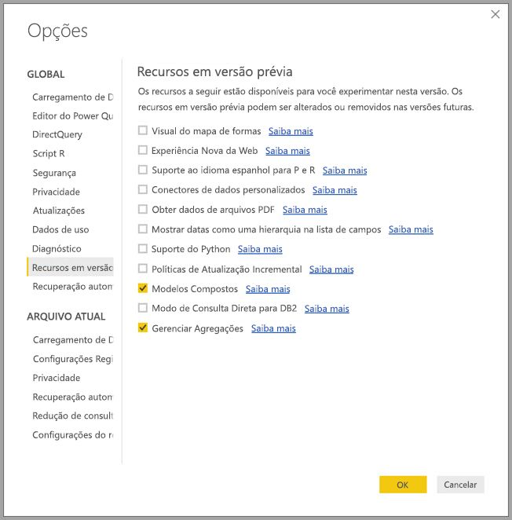

Será preciso reiniciar o **Power BI Desktop** para que o recurso seja habilitado.

## Agregações com base em relações

As **agregações** com base em relações são usadas normalmente com modelos dimensionais. Os conjuntos de dados do Power BI oriundos de data warehouses e data marts se parecem com esquemas floco de neve/estrela com relações entre tabelas de dimensões e tabelas de fatos.

Considere o seguinte modelo, proveniente de uma única fonte de dados. Digamos que todas as tabelas estão usando o DirectQuery para começar. A tabela de fatos **Vendas** contém bilhões de linhas. Definir o modo de armazenamento de **Vendas** como **Importação** para armazenamento em cache consumiria uma sobrecarga considerável de memória e de gerenciamento.

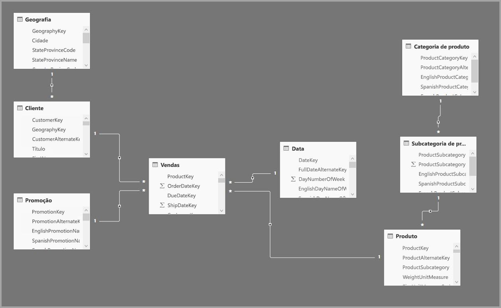

Em vez disso, criamos a tabela **Agregação de vendas** como uma tabela de agregação. Ela está em uma granularidade maior do que **Vendas** e, portanto, conterá muito menos linhas. O número de linhas deve ser igual à soma de **SalesAmount** agrupada por **CustomerKey**, **DateKey** e **ProductSubcategoryKey**. Em vez de bilhões, poderiam ser milhões de linhas, o que é muito mais fácil de gerenciar.

Vamos supor que as seguintes tabelas de dimensões são mais comumente usadas para as consultas com alto valor de negócios. Elas são as tabelas que podem filtrar **Agregação de vendas** usando relações *um-para-muitos* (ou *muitos-para-um*). Outros tipos de relação como *muitos-para-muitos* ou *várias fontes* não são considerados para agregações.

* Geografia
* Cliente
* Data
* Subcategoria de produto
* Categoria de produto

A imagem a seguir mostra este modelo.

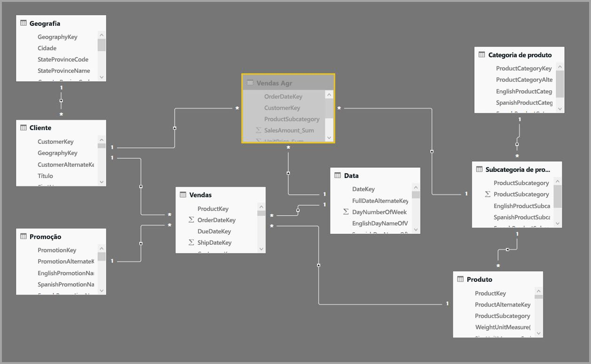

> [!NOTE]
> A tabela **Agregação de vendas** é apenas outra tabela; portanto, ela tem a flexibilidade de ser carregada de diversas formas. Por exemplo, a agregação pode ser executada no banco de dados de origem usando processos ETL/ELT ou pela [Expressão M](https://msdn.microsoft.com/query-bi/m/power-query-m-reference) para a tabela. Ela pode usar o Modo de armazenamento de importação com ou sem a [atualização incremental no Power BI Premium](service-premium-incremental-refresh.md) ou pode ser o DirectQuery e otimizada para consultas rápidas usando [índices columnstore](https://docs.microsoft.com/sql/relational-databases/indexes/columnstore-indexes-overview). Essa flexibilidade permite arquiteturas equilibradas que distribuem a carga de consulta para evitar gargalos.

### Modo de armazenamento 
Vamos continuar com o exemplo que estamos usando. Podemos definir o modo de armazenamento de **Agregação de vendas** como **Importação** para agilizar as consultas.

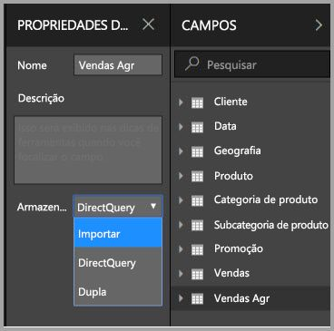

Quando fazemos isso, a seguinte caixa de diálogo é exibida, informando que as tabelas de dimensões relacionadas serão definidas como modo de armazenamento **Dual**. 

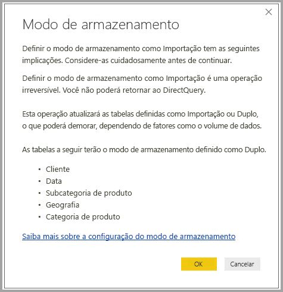

Defini-las como **Dual** permite que as tabelas de dimensões relacionadas atuem como Importação ou DirectQuery dependendo da subconsulta.

* As consultas que agregam métricas na tabela **Agregação de vendas**, que é Importação, e agrupam atributos nas tabelas Dual relacionadas podem ser retornadas do cache na memória.
* As consultas que agregam métricas na tabela **Vendas**, que é DirectQuery, e agrupam por atributos nas tabelas Dual relacionadas podem ser retornadas no modo DirectQuery. A lógica de consulta, incluindo o grupo por operação, será transmitida para o banco de dados de origem.

Para obter mais informações sobre o modo de armazenamento **Dual**, consulte o artigo [modo de armazenamento](desktop-storage-mode.md).

> Observação: a tabela **Agregação de vendas** está oculta. As tabelas de agregação devem ficar ocultas dos consumidores do conjunto de dados. Os consumidores e as consultas referem-se à tabela de detalhes, não à tabela de agregação; eles nem mesmo precisam saber que a tabela de agregação existe.

### Gerenciar caixa de diálogo de agregações
Em seguida, definiremos as agregações. Selecione o menu de contexto **Gerenciar agregações** para a tabela **Agregação de vendas** clicando com o botão direito do mouse na tabela.

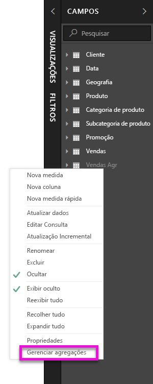

A caixa de diálogo **Gerenciar agregações** é exibida. Ela mostra uma linha para cada coluna na tabela **Agregação de vendas**, em que podemos especificar o comportamento da agregação. As consultas enviadas ao conjunto de dados do Power BI que se referem à tabela **Vendas** são redirecionadas internamente para a tabela **Agregação de vendas**. Os consumidores do conjunto de dados não precisam saber que a tabela **Agregação de vendas** existe.

A tabela a seguir mostra as agregações para a tabela **Agregação de vendas**.

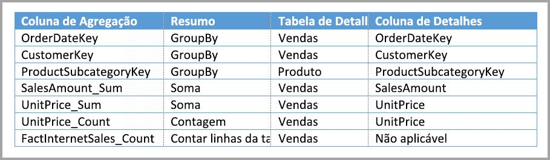

#### Função de resumo

O menu suspenso Resumo oferece os seguintes valores para seleção.
* Contagem
* GroupBy
* Máx.
* Mín.
* Soma
* Contar linhas da tabela

#### Validações

As seguintes validações notáveis são impostas pela caixa de diálogo:

* A coluna de detalhes selecionada deve ter o mesmo tipo de dados que a coluna de agregação, exceto pelas funções de resumo Contar e Contar linhas da tabela. Contar e Contar linhas da tabela são oferecidas apenas para colunas de agregação de inteiros e não exigem um tipo de dados correspondente.
* Não são permitidas agregações encadeadas que abranjam três ou mais tabelas. Por exemplo, não é possível configurar agregações na **Tabela A** que se referem à **Tabela B** que tem agregações que se referem à **Tabela C**.
* Não são permitidas agregações duplicadas em que duas entradas usam a mesma função de resumo e referem-se à mesma coluna/tabela de detalhes.

Durante esta visualização pública para **agregações**, as validações a seguir também são impostas. Pretendemos remover essas validações após a liberação para disponibilidade geral.

* As agregações não podem ser usadas com RLS (segurança em nível de linha). *Limitação de visualização pública.*
* A tabela de detalhes deve ser DirectQuery, não Importação. *Limitação de visualização pública.*

A maioria dessas validações são impostas desabilitando os valores suspensos e mostrando o texto explicativo na dica de ferramenta, conforme mostrado na imagem a seguir.

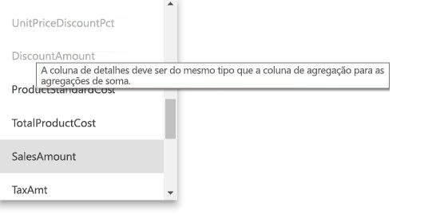

### Agrupar por colunas

Neste exemplo, as três entradas GroupBy são opcionais, elas não afetam o comportamento de agregação (exceto a consulta de exemplo DISTINCTCOUNT, mostrada na próxima imagem). Elas são incluídas principalmente para fins de legibilidade. Sem essas entradas GroupBy, as agregações ainda seriam atingidas com base nas relações. Esse é um comportamento diferente de usar agregações sem relações, que é abrangido pelo exemplo de Big Data fornecido posteriormente neste artigo.

### Detectando se as agregações foram atingidas ou não pelas consultas

Para obter mais informações sobre como detectar se as consultas são retornadas do cache na memória (mecanismo de armazenamento) ou do DirectQuery (enviadas por push à fonte de dados) usando o SQL Profiler, consulte o artigo [modo de armazenamento](desktop-storage-mode.md). Esse processo também pode ser usado para detectar se as agregações estão sendo atingidas.

Além disso, o seguinte evento estendido é fornecido no SQL Profiler.

    Query Processing\Aggregate Table Rewrite Query

O snippet de código JSON a seguir mostra um exemplo da saída do evento quando uma agregação é usada.

* **matchingResult** mostra que uma agregação foi usada para a subconsulta.
* **dataRequest** mostra as colunas agrupar por e as colunas agregadas usadas pela subconsulta.
* **mapping** mostra as colunas na tabela de agregação para as quais foram mapeadas.

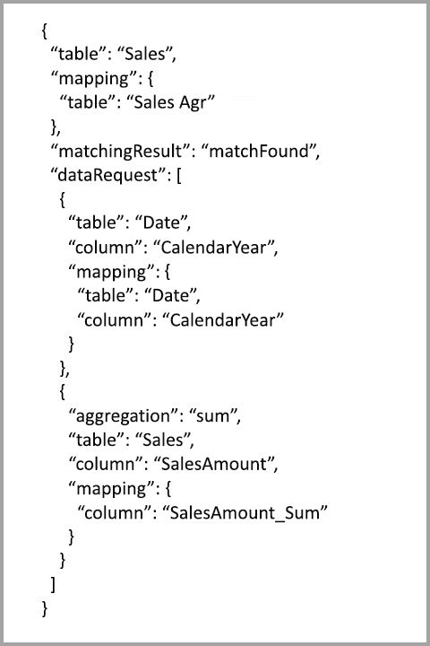

### Exemplos de consulta
A seguinte consulta atinge a agregação, porque as colunas na tabela *Data* estão na granularidade que pode atingir a agregação. Será usada a agregação **Sum** para **SalesAmount**.

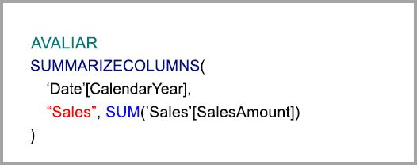

A consulta a seguir não atingirá a agregação. Apesar de solicitar a soma de **SalesAmount**, ela está executando uma operação agrupar por em uma coluna na tabela **Produto**, que não está na granularidade que pode atingir a agregação. Se você observar as relações no modelo, uma subcategoria de produto poderá ter várias linhas **Produto**; a consulta não seria capaz de determinar a qual produto agregar. Nesse caso, a consulta é revertida para DirectQuery e envia uma consulta SQL à fonte de dados.

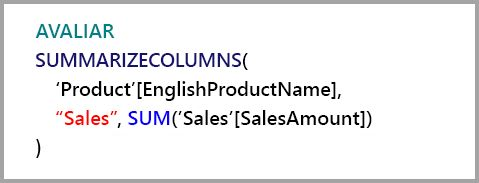

As agregações não são apenas para cálculos simples que executam uma soma simples. Cálculos completos também podem se beneficiar. Conceitualmente, um cálculo complexo é dividido em subconsultas para cada SUM, MIN, MAX e COUNT, e cada subconsulta é avaliada para determinar se a agregação pode ser atingida. Esta lógica não se mantém verdadeira em todos os casos devido à otimização do plano de consulta, mas em geral ela deve ser aplicada. O exemplo a seguir atingirá a agregação:

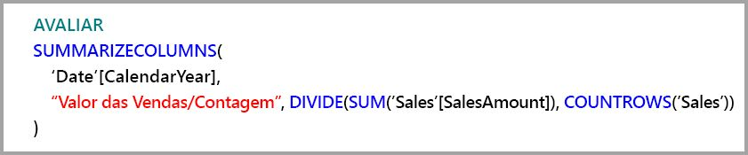

A função COUNTROWS pode se beneficiar das agregações. A seguinte consulta atingirá a agregação, porque há uma agregação **Contar** linhas da tabela definida para a tabela **Vendas**.

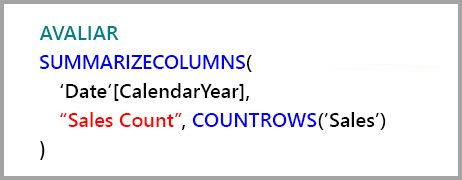

A função AVERAGE pode se beneficiar das agregações. A consulta a seguir atingirá a agregação, porque AVERAGE torna-se internamente um SUM dividido por um COUNT. Como a coluna **UnitPrice** tem agregações definidas para SUM e COUNT, a agregação é atingida.

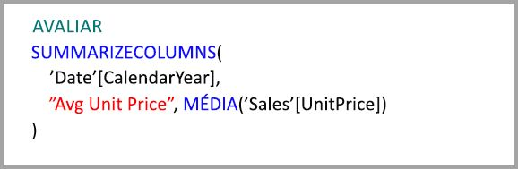

Em alguns casos, a função DISTINCTCOUNT pode se beneficiar de agregações. A consulta a seguir atingirá a agregação, porque há uma entrada GroupBy para **CustomerKey**, que mantém a distinção de **CustomerKey** na tabela de agregação. Esta técnica ainda está sujeita ao limite de desempenho em que mais de aproximadamente de dois a cinco milhões de valores diferentes podem afetar o desempenho da consulta. No entanto, ela pode ser útil em cenários em que há bilhões de linhas da tabela de detalhes e de dois a cinco milhões de valores distintos na coluna. Nesse caso, a contagem distinta poderá ser executada mais rapidamente do que examinar a tabela com bilhões de linhas, mesmo se ela tiver sido armazenada na memória.

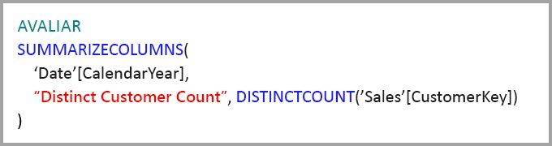

## Agregações baseadas em colunas agrupar por 

Os modelos de Big Data baseados em Hadoop têm características diferentes do que modelos dimensionais. Para evitar junções entre tabelas grandes, elas geralmente não contam com relações. Em vez disso, os atributos de dimensão geralmente são desnormalizados para tabelas de fatos. Esses modelos de Big Data podem ser usados para se fazer uma análise interativa usando **agregações** com base em colunas agrupar por.

A tabela a seguir contém a coluna numérica **Movimento** a ser agregada. Todas as outras colunas são atributos pelos quais agrupar. Ela contém dados de IoT e um grande número de linhas. O modo de armazenamento é DirectQuery. As consultas na fonte de dados agregadas em todo o conjunto de dados são lentas devido ao grande volume.

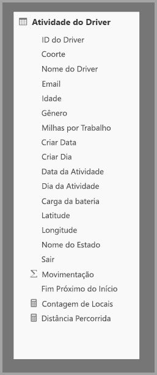

Para habilitar a análise interativa neste conjunto de dados, adicionamos uma tabela de agregação que agrupa pela maioria dos atributos, mas exclui atributos de alta cardinalidade como longitude e latitude. Isso reduz drasticamente o número de linhas, e é pequeno o suficiente para se ajustar confortavelmente em um cache na memória. O modo de armazenamento da **Agregação de atividade do driver** é Importação.

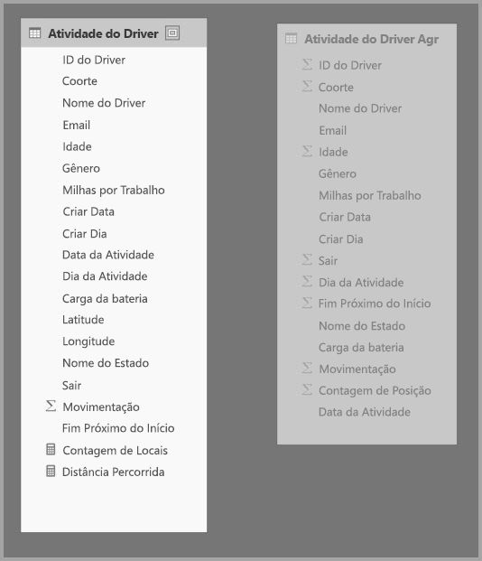

Em seguida, definimos os mapeamentos de agregação na caixa de diálogo **Gerenciar agregações**. Ela exibe uma linha para cada coluna na tabela **Agregação de atividade do driver**, em que podemos especificar o comportamento da agregação.

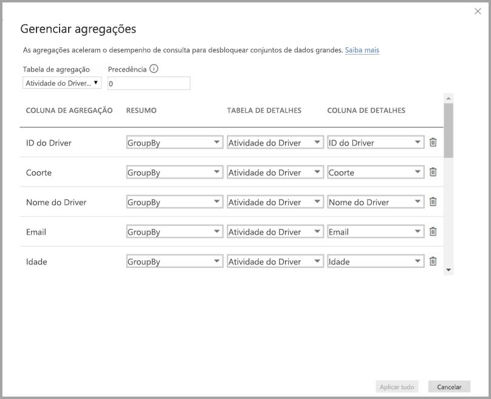

A tabela a seguir mostra as agregações para a tabela **Agregação de vendas**.

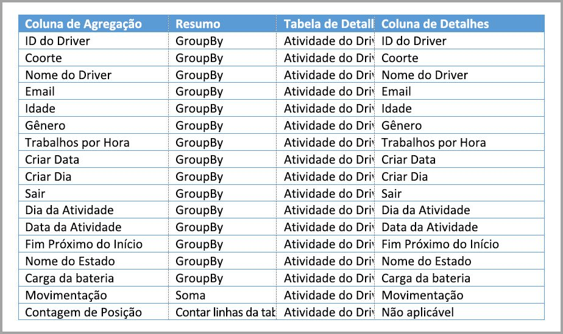

### Agrupar por colunas

Neste exemplo, as entradas **GroupBy** **não são opcionais**; sem elas, as agregações não seriam atingidas. Esse é um comportamento diferente para usar agregações com base em relações, que é abrangido pelo exemplo de modelo dimensional fornecido anteriormente neste artigo.

### Exemplos de consulta

A consulta a seguir atingirá a agregação, porque a coluna **Data da atividade** é abrangida pela tabela de agregação. A agregação Contar linhas da tabela é usada pela função COUNTROWS.

Principalmente para modelos que contêm atributos de filtro em tabelas de fatos, é uma boa ideia usar agregações Contar linhas da tabela. O Power BI pode enviar consultas ao conjunto de dados usando COUNTROWS nos casos não explicitamente solicitados pelo usuário. Por exemplo, a caixa de diálogo de filtro mostra a contagem de linhas para cada valor.

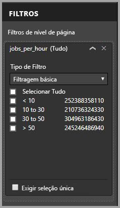

## Precedência de agregação

A precedência de agregação permite que várias tabelas de agregação sejam consideradas por uma única subconsulta.

Considere o exemplo a seguir. É um [modelo de composição](desktop-composite-models.md) que contém várias fontes DirectQuery.

* A tabela de importação **Agregação de atividade do driver2** está em uma alta granularidade, porque os atributos agrupar por são poucos e de baixa cardinalidade. O número de linhas poderia ser tão baixo quanto milhares; portanto, ele pode se ajustar facilmente em um cache na memória. Esses atributos são usados por um importante dashboard executivo, portanto, as consultas referentes a eles devem ser rápidas.
* A tabela **Agregação de atividade do driver** é uma tabela de agregação intermediária em modo DirectQuery. Ela contém mais de um bilhão de linhas e é otimizada na fonte que usa índices columnstore.
* A tabela **Atividade do driver** é DirectQuery e contém mais de um trilhão de linhas de dados de IoT originados de um sistema de Big Data. Ela atende a consultas de detalhamento para exibir leituras de IoT individuais em contextos de filtro controlados.

O volume de memória deste modelo é relativamente pequeno, mas usa um grande conjunto de dados. Ele representa uma arquitetura equilibrada, porque distribui a carga de consulta entre os componentes da arquitetura que os utiliza com base em seus pontos fortes.

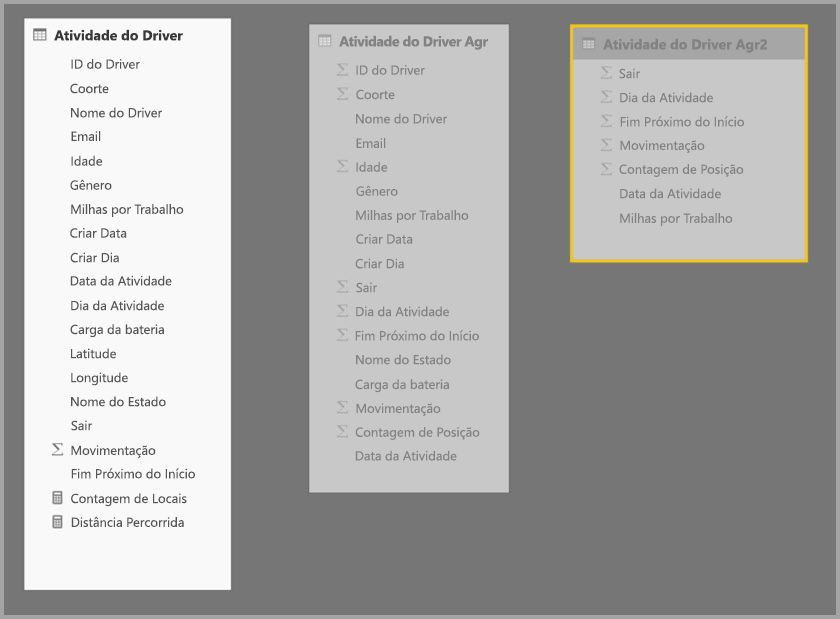

A caixa de diálogo **Gerenciar agregações** para **Agregação de Atividade do Driver2** mostra que o campo *Precedência* é 10, maior do que **Agregação de Atividade do Driver**, o que significa que ele será considerado primeiro por consultas que usam agregações. As subconsultas que não estão na granularidade e que podem ser respondidas por **Agregação de Atividade do Driver2** considerarão **Agregação de Atividade do Driver**. Consultas de detalhes que não podem ser respondidas por nenhuma tabela de agregação serão direcionadas à **Atividade do driver**.

A tabela especificada na coluna **Tabela de detalhes** é **Atividade do driver**, e não **Agregação de atividade do driver**, porque as agregações encadeadas não são permitidas (consulte [validações](#validations) anteriormente neste artigo).

A tabela a seguir mostra as agregações para a tabela **Agregação de vendas**.

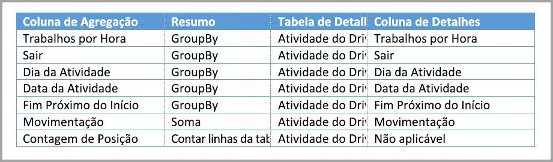

## Agregações baseadas nas colunas agrupar por combinadas com relações

Inclusive, é possível combinar as duas técnicas de agregações descritas anteriormente neste artigo. **Agregações** com base em relações podem exigir que as tabelas de dimensões desnormalizadas sejam divididas em várias tabelas. Se isso for dispendioso ou inviável para determinadas tabelas de dimensão, os atributos necessários poderão ser replicados na tabela de agregação para determinadas dimensões e relações usadas para outras pessoas.

O modelo a seguir replica *Mês*, *Trimestre*, *Semestre* e *Ano* na tabela **Agregação de vendas**. Não há nenhuma relação entre **Agregação de vendas** e a tabela **Data**. Há relações para **Cliente** e **Subcategoria de produto**. O modo de armazenamento de **Agregação de vendas** é Importação.

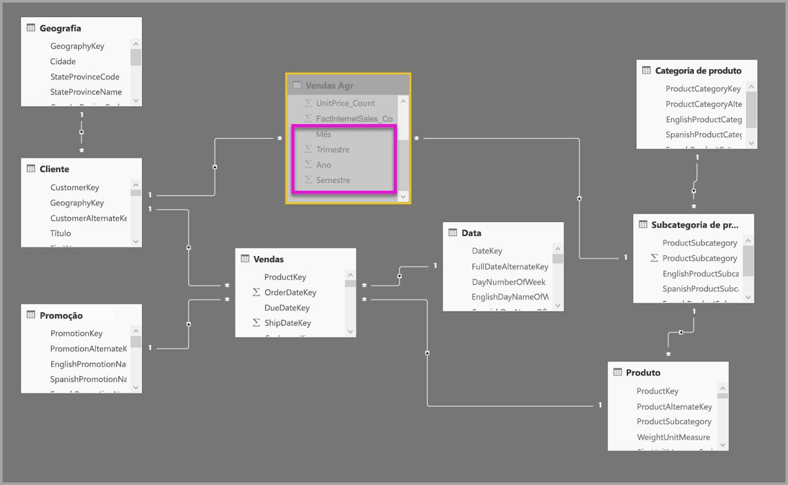

A tabela a seguir mostra as entradas definidas na caixa de diálogo **Gerenciar agregações** da tabela **Agregação de vendas**. As entradas GroupBy em que **Data** é a tabela de detalhes são obrigatórias para atingir agregações para consultas agrupadas pelos atributos de data. Como no exemplo anterior, as entradas GroupBy para CustomerKey e ProductSubcategoryKey não afetam as ocorrências de agregação devido à presença de relações (novamente com a exceção de DISTINCTCOUNT).

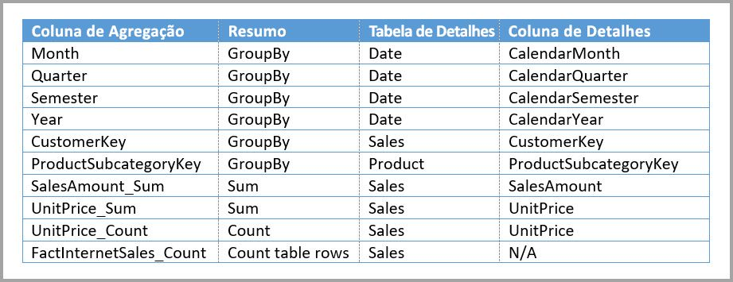

> Observação: esse modelo requer que a tabela **Data** esteja no modo DirectQuery para preencher a caixa de diálogo Gerenciar agregações, porque ele é uma tabela de detalhes. Essa é uma limitação de versão prévia que pretendemos remover da Disponibilidade geral.

### Exemplos de consulta

A consulta a seguir atinge a agregação, porque CalendarMonth é abrangido pela tabela de agregação, e CategoryName está acessível por meio de relações um para muitos. A agregação Sum é usada para **SalesAmount**.

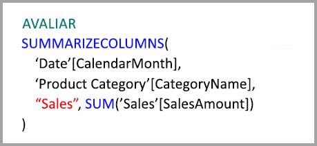

A consulta a seguir não atingirá a agregação, porque CalendarDay não é abrangido pela tabela de agregação.

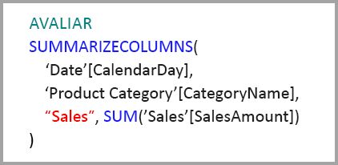

A seguinte consulta de inteligência de tempo não atingirá a agregação porque a função DATESYTD gera uma tabela de valores CalendarDay, não abrangida pela tabela de agregação.

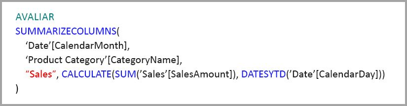

## Os caches devem ser mantidos em sincronia

**Agregações** que combinam o modo de armazenamento DirectQuery e Importação e/ou Dual poderão retornar dados diferentes se o cache na memória não for mantido sincronizado com os dados de origem. A execução da consulta não tentará ocultar os problemas de dados, filtrando, por exemplo, os resultados de DirectQuery para coincidir com os valores armazenados em cache. Esses recursos são otimizações de desempenho e devem ser usados apenas de maneiras que não comprometam sua capacidade de atender aos requisitos de negócios. É sua responsabilidade conhecer seus fluxos de dados; portanto projete de acordo com isso. Há técnicas estabelecidas para lidar com esses problemas na origem, se necessário.

## Próximas etapas

Os artigos a seguir tratam mais sobre os modelos compostos e também descrevem o DirectQuery em detalhes.

* [Modelos compostos no Power BI Desktop (prévia)](desktop-composite-models.md)
* [Relações muitos para muitos no Power BI Desktop (prévia)](desktop-many-to-many-relationships.md)
* [Modo de armazenamento no Power BI Desktop (prévia)](desktop-storage-mode.md)

Artigos do DirectQuery:

* [Usar o DirectQuery no Power BI](desktop-directquery-about.md)
* [Fontes de dados com suporte do DirectQuery no Power BI](desktop-directquery-data-sources.md)

