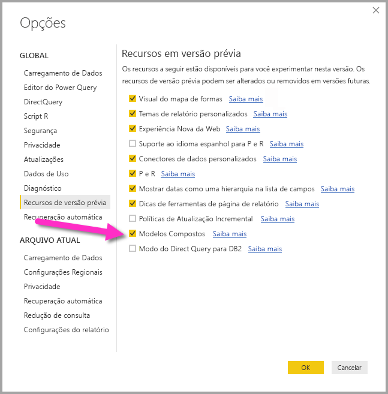

# Modelos compostos no Power BI Desktop (prévia)

Anteriormente no **Power BI Desktop**, quando você usava um DirectQuery em um relatório, nenhuma outra conexão de dados, DirectQuery ou de importação, era permitida para esse relatório. Com os **modelos compostos**, essa restrição é removida, e um relatório pode incluir perfeitamente conexões de dados de mais de um DirectQuery ou importar a conexão de dados, em qualquer combinação que você escolher.

O recurso **modelos compostos** no **Power BI Desktop** consiste em três recursos relacionados:

* **Modelos compostos**: permite que um relatório tenha várias conexões de dados, incluindo conexões DirectQuery ou importação, em qualquer combinação.
* **Relações muitos para muitos**: com **modelos compostos**, você pode estabelecer **relações muitos para muitos** entre tabelas, removendo os requisitos para valores exclusivos nas tabelas e removendo soluções alternativas anteriores, como introduzir novas tabelas apenas para estabelecer relações. 
* **Modo de armazenamento**: agora é possível especificar que elementos visuais exigem uma consulta a fontes de dados de back-end. Os que não exigem são importados, mesmo que baseados no DirectQuery, melhorando o desempenho e reduzindo a carga de back-end. Antes, mesmo elementos visuais simples como as segmentações de dados iniciavam consultas sendo enviadas para fontes de back-end. 

Esta coleção de três recursos relacionados para os **modelos compostos** é descrita em artigos separados:

* **Modelos compostos** são descritos em detalhes neste artigo.
* As **Relações muitos para muitos** são descritas no próprio artigo [Relações muitos para muitos no Power BI Desktop (prévia)](desktop-many-to-many-relationships.md).
* O **Modo de armazenamento** é descrito em seu próprio artigo, [Modo de armazenamento no Power BI Desktop (versão prévia)](desktop-storage-mode.md).

## Como habilitar o recurso de versão prévia de modelos compostos

O recurso **modelos compostos** está em visualização e deve ser habilitado no **Power BI Desktop**. Para habilitar **modelos compostos**, selecione **Arquivo > Opções e Configurações > Opções > Recursos de Visualização** e marque a caixa de seleção **modelos compostos**. 

Será preciso reiniciar o **Power BI Desktop** para que o recurso seja habilitado.

## Usando modelos compostos

Com **modelos compostos**, você pode se conectar a todos os tipos de fontes de dados diferentes usando o **Power BI Desktop** ou o **serviço do Power BI** e pode fazer essas conexões de dados de maneiras diferentes. Você pode importar dados para o Power BI, que é a maneira mais comum de obter dados, ou pode se conectar diretamente aos dados em seu repositório fonte original usando o DirectQuery. Você pode saber mais sobre os detalhes de DirectQuery no artigo [Usar o DirectQuery no Power BI](desktop-directquery-about.md).

Ao se usar o DirectQuery, com **modelos compostos** é possível criar um modelo do Power BI (como um único arquivo .pbix do Power BI Desktop) que faz o seguinte:

* combina dados de uma ou mais fontes de DirectQuery, e/ou
* combina dados de fontes de DirectQuery e importação de dados

Por exemplo, com **modelos compostos**, é possível criar um modelo que combina dados de vendas de um data warehouse empresarial a dados sobre as metas de vendas que estão em um banco de dados SQL do departamento, juntamente com alguns dados importados de uma planilha. Um modelo que combina dados de mais de uma origem de DirectQuery ou combina o DirectQuery a dados importados é conhecido como um *modelo composto*.

> [!NOTE]
> Enquanto os modelos compostos estão em visualização, não é possível publicar modelos compostos para o serviço do Power BI. 

Você pode criar relações entre tabelas, como de costume, mesmo quando essas tabelas são provenientes de fontes diferentes, com a seguinte restrição: quaisquer relações que são de origem cruzada devem ser definidas com a cardinalidade de **muitos para muitos**, independentemente de sua cardinalidade real. O comportamento dessas relações é o mesmo que o comportamento normal de relações**Muitos para Muitos**, conforme descrito em [Relações muitos para muitos no Power BI Desktop (prévia)](desktop-many-to-many-relationships.md). Observe que, no contexto de modelos compostos, todas as tabelas importadas efetivamente são uma única fonte, independentemente da fonte de dados subjacente real da qual são importadas de fato.   

## Exemplo de como usar modelos compostos

Como um exemplo de um **modelo composto**, considere a possibilidade de um relatório que se conectou a um data warehouse de dados corporativos (no SQL Server) usando o DirectQuery, em que o data warehouse contém dados de *Vendas por país*,  *Trimestre* e *Bicicleta (Produto)*, conforme mostrado na imagem a seguir.

Neste ponto, você pode criar visuais simples usando os campos dessa fonte. Por exemplo, o visual a seguir mostra o total de vendas por *ProductName*, para um trimestre selecionado. 

Porém, e se você tiver algumas informações sobre o Gerente de Produto que tenham sido atribuídas a cada produto, juntamente com a prioridade de marketing: onde esses dados são mantidos em uma planilha do Excel? Talvez você queira ver o *Valor de Vendas* por *Gerente de Produto*, mas adicionar esses dados locais ao data warehouse corporativo provavelmente seria impraticável ou levaria meses, na melhor das hipóteses. Embora seja possível importar os dados de vendas do data warehouse (em vez de usar o DirectQuery), quando eles podem ser combinados a dados importados da planilha, essa abordagem não é razoável, considerando os motivos que levam ao uso do DirectQuery em primeiro lugar, como uma combinação das regras de segurança impostas na fonte subjacente, a necessidade de ver os dados mais recentes e a enorme escala dos dados. 

É aí que entram os **modelos compostos**. Os modelos compostos oferecem a opção de conexão ao data warehouse usando DirectQuery e também usando GetData para fontes adicionais. Nesse caso, podemos estabelecer a conexão do DirectQuery para o data warehouse corporativo. Depois, usamos GetData e escolhemos o Excel, navegamos até a planilha que contém nossos dados locais e podemos importar a planilha que contém o *ProductNames*, o *SalesManager* atribuído e a *Prioridade*.  

Agora, na lista **Campos** original, vemos a tabela *Bicicleta* (do SQL Server) e uma nova tabela *Gerentes de Produto* (com os dados importados do Excel). 

Da mesma forma, observando a **Exibição de Relações** no **Power BI Desktop**, agora podemos ver uma tabela adicional chamada *Gerentes de Produto*. 

Agora, é necessário relacioná-las a outras tabelas no modelo, o que fazemos da maneira habitual, criando uma relação entre a tabela *Bicicleta* (no SQL Server) e a tabela *Gerentes de Produto* (que é importada), como entre *Bicicleta [ProductName]* e *ProductManagers [ProductName]*. Conforme discutido anteriormente neste artigo, todas as relações que passam pela origem devem ter a cardinalidade **muitos para muitos** e, assim, essa é a cardinalidade padrão que é selecionada. 

Depois de criar essa relação, a relação é mostrada na **Exibição de relações** no **Power BI Desktop** exatamente conforme esperado.

Com essas relações de tabela estabelecidas, agora podemos criar visuais usando qualquer um dos campos na lista **Campos**, mesclando perfeitamente os dados de várias fontes. Por exemplo, o visual abaixo mostra o *Valor de Vendas* total para cada *Gerente de Produto*. 

Este exemplo mostra um caso comum de uma tabela *Dimensão* (como *Produto* ou *Cliente*) que está sendo estendida com alguns dados adicionais importados de outro lugar. Também é possível fazer com que as tabelas usem o DirectQuery para se conectar a diferentes fontes. Para estender o exemplo, imagine que *SalesTargets* por *País* e *Período* sejam armazenados em um banco de dados de departamento separado. Você pode usar **GetData** para se conectar a esses dados como de costume, conforme mostrado na imagem a seguir. 

Em seguida, de forma semelhante ao que fizemos no exemplo, podemos criar relações entre a nova tabela e as outras tabelas no modelo e criar visuais que combinam seus dados. Vamos examinar novamente a **Exibição de Relações**, em que estabelecemos novas relações no cenário de exemplo estendido.

Conforme mostrado na imagem a seguir, que se baseia nos dados novos e nas relações que acabamos de criar, o visual no canto inferior esquerdo canto mostra o total do *Valor de Vendas* versus *Destino*, com o cálculo de variação que mostra a diferença, em que *Valor de Vendas* e *Destino* são provenientes de dois bancos de dados do SQL Server diferentes. 

## Como configurar o modo de armazenamento

Cada tabela em um **modelo composto** tem um **modo de armazenamento** que indica se a tabela é baseada no DirectQuery ou em importação. O **Modo de armazenamento** pode ser exibido e modificado no painel **Propriedade**. Para chegar lá, selecione **Propriedades** na lista **Campos** do menu de contexto de clique com o botão direito do mouse. A imagem a seguir mostra o **modo de armazenamento** (abreviado como **Armazenamento...**  na imagem, devido à largura do painel).

O **modo de armazenamento** também pode ser visto na dica de ferramenta de cada tabela.

Para qualquer arquivo do **Power BI Desktop** (um arquivo .pbix) que contém algumas tabelas de DirectQuery e algumas tabelas de importação, a barra de status mostra um **modo de armazenamento** **Misto**. Você pode clicar no termo na barra de status e alternar facilmente todas as tabelas para importação.

Detalhes sobre o **modo de armazenamento** são descritos completamente no artigo [Modo de armazenamento no Power BI Desktop (prévia)](desktop-storage-mode.md).  

## Tabelas calculadas

As tabelas calculadas podem ser adicionadas a um modelo que usa DirectQuery, e o DAX que define a tabela calculada pode fazer referência a tabelas importadas ou de DirectQuery ou uma combinação de ambas. 

As tabelas calculadas sempre são importadas, e os dados nessas tabelas são atualizados quando a tabela é atualizada. Assim, se uma tabela calculada faz referência a uma tabela do DirectQuery, visuais que referenciam a tabela de DirectQuery sempre mostram os valores mais recentes na fonte subjacente, mas visuais que referenciam a tabela calculada mostram os valores no momento em que a tabela calculada foi atualizada pela última vez.

## Implicações de segurança 

Os modelos compostos têm algumas implicações de segurança. Uma consulta enviada a uma fonte de dados pode incluir valores de dados que foram recuperados de outra origem diferente. Para o exemplo descrito anteriormente neste artigo, o visual que mostra *Valor de Vendas* por *Gerente de Produto* resultará no envio de uma consulta SQL ao banco de dados relacional **Vendas**, em que a consulta SQL pode conter os nomes dos *Gerentes de Produto* e seus respectivos *Produtos*. 

Por isso, informações que são armazenadas na planilha agora estão sendo incluídas em uma consulta enviada ao banco de dados relacional. Se essas informações forem confidenciais, as implicações de segurança deverão ser consideradas. Em particular, você deve considerar as seguintes implicações:

* Qualquer administrador de banco de dados que possa ver rastreamentos ou logs de auditoria poderá ver essas informações, mesmo que não tenha permissões para os dados em sua origem (nesse caso, as permissões para o arquivo do Excel).

* As configurações de criptografia de cada fonte devem ser consideradas, para evitar que as informações sejam recuperadas de uma fonte usando uma conexão criptografada, mas sejam incluídas inadvertidamente em uma consulta enviada para outra fonte usando uma conexão não criptografada. 

O **Power BI Desktop** exibe uma mensagem de aviso quando uma ação é executada para criar um modelo composto, para permitir a confirmação de que quaisquer implicações de segurança foram consideradas.  

Por motivos semelhantes, deve ser tomado cuidado ao se abrir um arquivo do **Power BI Desktop** enviado de uma fonte não confiável. Se esse arquivo contém modelos compostos, isso significa que informações recuperadas de uma origem (usando as credenciais do usuário que abre o arquivo) devem ser enviadas para outra fonte de dados como parte da consulta (em que podem, possivelmente, ser vistas pelo autor do arquivo do Power BI Desktop mal-intencionado). Portanto, ao ser aberto um arquivo do Power BI Desktop pela primeira vez, se ele contiver várias fontes, um aviso será exibido. Esse aviso é semelhante ao aviso exibido ao se abrir um arquivo que contém consultas SQL nativas.  

## Implicações de desempenho  

Ao se usar o DirectQuery, o desempenho deve sempre ser considerado, principalmente para garantir que a fonte de back-end tenha recursos suficientes para fornecer uma boa experiência aos usuários. Uma boa experiência significa que os visuais devem ser atualizados em cinco segundos ou menos. Você também deve seguir o conselho de desempenho do artigo [Usar o DirectQuery no Power BI](desktop-directquery-about.md). O uso de modelos compostos adiciona outras considerações de desempenho, pois um único visual pode resultar no envio de consultas para várias fontes, muitas vezes passando os resultados de uma consulta para uma segunda fonte. Essa situação pode resultar nas seguintes formas possíveis de execução:

* **Uma consulta SQL que inclui um grande número de valores literais**, como um visual que solicita o *Valor de Vendas* total (do banco de dados SQL) para um conjunto de selecionado de *Gerentes de Produto* (da tabela relacionada que foi importada de uma planilha), primeiro precisa verificar quais *Produtos* foram gerenciadas pelos Gerentes de Produto, antes de enviar uma consulta SQL incluindo todas as IDs do produto em uma cláusula *WHERE*.

* **Uma consulta SQL que consulta em um nível mais baixo de granularidade, com os dados sendo agregados localmente**, usando o mesmo exemplo que o item com marcador anterior nessa lista, à medida que o número de *Produtos* que atendem ao filtro em *Gerente de Produto* torna-se muito grande, em determinado ponto, torna-se ineficiente ou inviável incluir tudo em uma cláusula *WHERE*. Em vez disso, é necessário consultar a fonte relacional em um nível inferior de *Produto* e agregar localmente os resultados. Se a cardinalidade de *Produtos* exceder um limite de um milhão, a consulta falhará.

* **Várias consultas SQL, uma por grupo por valor**: quando a agregação usa **DistinctCount**, agrupado por alguma coluna de outra origem se a fonte externa não dá suporte à passagem eficiente de vários valores literais que definem o agrupamento, é necessário enviar uma consulta SQL por grupo por valor. Por exemplo, um visual que solicita uma contagem distinta de *CustomerAccountNumber* (de tabela do SQL Server) por *Gerente de Produto* (da tabela relacionada que foi importada de uma planilha) precisa passar os detalhes da tabela *Gerentes de Produto* na consulta enviada ao SQL Server. Em outras fontes, por exemplo, Redshift, isso não é viável. Em vez disso, deve haver uma consulta SQL enviada por *Gerente de Vendas* (até um limite prático, após o qual a consulta falharia). 

Cada um desses casos tem suas próprias implicações sobre o desempenho, e os detalhes exatos variam para cada fonte de dados. Uma boa regra prática é que, embora a cardinalidade das colunas usadas na relação de junção de duas fontes permaneça baixa (alguns milhares), o desempenho não deve ser afetado significativamente. À medida que aumenta esse cardinalidade, mais consideração precisa ser dada ao impacto sobre o desempenho resultante. 

Além disso, o uso de relações **muitos para muitos** significa que consultas separadas devem ser enviadas à fonte subjacente para cada total/subtotal nível, em vez de agregar os valores detalhados localmente. Dessa forma, um visual de tabela simples com totais enviaria as duas consultas SQL, em vez de uma. 

## Limitações e considerações

Há algumas limitações para esta versão de **modelos compostos**.

As seguintes fontes (multidimensionais) do Live Connect não podem ser usadas com os **modelos compostos**:

* SAP HANA
* SAP Business Warehouse
* SQL Server Analysis Services
* Conjuntos de dados do Power BI
* Azure Analysis Services

Ao se conectar a essas fontes multidimensionais usando o DirectQuery, não é possível se conectar também a outra fonte de DirectQuery, nem combinar com dados importados.

As limitações existentes no uso do DirectQuery ainda se aplicam ao serem usados **modelos compostos**. Muitas dessas limitações agora são por tabela, dependendo do **modo de armazenamento** da tabela. Por exemplo, uma coluna calculada em uma tabela importada pode se referir a outras tabelas, mas uma coluna calculada em uma tabela do DirectQuery ainda fica restrita para se referir apenas às colunas na mesma tabela. Outras limitações se aplicam ao modelo como um todo se quaisquer das tabelas no modelo forem DirectQuery. Por exemplo, os recursos **QuickInsights** e **P e R** não estão disponíveis em um modelo se qualquer uma das tabelas nele tiver um **modo de armazenamento** do DirectQuery. 

## Próximas etapas

Os artigos a seguir tratam mais sobre os modelos compostos e também descrevem o DirectQuery em detalhes.

* [Relações muitos para muitos no Power BI Desktop (prévia)](desktop-many-to-many-relationships.md)
* [Modo de armazenamento no Power BI Desktop (prévia)](desktop-storage-mode.md)

Artigos do DirectQuery:

* [Usar o DirectQuery no Power BI](desktop-directquery-about.md)
* [Fontes de dados com suporte do DirectQuery no Power BI](desktop-directquery-data-sources.md)

