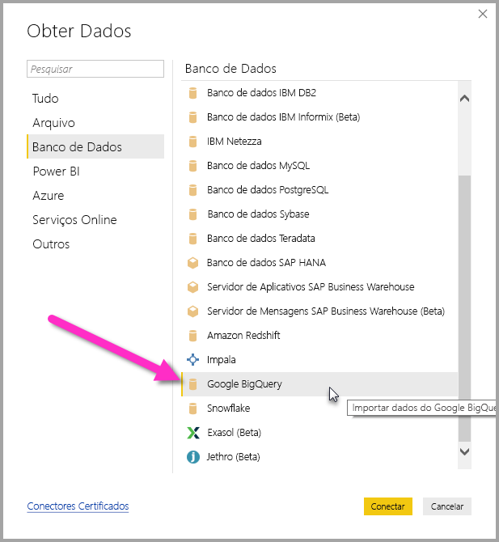
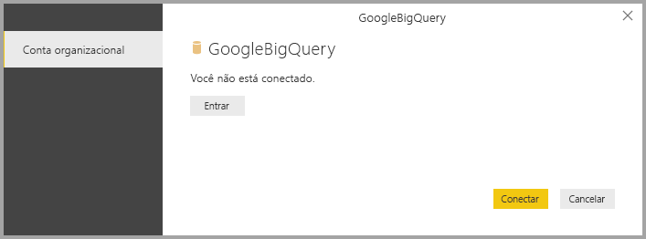
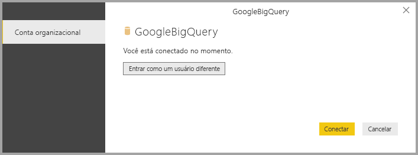
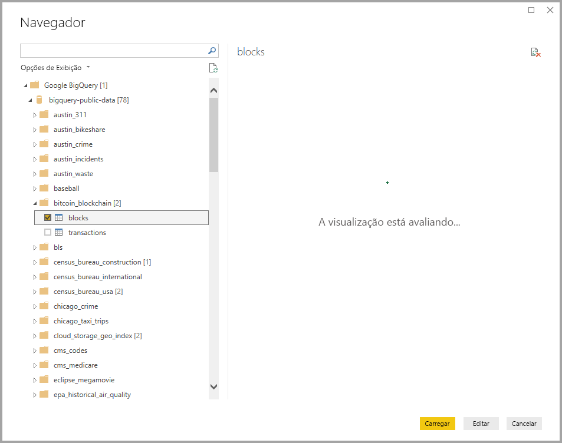

# <a name="connect-to-a-google-bigquery-database-in-power-bi-desktop"></a>Conectar-se a um banco de dados do Google BigQuery no Power BI Desktop
No Power BI Desktop, você pode se conectar a um banco de dados Google **BigQuery** e usar os dados subjacentes, assim como qualquer outra fonte de dados no Power BI Desktop.

## <a name="connect-to-google-bigquery"></a>Conectar-se ao Google BigQuery
Para se conectar a um banco de dados Google **BigQuery**, selecione **Obter dados** na faixa de opções **Início** no Power BI Desktop. Selecione **Banco de dados** nas categorias à esquerda e você verá **Google BigQuery**.



Na janela **Google BigQuery** que aparece, entre sua conta do Google BigQuery e selecione **Conectar-se**.



Depois de entrar, você verá a janela a seguir, que indica que você foi autenticado. 



Depois que você se conectar com êxito, uma janela **Navegador** será mostrada e exibirá os dados disponíveis no servidor, dentre os quais você pode selecionar um ou vários elementos para importar e usar no **Power BI Desktop**.



## <a name="considerations-and-limitations"></a>Considerações e limitações
Existem alguns limites e considerações que você deve ter em mente com relação ao conector do Google **BigQuery**:

* O conector do Google BigQuery está disponível no Power BI Desktop e no serviço do Power BI. No serviço do Power BI, o conector pode ser acessado usando a conexão de nuvem para nuvem do Power BI para o Google BigQuery.

É possível usar o Power BI com o **Projeto de Cobrança** do Google BigQuery. Por padrão, o Power BI usa o primeiro projeto na lista retornada para o usuário. Para personalizar o comportamento do Projeto de Cobrança quando usá-lo com o Power BI, execute as seguintes etapas:

 * Especificar a opção a seguir no M subjacente na etapa Fonte, que pode ser personalizada usando o **Editor do Power Query** no Power BI Desktop:

    ```Source = GoogleBigQuery.Database([BillingProject="Include-Billing-Project-Id-Here"])```

## <a name="next-steps"></a>Próximas etapas
Há todos os tipos de dados aos quais você pode se conectar usando o Power BI Desktop. Para obter mais informações sobre fontes de dados, confira os seguintes recursos:

* [O que é o Power BI Desktop?](desktop-what-is-desktop.md)
* [Fontes de dados no Power BI Desktop](desktop-data-sources.md)
* [Formatar e combinar dados com o Power BI Desktop](desktop-shape-and-combine-data.md)
* [Conectar-se a pastas de trabalho do Excel no Power BI Desktop](desktop-connect-excel.md)   
* [Inserir dados diretamente no Power BI Desktop](desktop-enter-data-directly-into-desktop.md)   

