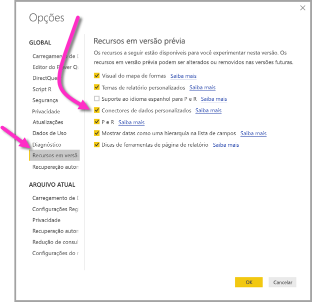

# Conectar-se aos dados criados por fluxos de dados do Power BI no Power BI Desktop (versão prévia)
No **Power BI Desktop**, é possível conectar-se a dados criados por **fluxos de dados do Power BI** como qualquer outra fonte de dados no Power BI Desktop.

O conector **fluxos de dados do Power BI (versão prévia)** permite que você se conecte a entidades criadas por fluxos de dados no serviço do Power BI. Como os fluxos de dados estão em versão prévia, há algumas etapas que devem ser seguidas para tornar o conector de fluxos de dados disponível em seu sistema. 

## Baixar e habilitar o conector de fluxos de dados do Power BI (versão prévia)

É necessário baixar uma cópia do conector dos **fluxos de dados do Power BI** e, em seguida, copiá-la para um local específico em seu computador. Em uma atualização mensal futura no Power BI Desktop, o conector será incluído automaticamente na lista de conectores de dados, momento em que essas etapas não serão necessárias.

É possível baixar o **conector de fluxos de dados do Power BI** neste local: [conector de fluxos de dados do Power BI](https://visuals.azureedge.net/cds-analytics/PublicPreview/CDSA.mez)

Siga estas etapas para tornar o conector de **fluxos de dados do Power BI** (versão prévia) disponível em seu computador:

1. Baixe uma cópia do arquivo .MEZ (o arquivo de conector de dados). Os clientes da versão prévia privada receberão informações sobre o download do arquivo .MEZ diretamente da Microsoft.

2. Coloque o arquivo do conector de dados baixado na seguinte pasta em seu computador: **Documentos > Power BI Desktop > Pasta Conectores personalizados**

3. No Power BI Desktop, selecione **Arquivo > Opções e configurações > Opções** e, em seguida, selecione **Versão prévia dos recursos** no painel esquerdo.

    

4. Selecione a caixa **Conectores de dados personalizados**, se ela não estiver selecionada. 

5. Reinicie o **Power BI Desktop** para que o conector seja exibido.

## Usar o conector de fluxos de dados do Power BI (versão prévia)
Após o **Power BI Desktop** ser reiniciado, o conector aparecerá como uma fonte de dados disponíveis. Para conectar-se a um pool de dados, selecione **Obter dados > Serviços Online > Fluxos de dados do Power BI (beta)**, conforme mostrado na imagem a seguir:

## Considerações e limitações

Para usar esta versão prévia do **conector de fluxos de dados do Power BI**, é necessário estar executando a versão mais recente do **Power BI Desktop**. Sempre é possível [baixar o Power BI Desktop](desktop-get-the-desktop.md) e instalá-lo em seu computador para garantir que você tem a versão mais recente.  

Observação: quando o conector de fluxos de dados do Power BI for exibido em uma atualização mensal futura no **Power BI Desktop**, será *necessário* excluir este arquivo .MEZ baixado na sua pasta **Documentos > Power BI Desktop > Conectores personalizados** para evitar conflitos. 

## Próximas etapas
Há inúmeras coisas interessantes que podem ser feitas com conexões de dados do Power BI, assim como artigos sobre o **Power BI Desktop** que podem ser úteis:

* [Fontes de dados no Power BI Desktop](desktop-data-sources.md)
* [Formatar e combinar dados com o Power BI Desktop](desktop-shape-and-combine-data.md)
* [Inserir dados diretamente no Power BI Desktop](desktop-enter-data-directly-into-desktop.md)   

