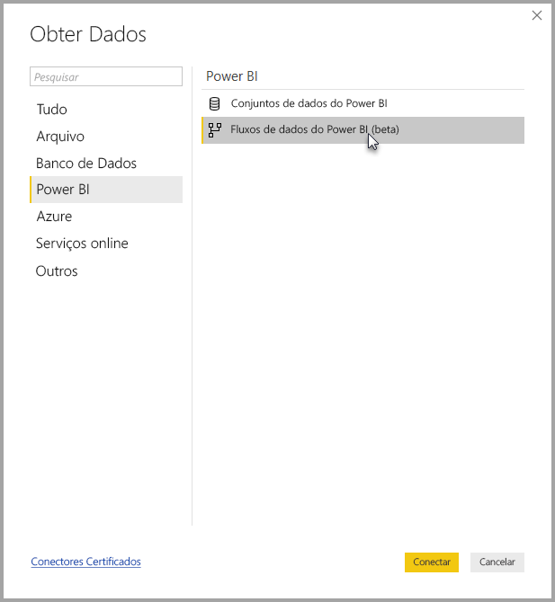

# Conectar-se aos dados criados por fluxos de dados do Power BI no Power BI Desktop (Beta)
No **Power BI Desktop**, é possível conectar-se a dados criados por **fluxos de dados do Power BI** como qualquer outra fonte de dados no Power BI Desktop.

O conector de **fluxos de dados do Power BI (Beta)** permite a conexão a entidades criadas por fluxos de dados no serviço do Power BI. 

## Considerações e limitações

Para usar esta versão beta do **conector de fluxos de dados do Power BI**, é necessário estar executando a versão mais recente do **Power BI Desktop**. Sempre é possível [baixar o Power BI Desktop](desktop-get-the-desktop.md) e instalá-lo em seu computador para garantir que você tem a versão mais recente.  

> [!NOTE]
> A versão anterior do conector de fluxos de dados do Power BI exigia que você fizesse o download de um arquivo .MEZ e o colocasse em uma pasta. As versões atuais do **Power BI Desktop** incluem o conector de fluxos de dados do Power BI, por isso esse arquivo não é mais necessário e pode causar conflitos com a versão incluída do conector. Caso tenha colocado o arquivo .MEZ manualmente na pasta, você *deve* exclui-lo da pasta **Documentos > Power BI Desktop > Conectores personalizados** para evitar conflitos. 

## Desempenho do desktop
O **Power BI Desktop** é executado localmente no computador em que se encontra instalado. Uma série de fatores determina o desempenho da ingestão de fluxos de dados. Entre eles estão o tamanho dos dados, a CPU e a memória RAM do seu computador, a largura de banda de rede, a distância do data center, além de outros fatores.

É possível melhorar o desempenho da ingestão de dados dos fluxos de dados. Por exemplo, se o tamanho dos dados ingeridos for muito grande para o **Power BI Desktop** gerenciar no seu computador, você pode usar as entidades vinculadas e computadas em fluxos de dados para agregar os dados (dentro de fluxos de dados) e ingerir apenas os dados agregados preparados previamente. Dessa forma, o processamento de dados grandes é executado online em fluxos de dados, em vez de ser executados localmente na instância em execução do **Power BI Desktop**. Essa abordagem permite ao Power BI Desktop ingerir menores quantidades de dados, além de manter a experiência com os fluxos de dados rápida e responsiva.

## Considerações e limitações

A maioria dos fluxos de dados residem no locatário do serviço do Power BI. No entanto, os usuários do **Power BI Desktop** não podem acessar os fluxos de dados armazenados na conta do Azure Data Lake Storage Gen2, a menos que sejam os proprietários do fluxo de dados ou tenham sido explicitamente autorizados na pasta do CDM do fluxo de dados. Considere a seguinte situação:

1.  Brenda cria um novo espaço de trabalho do aplicativo e o configura para armazenar fluxos de dados no data lake da organização.
2.  Davi, que também é membro do espaço de trabalho criado por Brenda, deseja usar o Power BI Desktop e o conector de fluxo de dados para obter dados do fluxo de dados criado por Brenda.
3.  Davi recebe um erro porque não foi adicionado como usuário autorizado à pasta do CDM do fluxo de dados no data lake.

    

Para resolver esse problema, o Davi deve receber permissões de leitura para a pasta do CDM e seus arquivos. Você pode saber mais sobre como conceder acesso à pasta do CDM [neste artigo](https://go.microsoft.com/fwlink/?linkid=2029121).

## Próximas etapas
Há inúmeras coisas interessantes que você pode fazer com os fluxos de dados do Power BI. Confira mais informações nos recursos a seguir:

* [Preparação de dados de autoatendimento com fluxos de dados](service-dataflows-overview.md)
* [Criação e uso de fluxos de dados no Power BI](service-dataflows-create-use.md)
* [Uso de entidades computadas no Power BI Premium (versão prévia)](service-dataflows-computed-entities-premium.md)
* [Uso de fluxos de dados com fontes de dados locais (versão prévia)](service-dataflows-on-premises-gateways.md)
* [Recursos de desenvolvedor para fluxos de dados do Power BI (versão prévia)](service-dataflows-developer-resources.md)

Para obter mais informações sobre a integração com o Azure Data Lake Storage Gen2, confira os artigos a seguir:

* [Integração entre fluxos de dados e o Azure Data Lake (versão prévia)](service-dataflows-azure-data-lake-integration.md)
* [Definir configurações de fluxo de dados de espaço de trabalho (versão prévia)](service-dataflows-configure-workspace-storage-settings.md)
* [Adicionar uma pasta do CDM ao Power BI como um fluxo de dados (versão prévia)](service-dataflows-add-cdm-folder.md)
* [Conectar-se ao Azure Data Lake Storage Gen2 para armazenamento de fluxo de dados (versão prévia)](service-dataflows-connect-azure-data-lake-storage-gen2.md)

Também há artigos sobre o **Power BI Desktop** que podem ser úteis:

* [Fontes de dados no Power BI Desktop](desktop-data-sources.md)
* [Formatar e combinar dados com o Power BI Desktop](desktop-shape-and-combine-data.md)
* [Inserir dados diretamente no Power BI Desktop](desktop-enter-data-directly-into-desktop.md)   

