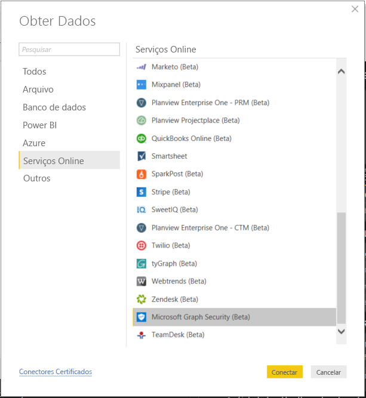
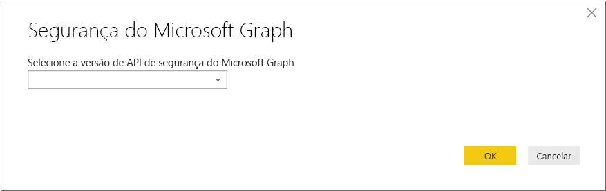
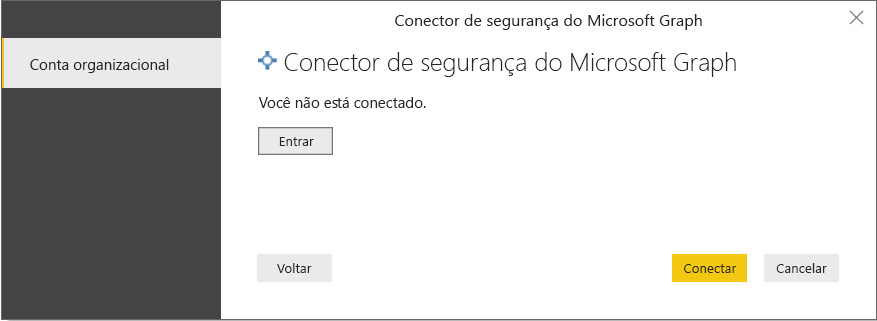
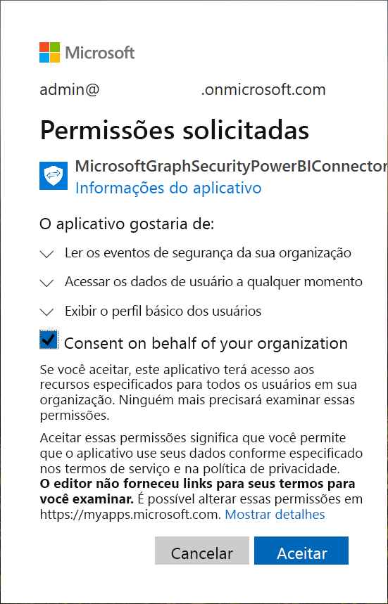
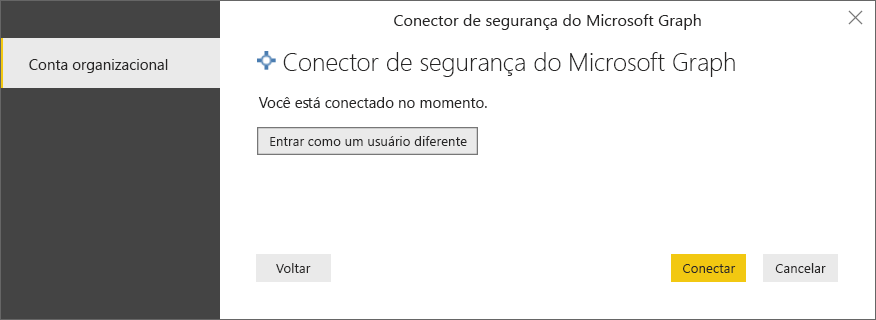
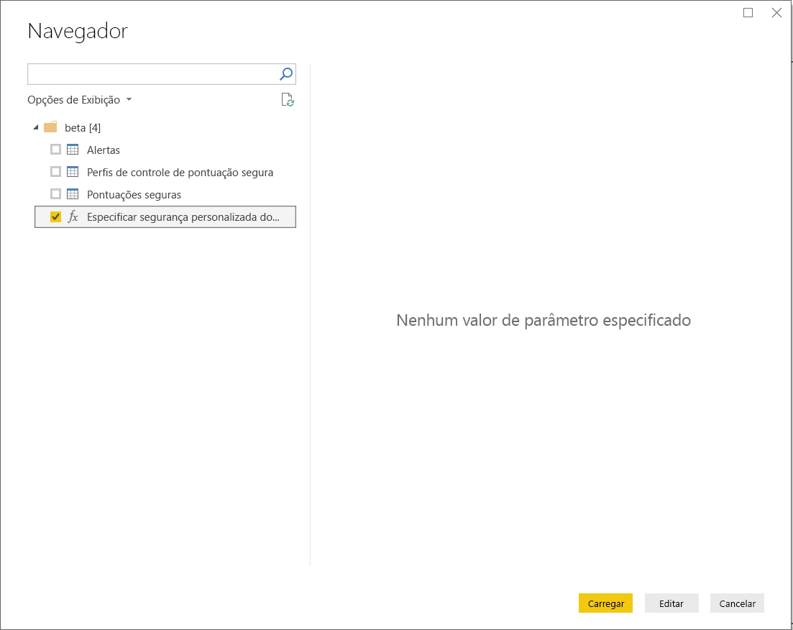
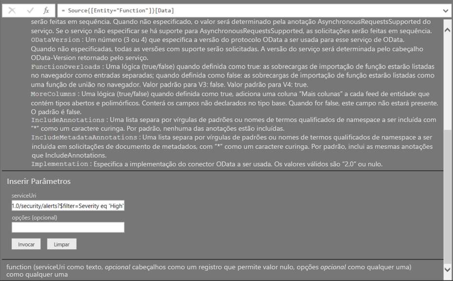
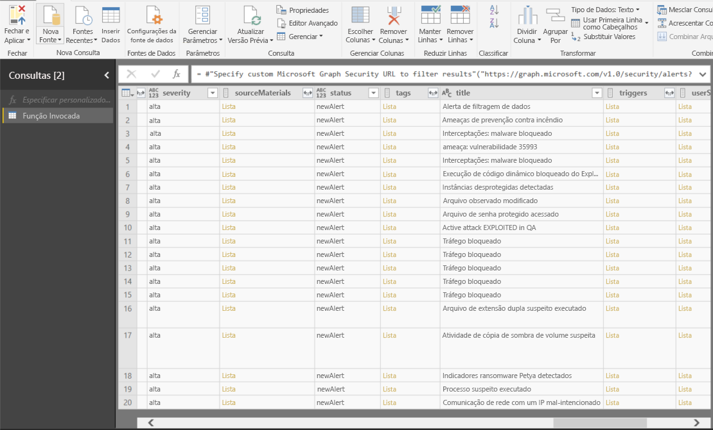

# Conectar-se à API de Segurança do Microsoft Graph no Power BI Desktop

Use o conector de Segurança do Microsoft Graph do Power BI Desktop para se conectar à [API de Segurança do Microsoft Graph](https://aka.ms/graphsecuritydocs). Você poderá então criar dashboards e relatórios, a fim de obter insights sobre [alertas](https://docs.microsoft.com/graph/api/resources/alert?view=graph-rest-1.0) relacionados à segurança e sobre [classificações de segurança](https://docs.microsoft.com/graph/api/resources/securescores?view=graph-rest-beta).

A API de Segurança do Microsoft Graph conecta [várias soluções de segurança](https://aka.ms/graphsecurityalerts) da Microsoft e seus parceiros de ecossistema para facilitar a correlação de alertas. Essa combinação fornece acesso a informações contextuais avançadas e simplifica a automação. Ela capacita as organizações a obter insights rapidamente e agir em vários produtos de segurança, reduzindo o custo e a complexidade.

## Pré-requisitos para usar o conector de Segurança do Microsoft Graph

Para usar o conector de segurança do Microsoft Graph, você precisa obter *explicitamente* o consentimento do administrador de locatário do Azure AD (Azure Active Directory). Veja [requisitos de autenticação de Segurança do Microsoft Graph](https://aka.ms/graphsecurityauth).
O consentimento requer a ID e o nome do aplicativo do conector, sendo que esse nome é citado aqui e está disponível no [portal do Azure](https://portal.azure.com):

| Propriedade | Valor |
|----------|-------|
| **Nome do aplicativo** | `MicrosoftGraphSecurityPowerBIConnector` |
| **ID do Aplicativo** | `cab163b7-247d-4cb9-be32-39b6056d4189` |
|||

Para fornecer consentimento ao conector, o administrador de locatários do Azure AD poderá usar qualquer um destes métodos:

* [Dar consentimento para aplicativos do Azure AD](https://docs.microsoft.com/azure/active-directory/develop/v2-permissions-and-consent)

* Responder a uma solicitação que seu aplicativo lógico envia durante sua primeira execução por meio da [experiência de consentimento de aplicativo](https://docs.microsoft.com/azure/active-directory/develop/application-consent-experience)
   
A conta de usuário usada para entrar e se conectar ao conector da Segurança do Microsoft Graph precisa ser membro da função Administrador limitado Leitor de segurança no Azure AD, seja como *Leitor de Segurança* ou *Administrador de Segurança*. Veja [Atribuir funções do Azure AD a usuários](https://docs.microsoft.com/graph/security-authorization#assign-azure-ad-roles-to-users).

## Usando o conector de Segurança do Microsoft Graph

Siga estas etapas para usar o conector:

1. Selecione **Obter Dados** > **Mais** na faixa de opções **Início** no Power BI Desktop.
2. Selecione **Serviços Online** na lista de categorias no lado esquerdo da janela.
3. Selecione **Segurança do Microsoft Graph (Beta)** .

    
    
4. Na janela **Segurança do Microsoft Graph**, selecione a versão da API do Microsoft Graph a ser consultada: **v1.0** ou **beta**.

    
    
5. Entre em sua conta do Azure Active Directory, quando solicitado. Essa conta precisa ter a função de *Leitor de Segurança* ou *Administrador de Segurança*, conforme mencionado na seção anterior.

     
    
6. Se você for o administrador de locatário *e* ainda não tiver fornecido consentimento ao conector (aplicativo) do Power BI para Segurança do Microsoft Graph, você verá a caixa de diálogo a seguir. Selecione **Consentir em nome de sua organização**.

    
    
7. Depois que estiver conectado, você verá a caixa de diálogo a seguir indicando que você foi autenticado. Selecione **Conectar**.

    
    
8. Depois de se conectar, a janela **Navigator** exibe os alertas, classificações de segurança e outras entidades que estão disponíveis na [API de Segurança do Microsoft Graph](https://aka.ms/graphsecuritydocs) para a versão que você selecionou na etapa 4. Selecione uma ou mais entidades para importação e uso no Power BI Desktop. Em seguida, selecione **Carregar** para obter a exibição de resultado mostrada após a etapa 9.

    
    
9. Caso deseje fazer uma consulta avançada na API de Segurança do Microsoft Graph, selecione **Especificar uma URL personalizada de Segurança do Microsoft Graph para filtrar os resultados**. Use essa função para emitir uma consulta [OData.Feed](https://docs.microsoft.com/power-bi/desktop-connect-odata) na API de Segurança do Microsoft Graph com as permissões necessárias.

   O exemplo a seguir usa o `https://graph.microsoft.com/v1.0/security/alerts?$filter=Severity eq 'High'` *serviceUri*. Para ver como criar consultas para filtrar, ordenar ou recuperar os resultados mais recentes, veja [opções de consulta de sistema OData](https://docs.microsoft.com/graph/query-parameters).

   
    
   Quando você seleciona **Invocar**, a função **OData.Feed** faz uma chamada à API, que abre o Editor de Consultas. Você pode filtrar e refinar o conjunto de dados que deseja usar. Em seguida, você carrega os dados no Power BI Desktop.

Aqui está a janela de resultados para as entidades de Segurança do Microsoft Graph que consultamos:

   
    

Agora você está pronto para usar os dados importados do conector da Segurança do Microsoft Graph no Power BI Desktop. Você pode criar gráficos ou relatórios. Ou você pode interagir com outros dados que você importa de pastas de trabalho do Excel, bancos de dados ou outras fontes de dados.

## Próximas etapas
* Confira as amostras e os modelos do Power BI que usam esse conector em [amostras do Power BI no GitHub para Segurança do Microsoft Graph](https://aka.ms/graphsecuritypowerbiconnectorsamples).

* Para cenários de usuário e mais informações, veja [esta postagem no blog sobre o Conector do Power BI para Segurança do Microsoft Graph](https://aka.ms/graphsecuritypowerbiconnectorblogpost).

* Há muitos tipos de dados aos quais você pode se conectar usando o Power BI Desktop. Confira mais informações nos recursos a seguir:

    * [O que é o Power BI Desktop?](desktop-what-is-desktop.md)
    * [Fontes de dados no Power BI Desktop](desktop-data-sources.md)
    * [Formatar e combinar dados com o Power BI Desktop](desktop-shape-and-combine-data.md)
    * [Conectar-se a pastas de trabalho do Excel no Power BI Desktop](desktop-connect-excel.md)
    * [Inserir dados diretamente no Power BI Desktop](desktop-enter-data-directly-into-desktop.md)
