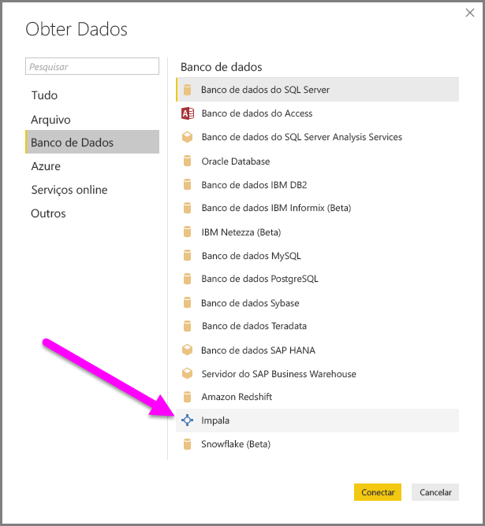
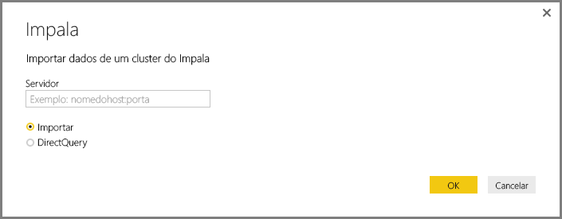
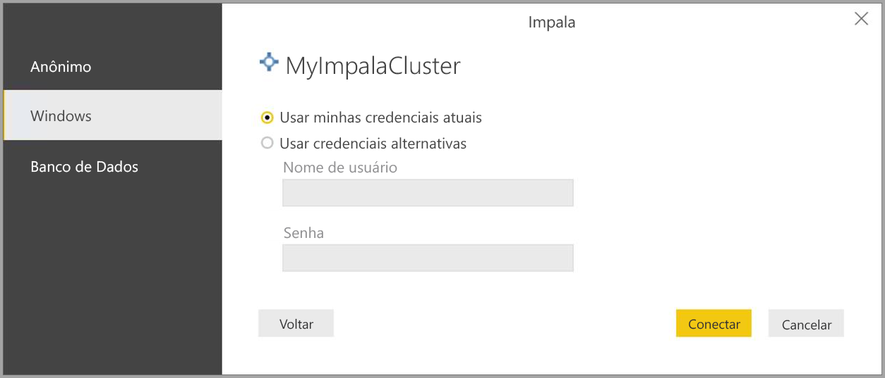
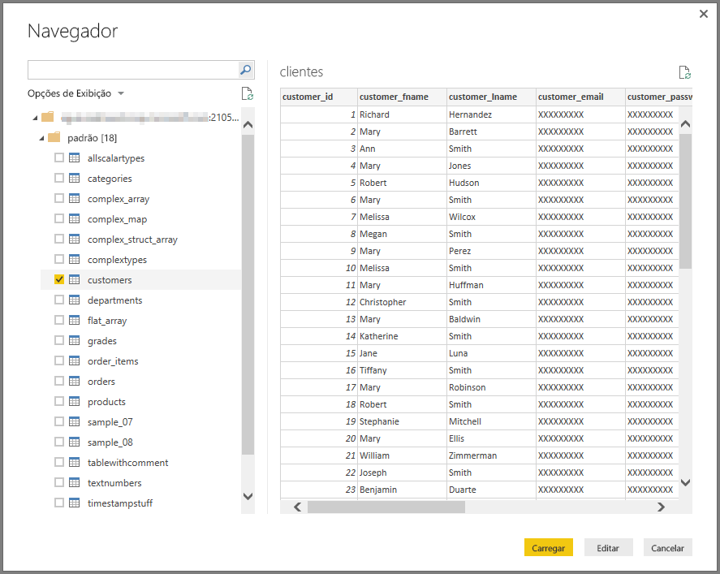

# Conectar-se a um banco de dados Impala no Power BI Desktop
No Power BI Desktop, você pode se conectar a um banco de dados **Impala** e usar os dados subjacentes, assim como qualquer outra fonte de dados no Power BI Desktop.

## Conectar-se a um banco de dados Impala
Para se conectar a um banco de dados **Impala**, execute as seguintes etapas: 

1. Selecione **Obter Dados** na faixa de opções **Início** no Power BI Desktop. 

2. Selecione **Banco de Dados** nas categorias à esquerda. Lá, você verá **Impala**.

    

3. Na janela **Impala** que será exibida, digite ou cole o nome do servidor Impala na caixa. Selecione **OK**. Você pode **Importar** dados diretamente no Power BI ou usar o **DirectQuery**. Saiba mais sobre [como usar o DirectQuery](desktop-use-directquery.md).

    

4. Ao receber a solicitação, insira suas credenciais ou conecte-se anonimamente. O conector Impala é compatível com a autenticação Anônima, Básica (nome de usuário + senha) e do Windows.

    

    > [!NOTE]
    > Após inserir seu nome de usuário e senha para um servidor **Impala** específico, o Power BI Desktop usa as mesmas credenciais em tentativas de conexão subsequentes. Você pode modificar essas credenciais indo para **Arquivo > Opções e configurações > Configurações de fonte de dados**.

5. Após a conexão, uma janela **Navigator** aparece e exibe os dados disponíveis no servidor. Escolha os elementos nesses dados para importar e usar no **Power BI Desktop**.

    

## Considerações e limitações
Existem algumas limitações e considerações que você deve ter em mente com relação ao conector **Impala**:

* O conector Impala é compatível com o gateway de dados local por meio de qualquer um dos três mecanismos de autenticação com suporte.

## Próximas etapas
Há vários tipos diferentes de fontes de dados aos quais você pode se conectar com o Power BI Desktop. Para saber mais sobre fontes de dados, confira os seguintes recursos:

* [O que é o Power BI Desktop?](desktop-what-is-desktop.md)
* [Fontes de dados no Power BI Desktop](desktop-data-sources.md)
* [Formatar e combinar dados com o Power BI Desktop](desktop-shape-and-combine-data.md)
* [Conectar-se a pastas de trabalho do Excel no Power BI Desktop](desktop-connect-excel.md)   
* [Inserir dados diretamente no Power BI Desktop](desktop-enter-data-directly-into-desktop.md)   

