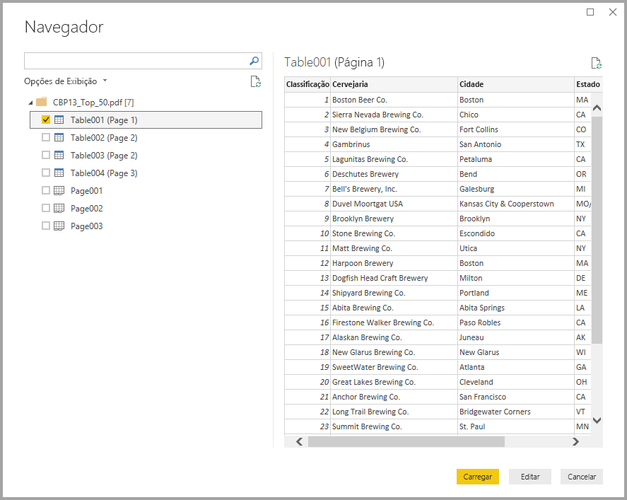
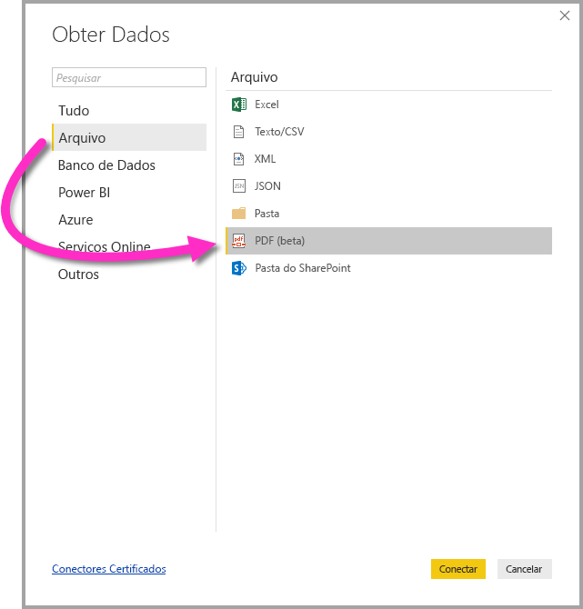

# Conectar-se ao arquivo PDF no Power BI Desktop (versão prévia)
No Power BI Desktop, é possível se conectar a um **arquivo PDF** e usar os dados incluídos do arquivo, como qualquer outra fonte de dados no Power BI Desktop.

As seguintes seções descrevem como conectar-se a um **arquivo PDF**, selecionar dados e trazê-los para o **Power BI Desktop**.

## Habilitar o conector PDF
O conector PDF está em versão prévia para o **Power BI Desktop** e deve ser habilitado. Para habilitar o conector PDF, selecione **Arquivo > Opções e Configurações > Opções > Versão prévia dos recursos**, em seguida, marque a caixa de seleção ao lado de **Obter dados de arquivos PDF**. 

Você precisará reiniciar o **Power BI Desktop** depois de fazer a seleção.

Quando você usar o conector **PDF (beta)** pela primeira vez, será informado de que o conector PDF ainda está em desenvolvimento e poderá mudar no futuro. Selecione **Continuar** para usar o conector.

É recomendável sempre atualizar para a versão mais recente do **Power BI Desktop**, que pode ser obtida de um link em [obter o Power BI Desktop](desktop-get-the-desktop.md). 

## Conectar-se a um arquivo PDF
Para se conectar a um arquivo **PDF**, selecione **Obter dados** na faixa de opções **Início** no Power BI Desktop. Selecione **Arquivo** nas categorias à esquerda e você verá o **PDF (beta)**.

Você deverá fornecer o local do arquivo PDF que deseja usar. Após fornecer o local do arquivo e o carregamento do arquivo PDF, uma janela **Navegador** aparecerá e exibirá os dados disponíveis do arquivo, na qual será possível selecionar um ou vários elementos para serem importados e usados no **Power BI Desktop**.

Marcar uma caixa de seleção ao lado de elementos descobertos no arquivo PDF exibe-os no painel direito. Quando estiver pronto para importar, selecione o botão **Carregar** para inserir os dados no **Power BI Desktop**.

A partir da versão de novembro de 2018 do **Power BI Desktop**, você pode especificar a **Página inicial** e **Página final** como parâmetros opcionais para sua conexão de PDF. Você também pode especificar esses parâmetros na linguagem de fórmula M, usando o seguinte formato:

`Pdf.Tables(File.Contents("c:\sample.pdf"), [StartPage=10, EndPage=11])`

## Próximas etapas
Há todos os tipos de dados aos quais você pode se conectar usando o Power BI Desktop. Para obter mais informações sobre fontes de dados, confira os seguintes recursos:

* [O que é o Power BI Desktop?](desktop-what-is-desktop.md)
* [Fontes de dados no Power BI Desktop](desktop-data-sources.md)
* [Formatar e combinar dados com o Power BI Desktop](desktop-shape-and-combine-data.md)
* [Conectar-se a pastas de trabalho do Excel no Power BI Desktop](desktop-connect-excel.md)   
* [Inserir dados diretamente no Power BI Desktop](desktop-enter-data-directly-into-desktop.md)   

