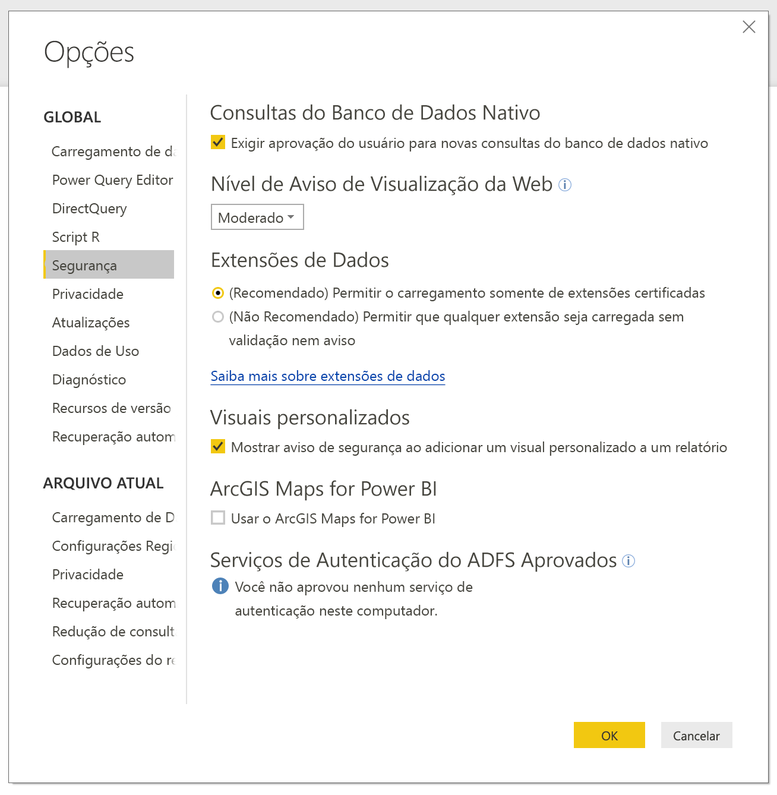
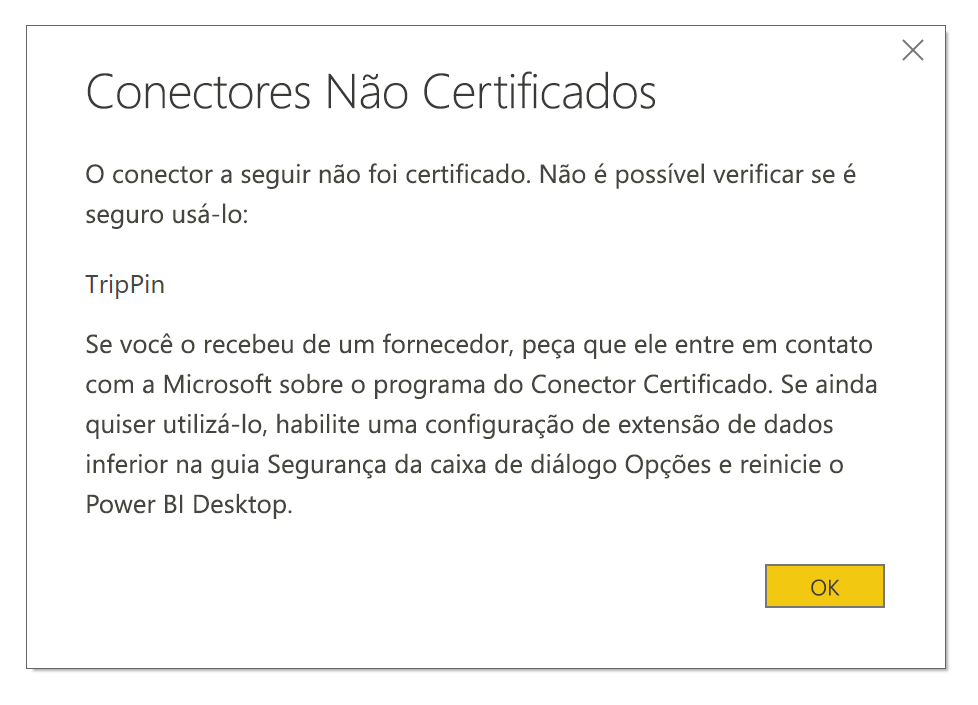

# Extensibilidade do conector no Power BI

No Power BI, clientes e desenvolvedores podem estender as fontes de dados que se conectam de várias maneiras. Eles usam conectores existentes e fontes de dados genéricos (por exemplo, ODBC, OData, Oledb, Web, CSV, XML, JSON). Ou, os desenvolvedores criar extensões de dados, conhecidas como **conectores personalizados**e torná-los **Certified conectores**.

No momento, você habilitar **conectores personalizados** usando um menu que permite que você com segurança controlar o nível de código personalizado que você deseja permitir que seja executado em seu sistema. Você pode escolher todos os conectores personalizados ou apenas os conectores certified e distribuídas pela Microsoft na **obter dados** caixa de diálogo.

## Conectores personalizados

**Conectores personalizados** pode incluir uma ampla gama de possibilidades, que variam de pequenas APIs críticas para os negócios, até grandes serviços específicos do setor que a Microsoft ainda não liberou um conector para. Muitos conectores são distribuídos pelo fornecedor. Se você tiver uma necessidade de um conector de dados específico, entre em contato com um fornecedor.

Para usar um **conector personalizado**, coloque-o na  *\[documentos]\\Power BI Desktop\\conectores personalizados* pasta e ajustar as configurações de segurança, conforme descrito em a seção a seguir.

Você não precisa ajustar as configurações de segurança para usar **Conectores Certificados**.

## Segurança da extensão de dados

Para alterar as configurações de segurança da extensão de dados, na **Power BI Desktop** selecionar **arquivo > Opções e configurações > Opções > segurança**.

Em **Extensões de Dados**, você pode selecionar dois níveis de segurança:

* (Recomendado) Permitir o carregamento somente de extensões certificadas
* (Não recomendado) Permitir o carregamento de qualquer extensão sem aviso

Se você planeja usar **conectores personalizados** ou conectores que você ou terceiros desenvolveram, você deve selecionar **"(Not Recommended) permitir qualquer extensão carregar sem aviso"** . Não recomendamos essa configuração de segurança, a menos que você confie plenamente seus conectores personalizados. Porque o código lá pode lidar com as credenciais, incluindo enviá-los por HTTP e ignorar os níveis de privacidade.

No **"(recomendado)"** segurança configuração, se não houver conectores personalizados em seu sistema, aparecerá um erro que descreve os conectores que não é possível carregar devido à segurança.

Para resolver o erro e usar esses conectores, alterar as configurações de segurança para o **"(Not Recommended) permitir qualquer extensão carregar sem aviso"** configuração conforme descrito anteriormente. Em seguida, reinicie **Power BI Desktop**.

## Conectores certificados

Um subconjunto limitado de extensões de dados é considerado **Certified**. Acessar os conectores de certificado na **obter dados** caixa de diálogo. Porém, o desenvolvedor de terceiros que criou o conector é responsável por sua manutenção e suporte. Embora a Microsoft distribui os conectores, não é responsável por seu desempenho ou a função contínua.

Se você deseja que um conector personalizado seja certificado, solicite que seu fornecedor contate dataconnectors@microsoft.com.
