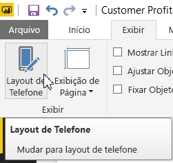
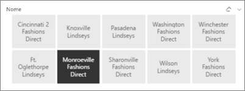
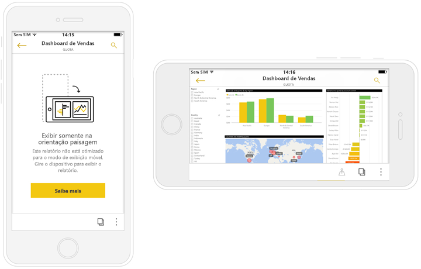

# Criar relatórios otimizados para os aplicativos de telefone do Power BI
Você pode melhorar a experiência de exibição de seus relatórios em um telefone nos aplicativos móveis com a criação de uma versão do relatório especificamente para o telefone. No Power BI Desktop e no serviço do Power BI, você pode adaptar seu relatório para o telefone reorganizando e redimensionando os visuais, talvez não incluindo todos eles, para uma experiência ideal. Além disso, você pode criar [*visuais* responsivos](#optimize-a-visual-for-any-size) e [segmentação responsiva](#enhance-slicers-to-to-work-well-in-phone-reports) que são bem redimensionados para a visualização em um telefone. Você também pode adicionar filtros ao relatório, os quais aparecerão automaticamente no relatório do telefone. Os leitores do relatório poderão vê-los e filtrar o relatório com eles.

## Definir o layout de uma página de relatório para o telefone

Depois de criar um relatório, você pode otimizá-lo para telefones.

1. Na Exibição de Relatório no Power BI Desktop, na guia **Exibição**, selecione **Layout do Telefone**.  
   
    
   
    No serviço do Power BI, selecione **Editar Relatório** > **Layout Móvel**.

    Você verá uma tela com telefone em branco. Todos os elementos visuais na página do relatório original são listados no painel Visualizações à direita.

3. Para adicionar um elemento visual ao layout do telefone, arraste-o do painel Visualizações para a tela do telefone.
   
    Relatórios de telefone usam um layout de grade. Ao arrastar elementos visuais para a tela do telefone, eles se ajustam à grade.
   
    
   
    Você pode adicionar alguns ou todos os elementos visuais da página de relatório mestre à página de relatório do telefone. Você pode adicionar cada elemento visual apenas uma vez.

4. Você pode redimensionar os elementos visuais na grade, como você faria para blocos em dashboards e dashboards móveis.
   
   A grade do relatório do telefone é dimensionada em telefones de tamanhos diferentes para que o relatório fique bom em telefones com tela pequena e grande.
   
   

## Otimizar um visual para qualquer tamanho
Você pode definir os visuais em seu dashboard ou relatório para serem *responsivos*, para mudarem dinamicamente para exibir o máximo de dados e insight, independentemente do tamanho da tela. 

Como um visual muda de tamanho, o Power BI prioriza a exibição de dados, por exemplo, removendo o preenchimento e movendo a legenda para a parte superior do visual automaticamente, para que ele continue informativo mesmo quando fica menor.

Você opta por ativar a capacidade de resposta para cada visual. Leia mais sobre a [otimização de visuais](visuals/desktop-create-responsive-visuals.md).

## Considerações ao criar layouts de relatório do telefone
* Para relatórios com várias páginas, você pode otimizar todas as páginas ou apenas algumas. 
* Se você tiver definido uma cor da tela de fundo para uma página de relatório, o relatório de telefone terá a mesma cor da tela de fundo.
* Você não pode modificar as configurações de formatação apenas para o telefone. A formatação é consistente entre os layouts mestres e móveis. Por exemplo, tamanhos de fonte serão os mesmos.
* Para alterar um elemento visual, como alterar sua formatação, seu conjunto de dados, seus filtros ou qualquer outro atributo, retorne ao modo de criação de relatórios regular.
* O Power BI fornece títulos e nomes de página padrão para relatórios de telefone no aplicativo móvel. Se você tiver criado elementos visuais de texto para títulos e nomes de página em seu relatório, considere não adicioná-los aos seus relatórios do telefone.     

## Remover um visual do layout do telefone
* Para remover um elemento visual, clique no X no canto superior direito do elemento visual na tela do telefone ou selecione-o e pressione **Excluir**.
  
   Remover o visual aqui apenas o remove da tela de layout do telefone. O visual e o relatório original não são afetados.
  
   

## Melhorar as segmentações funcionar bem em relatórios de telefone
As segmentações oferecem filtragem de dados de relatório na tela. Ao criar segmentações no modo de criação de relatórios regular, você pode modificar algumas configurações de segmentação para torná-los mais utilizáveis em relatórios de telefone:

* Decida se os leitores do relatório podem selecionar apenas um ou mais de um item.
* Coloque uma caixa ao redor da segmentação para facilitar a verificação do relatório.
* Torne a segmentação vertical, horizontal ou *responsiva*. 

Se você fizer a segmentação responsiva, à medida que altera seu tamanho e sua forma, ela mostrará mais ou menos opções. Ela pode ser alta, baixa, larga ou estreita. Se você a fizer pequena o suficiente, ela se tornará apenas um ícone de filtro na página do relatório. 

Leia mais sobre a [criação de segmentações responsivas](power-bi-slicer-filter-responsive.md).

## Publicar um relatório de telefone
* Para publicar a versão de telefone de um relatório, você [publica o relatório principal do Power BI Desktop no serviço do Power BI](desktop-upload-desktop-files.md) e a versão do telefone publica ao mesmo tempo.
  
    Leia mais sobre [compartilhamento e permissões no Power BI](service-how-to-collaborate-distribute-dashboards-reports.md).

## Exibir relatórios otimizados e não otimizados em um telefone
Nos aplicativos móveis em telefones, o Power BI detecta automaticamente relatórios de telefone otimizados e não otimizados. Se houver um relatório otimizado para telefone, o aplicativo de telefone do Power BI abrirá automaticamente o relatório no modo de relatório do telefone.

Se um relatório otimizado para telefone não existir, o relatório será aberto na exibição de paisagem não otimizada.  

Quando estiver em um relatório do telefone, alterar a orientação do telefone para paisagem abrirá o relatório no modo de exibição não otimizado com o layout do relatório original, independentemente de o relatório ser otimizado ou não.

Se você otimizar apenas algumas páginas, os leitores encontrarão uma mensagem no modo retrato, indicando que o relatório está disponível em paisagem.

Leitores de relatório podem virar seus telefones para o lado para ver a página em modo paisagem. Leia mais sobre a [interação com relatórios do Power BI otimizados para seu telefone](consumer/mobile/mobile-apps-view-phone-report.md).

## Próximas etapas
* [Criar uma exibição de telefone de um dashboard no Power BI](service-create-dashboard-mobile-phone-view.md)
* [Exibir relatórios do Power BI otimizados para seu telefone](consumer/mobile/mobile-apps-view-phone-report.md)
* [Criar visuais responsivos otimizados para qualquer tamanho](visuals/desktop-create-responsive-visuals.md)
* Mais perguntas? [Experimente perguntar à Comunidade do Power BI](http://community.powerbi.com/)

