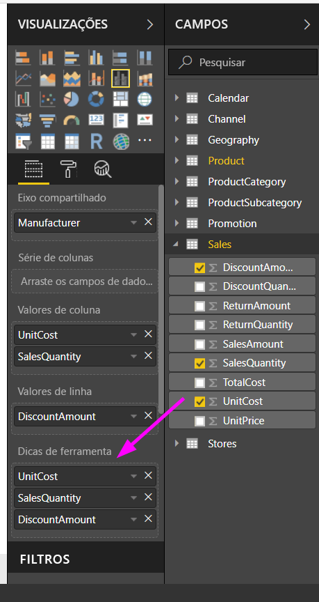
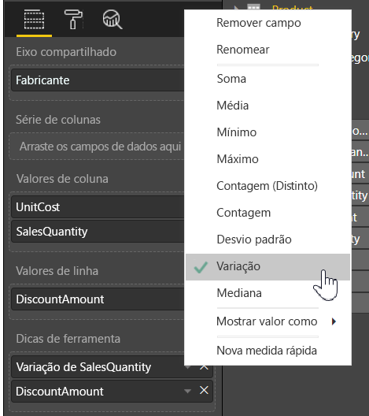

# Personalizando Dicas de Ferramenta no Power BI Desktop
Dicas de ferramenta são uma maneira elegante de fornecer mais informações contextuais e detalhes sobre pontos de dados em um visual. A imagem a seguir mostra uma dica de ferramenta aplicada a um gráfico no Power BI Desktop.

Quando uma visualização é criada, a dica de ferramenta padrão exibe a categoria e o valor do ponto de dados. Há muitas situações em poder personalizar as informações nas dicas de ferramenta seria útil e forneceria contexto e informações adicionais para usuários que veem o visual. Dicas de ferramentas personalizadas permitem que você especifique os pontos de dados adicionais que são exibidos como parte da dica de ferramenta.

## Como personalizar dicas de ferramentas
Para criar uma dica de ferramenta personalizada, nos **Campos** do painel **Visualizações**, basta arrastar um campo para o bucket **Dicas de ferramenta**, mostrado na imagem a seguir. Na imagem a seguir, dois campos foram colocados no bucket **Dicas de ferramenta**.

Após as dicas de ferramentas serem adicionadas ao campo, passar o mouse sobre um ponto de dados na visualização mostra os valores desses campos na dica de ferramenta.

## Personalizando dicas de ferramenta com agregação ou Cálculos Rápidos
Você pode personalizar mais a dica de ferramenta selecionando uma função de agregação ou um *Cálculo Rápido*, selecionando a seta ao lado do campo no bucket **Dicas de ferramenta** e selecionando as opções disponíveis.

Há muitas maneiras de personalizar **Dicas de ferramenta**, usando qualquer campo disponível no conjunto de dados, para transmitir informações e ideias rápidas para usuários que veem seus dashboards ou relatórios.

