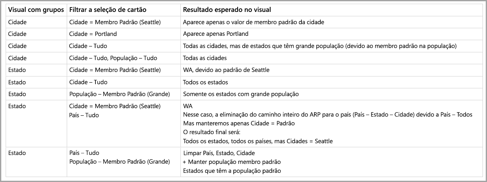

# Membro padrão em modelos multidimensionais no Power BI

Você pode se conectar a modelos multidimensionais no Power BI e criar relatórios que visualizem todos os tipos de dados dentro do modelo. Ao trabalhar com modelos multidimensionais, o Power BI aplica regras de como processar dados, com base na coluna que é definida como o *membro padrão*. 

Ao trabalhar com modelos multidimensionais, o Power BI trata os dados do modelo com base em onde é usada a coluna que contém **DefaultMember**. O atributo *DefaultMember* é definido em CSDL (Linguagem de Definição de Esquema Conceitual) para uma coluna específica em um modelo multidimensional. Você pode saber mais sobre o membro padrão no respectivo [artigo de propriedades de atributo](https://docs.microsoft.com/sql/analysis-services/multidimensional-models/attribute-properties-define-a-default-member?view=sql-server-2017). Ao executar uma consulta DAX, o membro padrão especificado no modelo é aplicado automaticamente.

Este artigo descreve como o Power BI se comporta sob várias circunstâncias ao trabalhar com modelos multidimensionais, com base em onde está o *membro padrão*. 

## Trabalhar com cartões de filtro

Ao criar um cartão de filtro em um campo com um membro padrão, o valor do campo do membro padrão é selecionado automaticamente no cartão de filtro. Consequentemente, todos os visuais que forem afetados pelo cartão de filtro mantêm os modelos padrão no banco de dados. Os valores nesses cartões de filtro refletem esse membro padrão.

Se o membro padrão é removido, desmarcar o valor o limpa de todos os visuais aos quais o cartão de filtro se aplica e os valores exibidos não refletem o membro padrão.

Por exemplo, imagine que temos uma *Moeda* que tenha um membro padrão definido como *USD*:

* Nesse caso de exemplo, se tivermos um cartão que mostre *Total de Vendas*, o valor terá o membro padrão aplicado e poderemos ver as vendas que correspondem a "USD".
* Se arrastarmos *Moeda* para o painel do cartão de filtro, veremos *USD* como o valor padrão selecionado. O valor de *Total de Vendas* permanecerá igual, uma vez que o membro padrão está aplicado.
* No entanto, se desmarcamos o valor *USD* do cartão de filtro, o membro padrão para *Moeda* será limpo e o *Total de Vendas* refletirá todas as moedas.
* Consequentemente, quando selecionamos outro valor no cartão de filtro (digamos que selecionamos *EURO*) do membro padrão, o *Total de Vendas* refletirá o filtro *Moeda EM {USD, EURO}*.

## Comportamento do agrupamento

No Power BI, sempre que você agrupar um visual em uma coluna que tenha um *membro padrão*, o Power BI limpará o *membro padrão* dessa coluna e seu caminho de relação de atributo. Isso garante que o visual exiba todos os valores, e não apenas os valores padrão.

## Caminhos de relação do atributo (ARPs)

Os ARPs fornecem poderosos recursos aos *membros padrão*, mas também introduzem uma certa quantidade de complexidade. Ao encontrar ARPs, o Power BI segue o caminho dos ARPs para limpar membros padrão adicionais de outras colunas, de modo a fornecer tratamento consistente e preciso de dados dos visuais.

Vejamos um exemplo para esclarecer o comportamento. Considere a seguinte configuração dos ARPs:

Agora vamos imaginar que os seguintes *membros padrão* estejam definidos para estas colunas:

* Cidade > Seattle
* Estado > WA
* País > EUA
* População > Grande

Agora vamos examinar o que acontece quando cada uma das colunas é usada no Power BI. Quando os visuais são agrupados nas seguintes colunas, estes são os resultados:

* **Cidade**: o Power BI exibe todas as cidades limpando todos os **membros padrão** de *Cidade*, *Estado* e *País*, mas preserva o **membro padrão** de *População*; o Power BI limpou todo o ARP de *Cidade*.
    > [!NOTE]
    > *População* não está no caminho ARP de *Cidade*, está exclusivamente relacionada a *Estado* e, portanto, o Power BI não a limpa.
* **Estado**: o Power BI exibe todos os *Estados* limpando todos os **membros padrão** de *Cidade*, *Estado*, *País* e *População*.
* **Cidade**: o Power BI exibe todos os países limpando todos os **membros padrão** de *Cidade*, *Estado* e *País*, mas preserva o **membro padrão** de *População*.
* **Cidade e Estado**: o Power BI limpa todos os **membros padrão** de todas as colunas.

Todo o caminho ARP dos grupos exibidos no visual é limpo. 

Se um grupo não for exibido no visual, mas fizer parte do caminho ARP de outra coluna agrupada, estas duas condições serão verdadeiras:

* Nem todas as ramificações do caminho ARP serão limpas automaticamente.
* Esse grupo continuará sendo filtrado pelo **membro padrão** não limpo.

### Segmentações de dados e cartões de filtro

Ao trabalhar com segmentações de dados e cartões de filtro, ocorre o seguinte comportamento:

* quando um cartão de filtro ou uma segmentação de dados é carregado(a) com dados, o Power BI os agrupa na coluna do visual, de modo que o comportamento de exibição é o mesmo descrito na seção anterior.

Uma vez que os cartões de filtro ou segmentações de dados muitas vezes são usados para interação com outros visuais, a lógica de limpar os **membros padrão** para os visuais afetados ocorre conforme explicado na tabela a seguir. 

Nesta tabela, usamos os mesmos dados de exemplo que foram usados anteriormente neste artigo:

As regras a seguir aplicam-se ao comportamento do Power BI nessas circunstâncias.

O Power BI limpa um **membro padrão** de uma determinada coluna se:

* O Power BI agrupar nessa coluna
* O Power BI agrupar em uma coluna relacionada a essa coluna (em qualquer lugar do ARP, para cima ou para baixo)
* O Power BI filtrar em uma coluna que esteja no ARP (para cima ou para baixo)
* A coluna tiver um cartão de filtro com o estado *TODOS*
* A coluna tiver um cartão de filtro com qualquer valor selecionado (o Power BI recebe um filtro para a coluna)

O Power BI não limpa um **membro padrão** para uma determinada coluna se:

* A coluna tiver um cartão de filtro com o estado padrão e o Power BI estiver agrupando em uma coluna em seu ARP.
* A coluna estiver acima de outra coluna no ARP e o Power BI tiver uma cartão de filtro para essa outra coluna no estado padrão.

## Próximas etapas

Este artigo descreveu o comportamento do Power BI ao trabalhar com membros padrão em modelos multidimensionais. Você também pode estar interessado nos seguintes artigos: 

* [Mostrar itens sem dados no Power BI](desktop-show-items-no-data.md)
* [Fontes de dados no Power BI Desktop](desktop-data-sources.md)
