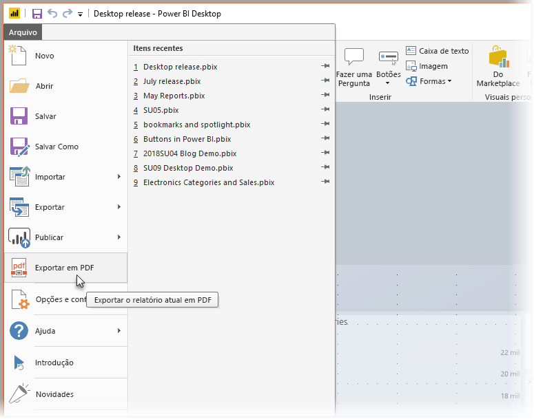
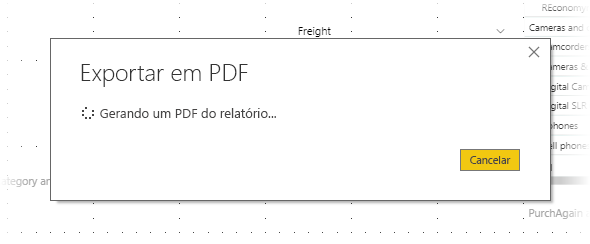

# Exportar relatórios para PDF do Power BI Desktop
No **Power BI Desktop**, é possível exportar relatórios para um arquivo PDF e, assim, compartilhá-los ou imprimi-los com facilidade desse PDF.

O processo de exportação do seu relatório do **Power BI Desktop** para um PDF, para você poder imprimir o PDF ou compartilhar esse documento PDF com outras pessoas, é simples. Basta selecionar **Arquivo > Exportar para PDF** no Power BI Desktop.

O processo **Exportar para PDF** exportará todas as páginas *visíveis* no relatório, com cada página do relatório sendo exportada para uma página única no PDF. As páginas de relatório que não estão visíveis no momento, como dicas de ferramenta ou páginas ocultas, não são exportadas para o arquivo PDF. 

Quando você seleciona **Arquivo > Exportar para PDF**, a exportação é iniciada e uma caixa de diálogo é exibida mostrando que o processo de exportação está em andamento. A caixa de diálogo permanecerá na tela até que o processo de exportação seja concluído. Durante o processo de exportação, toda a interação com o relatório que está sendo exportado é desabilitada. A única maneira de interagir com o relatório é aguardar até que o processo de exportação seja concluído ou cancelar a exportação. 

Quando a exportação for concluída, o PDF será carregado no visualizador de PDF padrão no computador. 

## Considerações e limitações
Há algumas considerações para se ter mente com o recurso **Exportar para PDF**:

* O recurso **Exportar para PDF** só está disponível com o **Power BI Desktop**, e não está disponível no momento no **serviço do Power BI**.
* O recurso exporta visuais personalizados, mas *não* exporta nenhum papel de parede que você pode ter aplicado ao relatório.

Como o papel de parede não é exportado para o PDF, você deve prestar atenção especial nos relatórios que usam um papel de parede escuro. Se o texto no seu relatório estiver claro ou for branco para se destacar sobre o papel de parede escuro, no processo de exportação para PDF será difícil lê-lo ou ele ficará ilegível, uma vez que o papel de parede não será exportado com o restante do relatório. 

## Próximas etapas
Há todos os tipos de elementos visuais e recursos interessantes no **Power BI Desktop**. Para obter mais informações, confira os seguintes recursos:

* [Usar elementos visuais para aprimorar os relatórios do Power BI](desktop-visual-elements-for-reports.md)
* [O que é o Power BI Desktop?](desktop-what-is-desktop.md)

