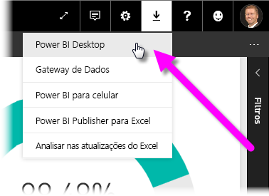
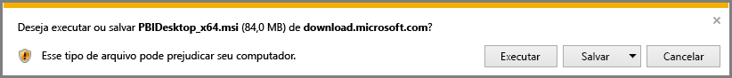
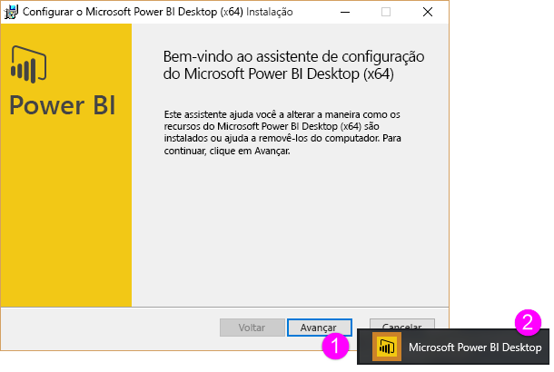
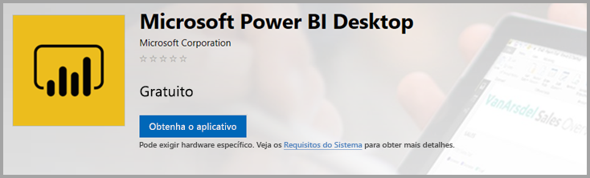
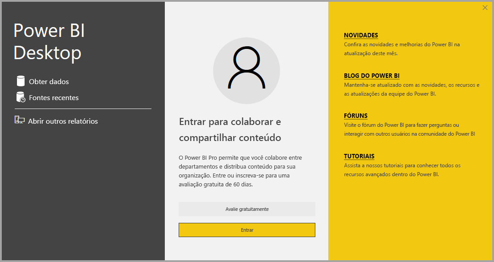

# Obter o Power BI Desktop
O **Power BI Desktop** permite a criação de consultas, modelos e relatórios avançados que visualizam dados. Com o **Power BI Desktop**, você pode criar modelos de dados, criar relatórios e compartilhar seu trabalho publicando-o no serviço do Power BI.  **Power BI Desktop** é um download gratuito.

É possível obter o **Power BI Desktop** de duas maneiras e cada uma delas é descrita nas seções a seguir:

* **Download** direto (um pacote MSI baixado e instalado no seu computador)
* Instalação como aplicativo da **Microsoft Store**

Qualquer uma dessas abordagens instalarão a versão mais recente do **Power BI Desktop** no seu computador, mas há algumas diferenças dignas de nota, que serão descritas nas seções a seguir.

## Baixe o Power BI Desktop
Para baixar a versão mais recente do **Power BI Desktop**, você pode selecionar o ícone de download no canto superior direito do serviço do Power BI e selecionar **Power BI Desktop**.

Você também pode baixar a versão mais recente do Power BI Desktop da seguinte página de download:

* [**Download do Power BI Desktop** (ambas as versões de 32 e 64 bits)](https://powerbi.microsoft.com/desktop).
  
  

Independentemente de qual modo você optar por baixar, quando o **Power BI Desktop** for baixado, você será solicitado a executar o arquivo de instalação:

O **Power BI Desktop** é instalado como um aplicativo e executado na sua área de trabalho.

> [!NOTE]
> A instalação da versão baixada (MSI) e a versão do **Microsoft Store** do **Power BI Desktop** no mesmo computador (às vezes conhecida como instalação *lado a lado*) não é compatível.
> 
> 

## Instalação como aplicativo da Microsoft Store
Também é possível obter o **Power BI Desktop** na Microsoft Store, por meio do link a seguir:

* [Instale o**Power BI Desktop** da **Microsoft Store**](http://aka.ms/pbidesktopstore)

Há algumas vantagens em obter o **Power BI Desktop** na Microsoft Store:

* **Atualizações automáticas**: assim que disponível, o Windows baixa a versão mais recente automaticamente em segundo plano, de modo que a sua versão permaneça sempre atualizada.
* **Downloads menores**: a **Microsoft Store** garante que apenas os componentes alterados em cada atualização sejam baixados em seu computador, o que resulta em downloads menores para cada atualização.
* **O privilégio de administrador não é necessário**: quando você baixa o MSI diretamente e o instala, é necessário ser administrador para que a instalação seja concluída com êxito. Quando você obtém o **Power BI Desktop** na Microsoft Store, o privilégio de administrador *não* é necessário.
* **Disponibilização de TI habilitada**: a versão da **Microsoft Store** pode ser implantada, ou *disponibilizada*, mais facilmente para todos os membros da sua organização e pode disponibilizar o **Power BI Desktop** por meio da **Microsoft Store para Empresas**.
* **Detecção de idioma**: a versão da **Microsoft Store** inclui todos os idiomas com suporte e verifica quais deles estão sendo usados no computador toda vez que ele é iniciado. Isso também afeta a localização de modelos criados no **Power BI Desktop**. Por exemplo, hierarquias de datas internas corresponderão ao idioma que o **Power BI Desktop** estava usando quando o arquivo .pbix foi criado.

Há algumas considerações e limitações para instalar o **Power BI Desktop** da Microsoft Store, como:

* Se o conector SAP for utilizado, poderá ser necessário mover os arquivos do driver do SAP para a pasta *Windows\System32*.
* Instalar o **Power BI Desktop** da Microsoft Store não copia as configurações do usuário da versão do MSI. Talvez seja necessário se reconectar às suas fontes de dados recentes e inserir novamente as credenciais de sua fonte de dados. 

> [!NOTE]
> A instalação da versão baixada (MSI) e a versão do **Microsoft Store** do **Power BI Desktop** no mesmo computador (às vezes conhecida como instalação *lado a lado*) não é compatível. Você deve desinstalar manualmente o **Power BI Desktop** antes de fazer download da **Microsoft Store**
> 
> [!NOTE]
> A versão do Servidor de Relatórios do Power BI do **Power BI Desktop** é uma instalação separada e diferente das versões discutidas neste artigo. Para saber mais sobre a versão do Servidor de Relatórios do **Power BI Desktop**, consulte [Criar um relatório do Power BI para o Servidor de Relatórios do Power BI](report-server/quickstart-create-powerbi-report.md).
> 
> 

## Usando o Power BI Desktop
Ao inicializar o **Power BI Desktop**, uma tela de *Boas-vindas* será exibida.

Se essa for sua primeira vez usando o **Power BI Desktop** (se a instalação não for uma atualização), será solicitado que você preencha um formulário e responda a algumas perguntas ou então que entre no **serviço do Power BI** antes que seja possível continuar.

Daí, você pode começar a criar relatórios ou modelos de dados e compartilhá-los com outros usuários no serviço do Power BI. Confira os links **Obter mais informações** no final deste artigo para links em guias que podem ajudá-lo a começar a usar **Power BI Desktop**.

## Requisitos mínimos
A lista a seguir fornece os requisitos mínimos para executar o **Power BI Desktop**:

* Windows 7 / Windows Server 2008 R2 ou posterior
* .NET 4.5
* Internet Explorer 9 ou posterior
* **Memória (RAM):** ao menos 1 GB disponível; recomendável 1,5 GB ou mais.
* **Vídeo:** recomendável pelo menos 1440 x 900 ou 1600 x 900 (16:9). Resoluções mais baixas, como 1024 x 768 ou 1280 x 800 não são recomendadas, pois determinados controles (como fechar a tela de inicialização) são exibidos além destas resoluções.
* **Configurações de vídeo do Windows:** se as configurações de vídeo forem definidas para alterar o tamanho do texto, dos aplicativos e de outros itens para mais de 100%, talvez você não consiga ver algumas caixas de diálogo que devem ser fechadas ou respondidas para que seja possível continuar usando o **Power BI Desktop**. Caso tenha esse problema, verifique as **Configurações de vídeo** acessando **Configurações > Sistema > Vídeo** no Windows e use o controle deslizante para retornar as configurações de vídeo para 100%.
* **CPU:** recomendável processador x86 ou x64 bits de 1 GHz (gigahertz) ou mais rápido.

## Considerações e limitações

Queremos que a sua experiência com o Power BI Desktop seja sempre incrível. Às vezes, você pode ter problemas com o Power BI Desktop, por isso, esta seção apresenta soluções ou sugestões para solucionar esses problemas. 

### Problemas ao usar versões anteriores do Power BI Desktop

Alguns usuários encontram um erro semelhante ao seguinte ao usar uma versão desatualizada do **Power BI Desktop**: 

    "We weren't able to restore the saved database to the model" 

A atualização para a versão atual do Power BI Desktop geralmente resolve esse problema.

### Desabilitar as notificações
Recomendamos a atualização para a versão mais recente do Power BI Desktop, a fim de aproveitar os avanços em recursos, desempenho, estabilidade e outras melhorias. Talvez algumas organizações não queiram que os usuários atualizem a cada nova versão. Você pode desabilitar as notificações modificando o Registro com as seguintes etapas:

1. No Editor do Registro, navegue até *HKEY_LOCAL_MACHINE\SOFTWARE\Microsoft\Microsoft Power BI Desktop*
2. Crie uma nova entrada com as seguintes configurações: *REG_DWORD: DisableUpdateNotification*
3. Defina o valor da nova entrada como **1**.

Será necessário reiniciar o computador para que a alteração entre em vigor.

### O Power BI Desktop é carregado com uma tela parcial

Em certas circunstâncias, incluindo algumas configurações de resolução de tela, alguns usuários poderão ver o Power BI Desktop renderizar o conteúdo com grandes áreas negras. Geralmente, isso é resultado de atualizações recentes do sistema operacional que afetaram o modo de renderização dos itens, e não o resultado direto de como o Power BI Desktop apresenta o conteúdo. Independentemente disso, grandes áreas negras não são tão interessantes quanto belos visuais, então, para resolver esse problema, execute estas etapas:

1. Pressione a tecla Iniciar e digite a palavra *desfocado* na barra de pesquisa exibida.
2. Na caixa de diálogo exibida, selecione a opção: *Permitir que o Windows corrija aplicativos que estão desfocados.*
3. Reinicie o Power BI Desktop.

Esse problema poderá ser resolvido após o lançamento de atualizações subsequentes do Windows. 
 

## Próximas etapas
Depois que você instalar o **Power BI Desktop**, o conteúdo a seguir poderá ajudá-lo a colocar ele em funcionamento rapidamente:

* [O que é o Power BI Desktop?](desktop-what-is-desktop.md)
* [Visão geral de Consulta com o Power BI Desktop](desktop-query-overview.md)
* [Fontes de dados no Power BI Desktop](desktop-data-sources.md)
* [Conectar-se a dados no Power BI Desktop](desktop-connect-to-data.md)
* [Formatar e combinar dados com o Power BI Desktop](desktop-shape-and-combine-data.md)
* [Tarefas comuns de consulta no Power BI Desktop](desktop-common-query-tasks.md)   

