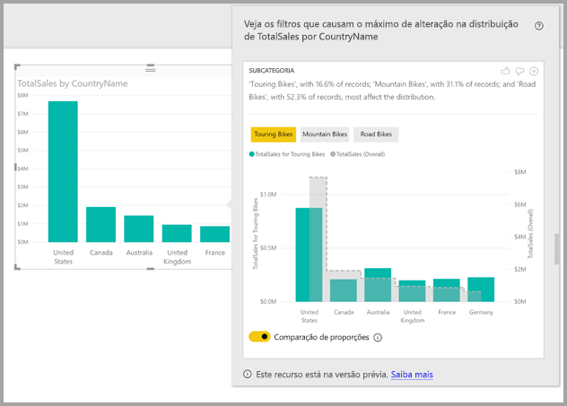
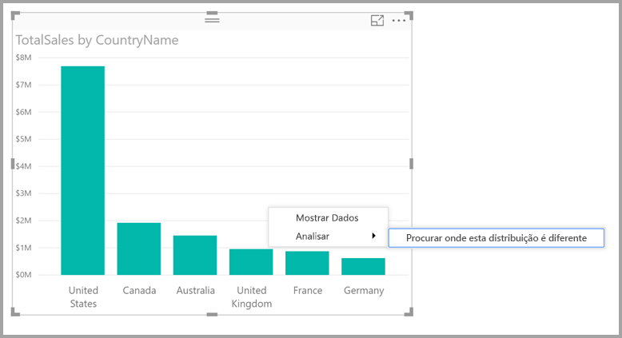
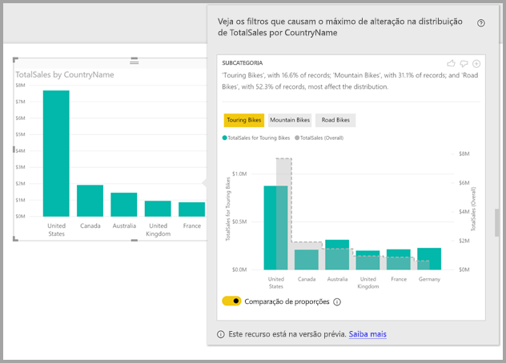

# Usar insights no Power BI Desktop para localizar onde uma distribuição está diferente (versão prévia)

Muitas vezes nos visuais, você vê um ponto de dados e se pergunta se a distribuição seria a mesma para categorias diferentes. Com o **insights** no **Power BI Desktop** você pode descobrir isso com apenas alguns cliques.

Considere o seguinte visual, que mostra o *Total de Vendas* por *País*. Como mostra o gráfico, a maioria das vendas vêm dos Estados Unidos, considerando 57% de todas as vendas com contribuições menores provenientes de outros países. Em casos como esse, é interessante explorar se essa mesma distribuição seria visualizada em diferentes subpopulações. Por exemplo, ela seria a mesma para todos os anos, todos os canais de vendas e todas as categorias de produtos?  Embora seja possível aplicar filtros diferentes e comparar os resultados visualmente, isso pode ser demorado e propenso a erros. 

Você pode solicitar que o **Power BI Desktop** localize onde uma distribuição é diferente e obter uma análise rápida, automatizada e informativas sobre seus dados. Basta clicar com o botão direito do mouse em um ponto de dados e selecionar **Analisar > Localizar onde a distribuição é diferente**, e o insight será fornecido em uma janela fácil de usar.

Nesse exemplo, a análise automatizada mostra rapidamente que, para *Touring Bikes*, a proporção de vendas nos Estados Unidos e no Canadá é menor, enquanto a proporção em outros países é maior.   

> [!NOTE]
> Esse recurso está em versão prévia e sujeito a alterações. O recurso de insights está habilitado e ativado por padrão (não é necessário marcar uma caixa Versão Prévia para habilitá-lo) a partir da versão de setembro de 2017 do **Power BI Desktop**.
> 
> 

## Usando insights
Para usar os insights a fim de descobrir as diferenças das distribuições vistas em gráficos, basta clicar com o botão direito do mouse em qualquer ponto de dados (ou no visual como um todo) e selecionar **Analisar > Descobrir as diferenças da distribuição**.

Em seguida, o **Power BI Desktop** executa seus algoritmos de aprendizado de máquina nos dados e popula uma janela com um visual e uma descrição de quais categorias (colunas) e quais valores dessas colunas resultam na distribuição mais significativamente diferente. Os insights são fornecidos como um gráfico de colunas, conforme é mostrado na imagem a seguir. 

Os valores com o filtro selecionado aplicado são exibidos usando a cor padrão normal. Os valores em geral, como vistos no visual inicial original, são mostrados em cinza para facilitar a comparação. Até três filtros diferentes podem ser incluídos (*Touring Bikes*, *Mountain Bikes*, *Road Bikes*, neste exemplo) e para escolher filtros diferentes basta clicar neles (ou usar Ctrl + clique para selecionar vários).

Para medidas aditivas simples, como *Total de Vendas* nesse exemplo, a comparação é baseada nos valores relativos, e não nos absolutos. Portanto, embora as vendas de Bicicletas de Passeio são menores do que as vendas totais para todas as categorias, o visual usa um eixo duplo por padrão para permitir que a comparação entre a proporção de vendas entre diferentes países, em Touring Bikes versus todas as categorias de bicicletas.  Mudar a alternância abaixo do visual permite que os dois valores sejam exibidos no mesmo eixo, para comparar os valores absolutos com facilidade (conforme é mostrado na imagem a seguir).    

O texto descritivo também oferece indicações do nível de importância que pode estar relacionada a um valor de filtro, considerando o número de registros que correspondem ao filtro. Nesse exemplo, você pode ver que embora a distribuição de *Touring Bikes* seja significativamente diferente, ela representa apenas 16,6% dos registros.

Os ícones *polegar para cima* e *polegar para baixo* na parte superior da página são fornecidos para que você possa fornecer comentários sobre o visual e o recurso. Isso fornece comentários, mas, no momento, não treina o algoritmo para influenciar os resultados retornados na próxima vez que você usar o recurso.

Além disso, o mais importante é o botão **+** na parte superior do visual, que permite adicionar o visual selecionado ao relatório, como se você tivesse criado o visual manualmente. Em seguida, você pode formatar ou, de outro modo, ajustar o visual adicionado exatamente como faria em qualquer outro visual do relatório. Você só pode adicionar um visual de insight selecionado quando estiver editando um relatório no **Power BI Desktop**.

Use os insights quando o relatório estiver no modo de leitura ou de edição, tornando-o versátil para a análise de dados e para a criação de visuais que podem ser adicionados com facilidade aos relatórios.

## Detalhes dos resultados retornados
Entenda que o algoritmo obtém todas as outras colunas do modelo e aplica todos os valores dessas colunas como filtros ao visual original, descobrindo quais desses valores de filtro produzem o resultado mais *diferente* do original.

Você provavelmente se perguntar o que *diferentes* significa. Por exemplo, digamos que a divisão geral de vendas entre os EUA e o Canadá seja a seguinte:

|País  |Vendas ($ milhão)|
|---------|----------|
|EUA      |15        |
|Canadá   |5         |

Assim, para uma determinada categoria de produto *"Road Bike*) a divisão de vendas pode ser:

|País  |Vendas ($ milhão)|
|---------|----------|
|EUA      |3        |
|Canadá   |1         |

Embora os números sejam diferentes em cada uma dessas tabelas, os valores relativos entre os EUA e o Canadá são idênticos (75% e 25% geral e para Road Bikes). Por isso, eles não são considerados diferentes. Para medidas aditivas simples como essa, o algoritmo procura as diferenças no valor *relativo*.  

Por outro lado, considere uma medida, como margem, que é calculada como Lucro/Custo, e considere que as margens geral para os EUA e Canadá eram a seguintes

|País  |Margem (%)|
|---------|----------|
|EUA      |15        |
|Canadá   |5         |

Assim, para uma determinada categoria de produto *"Road Bike*) a divisão de vendas pode ser:

|País  |Margem (%)|
|---------|----------|
|EUA      |3        |
|Canadá   |1         |

Devido à natureza dessas medidas, isso *é* curiosamente considerado diferente. Portanto, para medidas não aditivas, como nesse exemplo de margem, o algoritmo procura as diferenças no valor absoluto.

Portanto, os visuais exibidos tem como objetivo mostrar claramente as diferenças encontradas entre a distribuição geral (como visto no visual original) e o valor com o determinado filtro aplicado.  

Então, para medidas aditivas, como *Vendas* no exemplo anterior, é usado um gráfico de colunas e de linhas, no qual o uso de um eixo dual com o dimensionamento apropriado permite que os valores relativos sejam facilmente comparados. As colunas mostram o valor com o filtro aplicado e a linha mostra o valor geral (com o eixo de coluna à esquerda e o eixo de linha à direita, como normal). A linha é mostrada usando um *de nível* estilo, com uma linha tracejada, preenchido com cinza. No exemplo anterior, se o valor máximo do eixo de coluna é 4 e o valor máximo do eixo de linha é 20, em seguida, ele permitiria facilitar a comparação dos valores relativos entre os EUA e Canadá para os valores filtrados e geral. 

Da mesma forma, para medidas não aditivas, como *Margem* no exemplo anterior, é usado um gráfico de colunas e de linhas, no qual o uso de um único eixo significa que os valores absolutos podem ser comparados facilmente. Novamente a linha (preenchida de cinza) mostra o valor geral. Seja para comparar números reais ou relativos, a determinação do grau em que duas distribuições são diferentes não é simplesmente uma questão de calcular a diferença nos valores. Por exemplo:

* O tamanho da população é fatorado, pois uma diferença é que menos significativa estatisticamente e menos interessante quando se aplica a uma proporção menor da população geral. Por exemplo, a distribuição das vendas entre os países pode ser muito diferente para algum produto específico, mas isso não seria considerado interessante se houvesse milhares de produtos, pois um produto específico seria responsável por apenas um percentual pequeno do total de vendas.

* As diferenças para essas categorias em que os valores originais são muito altos ou muito próximos de zero são ponderadas mais do que outras. Por exemplo, se um país contribui apenas com 1% das vendas em geral, mas para um determinado tipo de produto ele contribui com 6%, isso é mais significativo estatisticamente e, portanto, considerado mais interessante do que um país cuja contribuição se altera de 50% para 55%. 

* Várias heurísticas são utilizadas para selecionar os resultados mais significativos, por exemplo, considerando as outras relações entre os dados.
     
Depois de examinar as diferentes colunas e os valores de cada uma dessas colunas, o conjunto de valores que fornece as maiores diferenças é escolhido. Para facilitar a compreensão, eles são agrupados por coluna, com a coluna cujos valores oferecem a maior diferença listados em primeiro lugar. Até três valores são mostrados por coluna, mas menor pode ser exibido se houver menos de três valores que têm um grande efeito ou se alguns valores são muito mais impactantes que outros. 

Nem sempre todas as colunas no modelo são examinadas no tempo disponível, portanto, não é garantido que as colunas e os valores mais impactantes sejam exibidos. No entanto, várias heurísticas são empregadas para garantir que as colunas mais prováveis sejam examinadas primeiro. Por exemplo, digamos que depois de examinar todas as colunas, seja determinado que as colunas/os valores a seguir apresentam o maior impacto na distribuição, do maior impacto para o menor:

    Subcategory = Touring Bikes
    Channel = Direct
    Subcategory = Mountain Bikes
    Subcategory = Road Bikes
    Subcategory = Kids Bikes
    Channel = Store

Este seria o resultado em ordem de coluna:

    Subcategory: Touring Bikes, Mountain Bikes, Road Bikes (only three listed, with the text including “...amongst others” to indicate that more than three have a significant impact) 

    Channel = Direct (only Direct listed, if it’s level of impact was much greater than Store)

## Considerações e limitações
A seguinte lista é uma coleção de cenários atualmente sem suporte em **insights**:

* Filtros TopN
* Filtros de medida
* Medidas não numéricas
* Uso de "Mostrar valor como"
* Medidas filtradas – medidas filtradas são cálculos no nível do visual com um filtro específico aplicado (por exemplo, *Total de Vendas na França*) e são usadas em alguns dos visuais criados pelo recurso de insights

Além disso, atualmente, não há suporte para os seguintes tipos de modelo e fontes de dados em insights:

* DirectQuery
* Live Connect
* Reporting Services local
* Inserção

## Próximas etapas
Para obter mais informações sobre o **Power BI Desktop** e como começar, confira os artigos a seguir.

* [O que é o Power BI Desktop?](desktop-what-is-desktop.md)
* [Visão geral de Consulta com o Power BI Desktop](desktop-query-overview.md)
* [Fontes de dados no Power BI Desktop](desktop-data-sources.md)
* [Conectar-se a dados no Power BI Desktop](desktop-connect-to-data.md)
* [Formatar e combinar dados com o Power BI Desktop](desktop-shape-and-combine-data.md)
* [Tarefas comuns de consulta no Power BI Desktop](desktop-common-query-tasks.md)   

