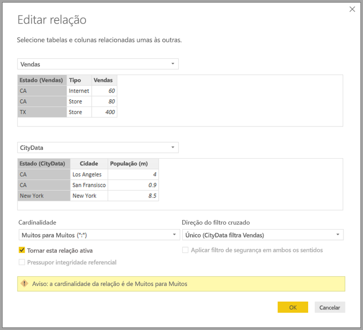

# Relações muitos para muitos no Power BI Desktop (prévia)

Com o recurso **relação muitos para muitos** no **Power BI Desktop**, você pode unir tabelas usando uma cardinalidade de **muitos para muitos** e criar modelos de dados que contêm várias fontes de dados de forma mais fácil e intuitiva. O recurso **relação muitos para muitos** faz parte dos recursos **modelos compostos** mais amplos no **Power BI Desktop**.

O recurso **relações muitos para muitos** no **Power BI Desktop** faz parte de uma coleção de três recursos relacionados:

* **Modelos compostos**: permite que um relatório tenha várias conexões de dados, incluindo conexões DirectQuery ou importação, em qualquer combinação.
* **Relações muitos para muitos**: com **modelos compostos**, você pode estabelecer **relações muitos para muitos** entre tabelas, removendo os requisitos para valores exclusivos nas tabelas e removendo soluções alternativas anteriores, como introduzir novas tabelas apenas para estabelecer relações. 
* **Modo de armazenamento**: agora é possível especificar que elementos visuais exigem uma consulta a fontes de dados de back-end. Os que não exigem são importados, mesmo que baseados no DirectQuery, melhorando o desempenho e reduzindo a carga de back-end. Antes, mesmo elementos visuais simples como as segmentações de dados iniciavam consultas sendo enviadas para fontes de back-end. 

Esta coleção de três recursos relacionados para os **modelos compostos** é descrita em artigos separados:

* **Modelos compostos** são descritos detalhadamente no artigo [Modelos compostos no Power BI Desktop (prévia)](desktop-composite-models.md).
* **Relações muitos para muitos** são descritas neste artigo.
* O **Modo de armazenamento** é descrito em seu próprio artigo, [Modo de armazenamento no Power BI Desktop (versão prévia)](desktop-storage-mode.md).

## Habilitando recurso de visualização de relações muitos para muitos

O recurso **relações muitos para muitos** faz parte dos recursos de **modelos compostos**, está em visualização e deve ser habilitado no **Power BI Desktop**. Para habilitar **modelos compostos**, selecione **Arquivo > Opções e Configurações > Opções > Recursos de Visualização** e marque a caixa de seleção **modelos compostos**.

Será preciso reiniciar o **Power BI Desktop** para que o recurso seja habilitado.

## O que as relações muitos para muitos resolvem

Antes da disponibilidade de **relações muitos para muitos**, ao ser definida uma relação entre duas tabelas no Power BI, pelo menos uma das colunas envolvidas na relação tinha que conter valores exclusivos. No entanto, em muitas circunstâncias, nenhuma coluna na tabela continha valores exclusivos. 

Por exemplo, duas tabelas podem ter uma coluna que contém o *País*, mas os valores de *País* não eram exclusivos em cada tabela. Para a união entre essas tabelas, era necessário criar uma solução alternativa, como introduzir tabelas adicionais para o modelo que continha os valores exclusivos necessários. O recurso **relações muitos para muitos** fornece uma abordagem alternativa, permitindo que essas tabelas sejam unidas diretamente usando uma relação com uma cardinalidade de **muitos para muitos**.  

## Como usar relações muitos para muitos

Ao definir uma relação entre duas tabelas no Power BI, você deve definir a cardinalidade da relação. Por exemplo, a relação entre *ProductSales* e *Produto* (usando as colunas *ProductSales [ProductCode]* e *Produto [ProductCode]*) seria definido como **Muitos-para-um**, pois há muitas vendas para cada produto, e a coluna na tabela *Produto* *(ProductCode)* é exclusiva. Ao definir uma cardinalidade da relação como **muitos-para-um**, **um-para-muitos** ou **um-para-um**, o Power BI realiza a validação para garantir que a cardinalidade selecionada corresponda aos dados reais.

Por exemplo, confira o modelo simples na imagem a seguir.

Imagine que a tabela *Produto* contida apenas duas linhas.

Imagine também que a tabela *Vendas* tenha apenas quatro linhas, incluindo *Vendas* de um produto **C** que não existe na tabela *Produto* (devido a um erro de integridade referencial).

Um visual que mostrasse *ProductName* e o *Preço* (da tabela *Produto*), juntamente com *Qty* total para cada produto (da tabela *ProductSales*) seria exibida como mostra a imagem a seguir: 

Como você pode ver na imagem anterior, há uma linha no visual com um espaço em branco *ProductName* associado a vendas do produto *C*. Essa linha em branco refere-se ao seguinte:

* Quaisquer linhas da tabela *ProductSales* para as quais não haja uma linha correspondente na tabela *Produto*: há um problema de integridade referencial, como podemos ver para o produto *C* neste exemplo.

* Quaisquer linhas na tabela *ProductSales* para as quais a coluna de chave estrangeira for Null. 

Por esses motivos, em ambos os casos, a linha em branco refere-se a vendas em que *ProductName* e *Preço* são desconhecidos.

No entanto, às vezes as tabelas são unidas por duas colunas, mas nenhuma coluna é exclusiva. Por exemplo, considere as duas seguintes tabelas:

* A tabela *Vendas* contém dados de vendas por *Estado*, com cada linha contendo o valor das vendas para o tipo de venda nesse estado (incluindo os estados de CA, WA e TX) 

    

* A tabela *CityData* contém dados de cidades, incluindo a população e o estado (incluindo os estados de CA, WA e Nova York)

    

Embora não haja uma coluna para *Estado* em ambas as tabelas e seja razoável querer relatar o total de *Vendas* por *Estado*, juntamente com a população total de cada estado, existe um problema: a coluna *Estado* não é exclusiva em nenhuma das tabelas. 

## A solução alternativa anterior

Nas versões do **Power BI Desktop** anteriores ao lançamento de julho de 2018, não era possível criar uma relação diretamente entre essas tabelas. Uma solução comum para esse problema era fazer o seguinte:

* Crie uma terceira tabela que contenha apenas as ids de *Estado* exclusivas. Pode ser uma tabela calculada (definida usando DAX) ou uma tabela definida pelo uso de uma consulta definida no **Editor de Consultas** que pode conter as ids exclusivas obtidas de uma das tabelas ou o conjunto completo unido.

* Relacione as duas tabelas originais à nova tabela, usando relações **Muitos-para-um* comuns.

Essa tabela de solução alternativa pode ser mantida visível ou oculta, de modo que não apareça na lista de campos. No último caso, as relações **muitos-para-um** normalmente são definidas para filtrar em ambas as direções, de modo que o campo *Estado* de qualquer tabela possa ser usado, com a filtragem cruzada subsequente propagada para a outra tabela. Essa abordagem de solução alternativa é mostrada na imagem a seguir da **Exibição de relações**.

Um visual que mostrasse o *Estado* (da tabela *CityData*), juntamente com a *população* total e o total de *Vendas* seria como o exemplo a seguir.

Observe que, dado o uso do estado da tabela *CityData* nessa solução alternativa, somente os *Estado*s na tabela são listados (e, assim, TX é excluído). Além disso, diferentemente do caso de relações**muitos-para-um**, embora a linha do total inclua todas as *Vendas* (incluindo as de TX), os detalhes não incluem uma linha em branco que abrange essas linhas não correspondentes. Da mesma forma, não havia linhas em branco, abrangendo quaisquer *Vendas* para as quais houvesse um valor nulo para o *Estado*.

Se a *Cidade* também for adicionada a esse visual, embora a população por *Cidade* seja conhecida, as *Vendas* mostradas para a *Cidade* simplesmente repetirão as *Vendas* para o *Estado* correspondente (como é normalmente o caso no agrupamento em uma coluna que não está relacionada a alguma medida de agregação), conforme mostrado na imagem a seguir.

Se a nova tabela *Vendas* tiver sido definida para ser a união de todos os *Estados* nessa solução alternativa e ficar visível na lista de campos, o mesmo visual que mostra *Estado* (na nova tabela), juntamente com a *População* total e o total de *Vendas* será como indicado a seguir.

Nesse caso e conforme mostrado no visual, *TX* (com *Vendas*, mas com população desconhecida) e *Nova York* (com população conhecida, mas sem *Vendas*) podem ser incluídos. 

Como você pode ver, essa solução alternativa não era ideal e tem vários problemas. Com a criação da **relação muitos para muitos**, esses problemas são resolvidos, conforme descrito na seção a seguir.

## Usando relações muitos para muitos em vez da solução alternativa

Nas versões do **Power BI Desktop** a partir de julho de 2018, você pode relacionar diretamente as tabelas descritas na seção anterior, sem a necessidade de recorrer a essas soluções alternativas. Agora é possível definir a cardinalidade de uma relação como **Muitos para Muitos**, indicando que nenhuma destas tabelas contém valores exclusivos. Para essas relações, você ainda pode controlar qual tabela filtra a outra tabela ou ter a filtragem bidirecional, em que ambas as tabelas se filtram entre si.  

> [!NOTE]
> A capacidade de criar relações **Muitos para Muitos** está em visualização e, enquanto isso, não é possível publicar modelos usando relações **Muitos para Muitos** para o serviço do Power BI. 

No **Power BI Desktop**, a cardinalidade usa como padrão **Muitos para Muitos** quando é determinado que nenhuma destas tabelas contém valores exclusivos para as colunas na relação. Nesses casos, que um aviso é exibido, para confirmar que essa relação de configuração é o comportamento desejado, em vez de ser o efeito não intencional de um problema de dados. 

Por exemplo, na criação de uma relação diretamente entre *CityData* e *Vendas*, em que os filtros devem fluir de *CityData* para *Vendas*, o diálogo de relação aparece como mostrado na imagem a seguir.

A **Exibição de Relações** resultante conteria a relação direta **Muitos para Muitos** entre as duas tabelas. A aparência na lista **Campos** e o comportamento subsequente quando elementos visuais são criados é igual ao uso da solução alternativa descrita na seção anterior, em que a tabela extra (com os *Estados* distintos nela) não fica visível. Por exemplo, como na seção anterior, que descreve a solução alternativa, uma visual que mostra *Estados* junto com a população total e vendas seria conforme a seguir.

Portanto, a principal diferença entre relações **Muitos para Muitos** e as relações mais comuns **muitos-para-um** é a seguinte.

* Os valores mostrados não incluem uma linha em branco referente a quaisquer linhas incompatíveis na outra tabela, nem para as linhas em que a coluna usada na relação na outra tabela é nula.
* Não é possível usar a função *RELATED()* (pois mais de uma linha pode estar relacionada)
* Usar a função *ALL()* em uma tabela não removerá os filtros aplicados a outras tabelas relacionadas a ela por uma relação **Muitos para Muitos**. Por exemplo, uma medida definida conforme a seguir no exemplo anterior não removeria filtros nas colunas na tabela *CityData* relacionada:

    

    Assim, um visual que mostra *Estado*, *Vendas* e *Total de vendas* resulta no seguinte:

    

Por isso, tome cuidado para garantir que cálculos que usam *TODOS(\<Tabela >)*, como *% do total geral*, retornem os resultados pretendidos. 

## Limitações e considerações

Há algumas limitações nesta versão de **relações muitos para muitos** e **modelos compostos**.

As seguintes fontes multidimensionais não podem ser usadas com os **modelos compostos**:

* SAP HANA
* SAP Business Warehouse
* SQL Server Analysis Services
* Conjuntos de dados do Power BI

Ao se conectar a essas fontes multidimensionais usando o DirectQuery, não é possível se conectar também a outra fonte de DirectQuery, nem combinar com dados importados.

As limitações existentes no uso do DirectQuery ainda se aplicam ao serem usadas **relações muitos para muitos**. Muitas dessas limitações agora são por tabela, dependendo do **modo de armazenamento** da tabela. Por exemplo, uma coluna calculada em uma tabela importada pode se referir a outras tabelas, mas uma coluna calculada em uma tabela do DirectQuery ainda fica restrita para se referir apenas às colunas na mesma tabela. Outras limitações se aplicam ao modelo como um todo se quaisquer das tabelas no modelo forem DirectQuery. Por exemplo, os recursos **QuickInsights** e **P e R** não estão disponíveis em um modelo se qualquer uma das tabelas nele tiver um **modo de armazenamento** do DirectQuery. 

## Próximas etapas

Os artigos a seguir tratam mais sobre os modelos compostos e também descrevem o DirectQuery em detalhes.

* [Modelos compostos no Power BI Desktop (prévia)](desktop-composite-models.md)
* [Modo de armazenamento no Power BI Desktop (prévia)](desktop-storage-mode.md)

Artigos do DirectQuery:

* [Usar o DirectQuery no Power BI](desktop-directquery-about.md)
* [Fontes de dados com suporte do DirectQuery no Power BI](desktop-directquery-data-sources.md)

