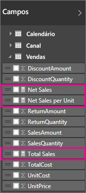
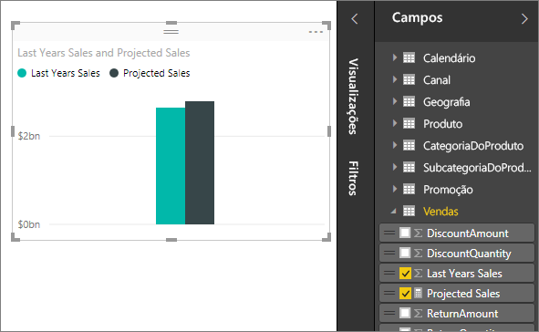

# Medidas no Power BI Desktop

O **Power BI Desktop** ajuda a criar informações sobre seus dados com apenas alguns cliques. Mas, às vezes, esses dados simplesmente não incluem tudo o que você precisa para responder algumas de suas perguntas mais importantes. As medidas podem ajudá-lo a alcançar essa meta.

As medidas são usadas em algumas das análises de dados mais comuns. Por exemplo, somas, médias, valores mínimos ou máximos, contagens ou cálculos mais avançados que você cria por conta própria usando uma fórmula DAX. Os resultados calculados das medidas estão sempre mudando em resposta à sua interação com seus relatórios, permitindo uma exploração de dados ad hoc, rápida e dinâmica. Vamos ver isso mais de perto.

## Noções básicas sobre medidas

No **Power BI Desktop**, as medidas são criadas e usadas na **Exibição de Relatório** ou na **Exibição de Dados**. As medidas que você cria são exibidas na lista Campos com um ícone de calculadora. Você pode nomear as medidas como desejar e adicioná-las a uma visualização nova ou existente, assim como com qualquer outro campo.

> [!NOTE]
> Talvez sejam também de seu interesse **medidas rápidas**, que são medidas prontas que podem ser selecionadas nas caixas de diálogo. Elas são uma boa maneira de criar medidas rapidamente e também de aprender a sintaxe DAX, uma vez que suas fórmulas DAX criadas automaticamente estão disponíveis para examinar. Confira o artigo: [medidas rápidas](desktop-quick-measures.md).
> 
> 

## Data Analysis Expressions (expressões de análise de dados)

As medidas calculam um resultado por meio de uma fórmula de expressão. Quando criar suas próprias medidas, você usará a linguagem de fórmula DAX [(Data Analysis Expressions)](https://msdn.microsoft.com/library/gg413422.aspx). O DAX inclui uma biblioteca de mais de 200 funções, operadores e constructos. Sua biblioteca fornece uma enorme flexibilidade na criação de medidas para calcular os resultados de praticamente qualquer análise de dados exigida.

As fórmulas DAX são muito semelhantes às fórmulas do Excel. O DAX tem muitas das mesmas funções que o Excel, como DATE, SUM e LEFT. As funções do DAX, no entanto, devem funcionar com dados relacionais, como os que temos no Power BI Desktop.

## Vejamos um exemplo
Julia é gerente de vendas da Contoso. Foi requisitado que ela fornecesse projeções de vendas de revendedores para o próximo ano fiscal. Sara decide basear suas estimativas nos valores de vendas do ano anterior, com um aumento anual de 6% resultante de várias promoções agendadas para os próximos seis meses.

Para relatar as estimativas, Sara importa os dados de vendas do ano anterior para o Power BI Desktop. Ela localiza o campo SalesAmount na tabela Reseller Sales. Como os dados importados contêm somente valores de vendas do ano anterior, Sara renomeia o campo SalesAmount como Last Years Sales. Em seguida, Sara arrasta Last Years Sales para a tela do relatório. Eles aparecem em uma visualização de gráfico como um valor único, que é a soma de todas as vendas dos revendedores do ano anterior.

Sara observa que um cálculo foi fornecido automaticamente, embora ela não tenha especificado nenhum. O Power BI Desktop criou sua própria medida somando todos os valores em Last Years Sales.

No entanto, Julia precisa de uma medida para calcular as projeções de vendas para o próximo ano, que serão baseadas nas vendas do ano anterior multiplicadas por 1,06 - para considerar o aumento de 6% esperado nos negócios. Para esse cálculo, ela criará sua própria medida. Usando o recurso Nova Medida, ela cria uma nova medida e, em seguida, insere a seguinte fórmula DAX:

    Projected Sales = SUM('Sales'[Last Years Sales])*1.06

Em seguida, Sara arrasta sua nova medida Projected Sales até o gráfico.

Rapidamente e com pouquíssimo trabalho, agora Sara tem uma medida para calcular as vendas projetadas. Sara poderá analisar melhor suas projeções filtrando por revendedores específicos ou adicionando outros campos ao seu relatório.

## Categorias de dados para medidas

Também é possível escolher as categorias de dados para medidas. 

Entre outras coisas, isso permite que você use medidas para criar URLs dinamicamente e marcar a categoria de dados como uma URL da Web. 

É possível criar tabelas que exibem as medidas como URLs da Web e clicar na URL criada com base em sua seleção. Isso será especialmente útil quando você desejar vincular a outros relatórios do Power BI com [parâmetros de filtro de URL](service-url-filters.md).

## Saiba mais
Fornecemos aqui apenas uma rápida introdução às medidas, mas há muito mais conteúdo para lhe ajudar a criá-las por conta própria. Não deixe de conferir o [Tutorial: Criar suas próprias medidas no Power BI Desktop](desktop-tutorial-create-measures.md), em que você pode baixar um arquivo de exemplo e obter lições passo a passo sobre como criar mais medidas.  

Para se aprofundar mais no DAX, não deixe de conferir [DAX basics in Power BI Desktop](desktop-quickstart-learn-dax-basics.md) (Noções básicas do DAX no Power BI Desktop). A [Referência de Data Analysis Expressions](https://msdn.microsoft.com/library/gg413422.aspx) fornece artigos detalhados sobre cada uma das funções, sintaxe, operadores e convenções de nomenclatura. O DAX já existe há muitos anos no Power Pivot no Excel e no SQL Server Analysis Services; portanto, há muitos outros recursos excelentes disponíveis também. Não deixe de conferir o [Wiki do Centro de Recursos do DAX](http://social.technet.microsoft.com/wiki/contents/articles/1088.dax-resource-center.aspx), no qual membros influentes da comunidade de BI compartilham seus conhecimentos sobre o DAX.

