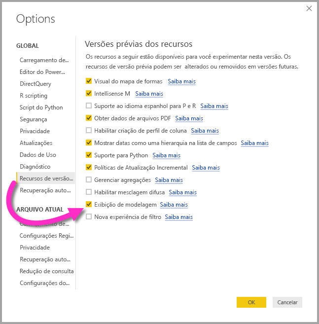
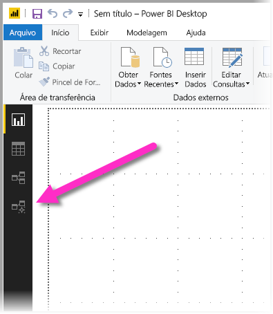
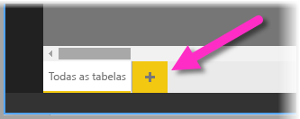
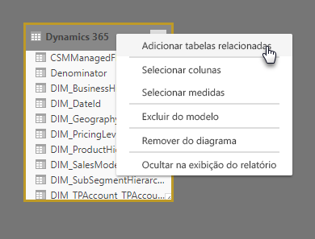
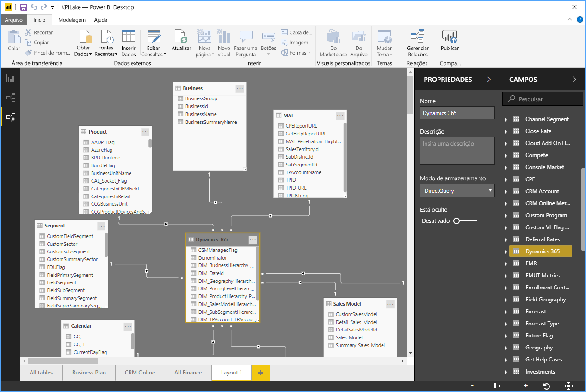
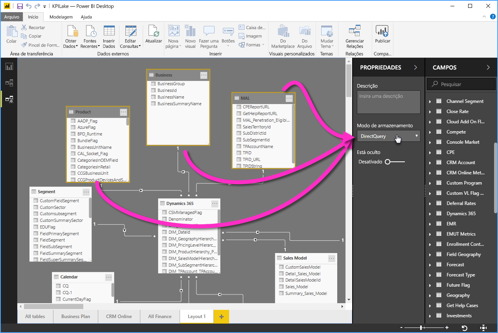

# Exibição de Modelagem no Power BI Desktop (versão prévia)

Com a **Exibição de Modelagem** no **Power BI Desktop**, você pode exibir e trabalhar com conjuntos de dados complexos que contêm muitas tabelas. Com a Exibição de Modelagem, você pode fazer o seguinte:

## Habilitar a versão prévia do recurso Exibição de Modelagem

O recurso Exibição de Modelagem está em versão prévia e deve ser habilitado no **Power BI Desktop**. Para habilitar a Exibição de Modelagem, selecione **Arquivo > Opções e Configurações > Opções > Versão Prévia dos Recursos** e, em seguida, marque a caixa de seleção **Exibição de Modelagem**, conforme mostrado na imagem a seguir.

Você será solicitado a reinicializar o **Power BI Desktop** para que a versão prévia do recurso seja habilitada. 

## Usando a Exibição de Modelagem

Para acessar a Exibição de Modelagem, selecione o ícone de Exibição de Modelagem localizado no lado esquerdo do **Power BI Desktop**, conforme mostrado na imagem a seguir.

## Criando diagramas separados

Com a Exibição de Modelagem, você pode criar diagramas do modelo, que contêm apenas um subconjunto das tabelas no modelo. Isso pode ajudar a fornecer uma exibição mais clara das tabelas com as quais você deseja trabalhar e facilita o trabalho com conjuntos de dados complexos. Para criar um novo diagrama com apenas um subconjunto das tabelas, clique no sinal **+**, ao lado da guia **Todas as tabelas**, na parte inferior da janela do Power BI Desktop.

Você pode arrastar uma tabela da lista **Campos** para a superfície do diagrama. Clique com botão direito do mouse na tabela e selecione **Adicionar tabelas relacionadas**, no menu exibido.

Quando você fizer isso, as tabelas relacionadas à tabela original serão exibidas no novo diagrama. A imagem a seguir mostra como as tabelas relacionadas são exibidas após a seleção da opção de menu **Adicionar tabelas relacionadas**.

## Configurando propriedades comuns

Para selecionar vários objetos ao mesmo tempo na Exibição de Modelagem, mantenha pressionada a tecla **Ctrl** e clique em várias tabelas. Quando você seleciona várias tabelas, elas ficam realçadas na Exibição de Modelagem. Quando várias tabelas são realçadas, as alterações aplicadas no painel **Propriedades** se aplicam a todas as tabelas selecionadas.

Por exemplo, para alterar o [modo de armazenamento](desktop-storage-mode.md) de várias tabelas na exibição de diagrama, mantenha pressionada a tecla **Ctrl**, selecione tabelas e altere a configuração do modo de armazenamento no painel **Propriedades**.

## Próximas etapas

Os artigos a seguir tratam mais sobre os modelos de dados e também descrevem detalhadamente o DirectQuery.

* [Agregações no Power BI Desktop (versão prévia)](desktop-aggregations.md)
* [Modelos compostos no Power BI Desktop (prévia)](desktop-composite-models.md)
* [Modo de armazenamento no Power BI Desktop (prévia)](desktop-storage-mode.md)
* [Relações muitos para muitos no Power BI Desktop (prévia)](desktop-many-to-many-relationships.md)

Artigos do DirectQuery:

* [Usar o DirectQuery no Power BI](desktop-directquery-about.md)
* [Fontes de dados com suporte do DirectQuery no Power BI](desktop-directquery-data-sources.md)
