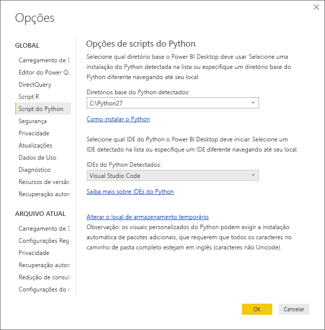
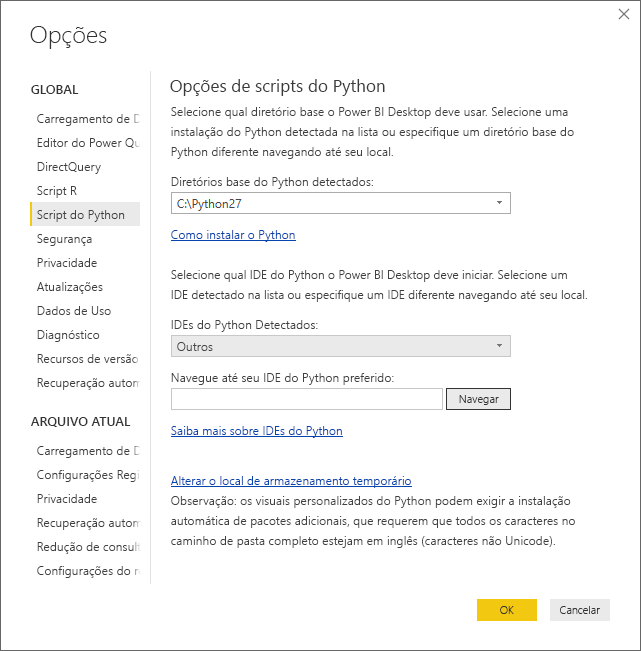
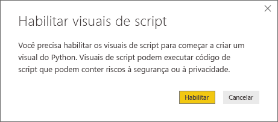
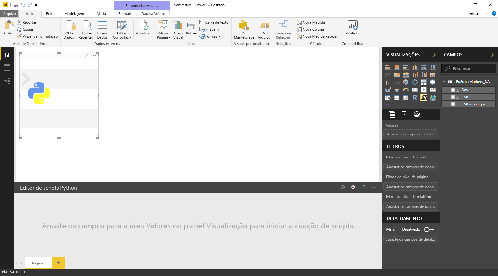
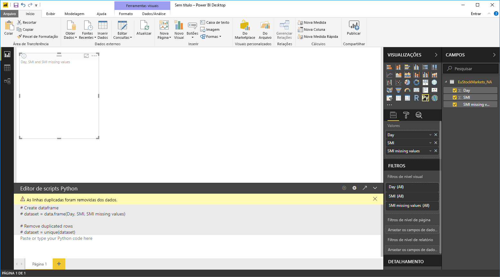
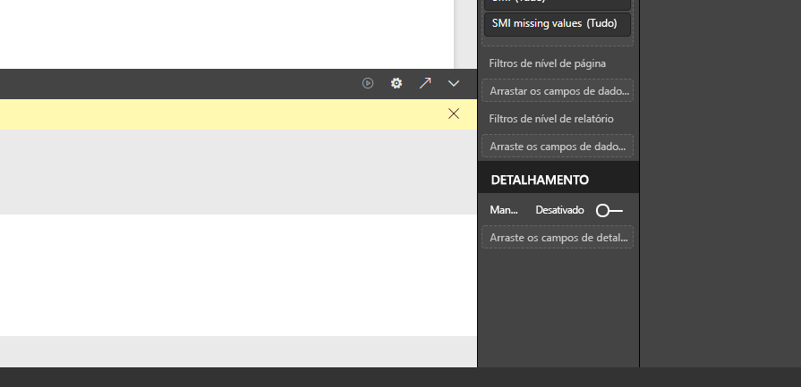
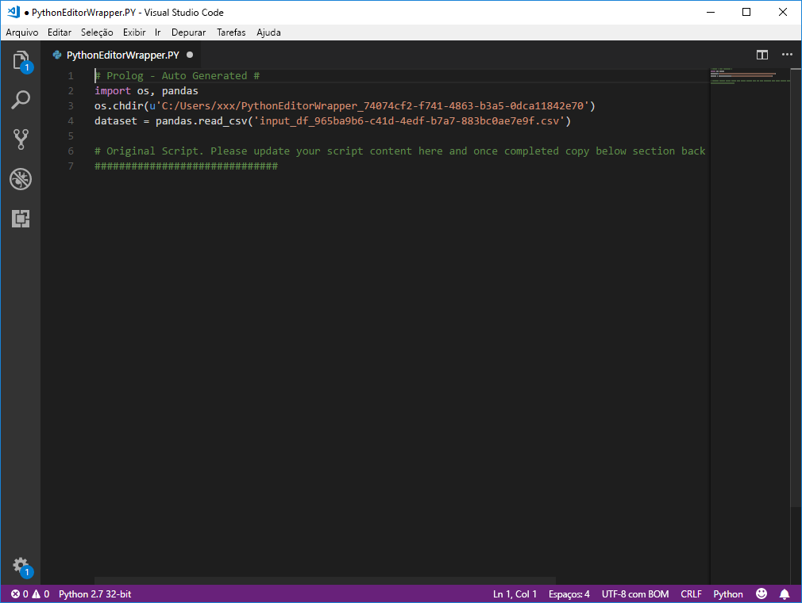

# Usar um IDE do Python externo com o Power BI
Com o **Power BI Desktop**, você pode usar um IDE do Python externo (ambiente de desenvolvimento integrado) para criar e refinar scripts do Python e então usar esses scripts no Power BI.

## Habilitar um IDE do Python externo
Você pode inicializar o seu IDE do Python externo do **Power BI Desktop** e fazer com que seus dados sejam automaticamente importados e exibidos no IDE do Python. Ali, você pode modificar o script nesse IDE do Python externo e então colá-lo novamente no **Power BI Desktop** para criar elementos visuais do Power BI e relatórios.

Você pode especificar qual IDE do Python você gostaria de usar e inicializá-lo automaticamente por meio do **Power BI Desktop**.

### Requisitos
Para usar esse recurso, você precisa instalar um **IDE do Python** no computador local. O **Power BI Desktop** não inclui, não implanta nem instala o mecanismo do Python, portanto, você deve instalar o **Python** separadamente no computador local. Você pode escolher qual IDE do Python usar com as seguintes opções:

* Você pode instalar seu IDE do Python favorito; muitos desses IDEs estão disponíveis gratuitamente, como a [página de download do Visual Studio Code](https://code.visualstudio.com/download/).
* **Power BI Desktop** também dá suporte para o **Visual Studio**.
* Você também pode instalar um IDE do Python diferente e fazer com que o **Power BI Desktop** inicialize o **IDE do Python** seguindo um destes procedimentos:
  
  * Você pode associar arquivos **.PY** ao IDE externo que você deseja que o **Power BI Desktop** inicialize.
  * Você pode especificar o .exe que **Power BI Desktop** deve inicializar selecionando *Outros* na seção **Opções de Script Python** do diálogo **Opções**. Você pode o diálogo **Opções** ao acessar **Arquivo > Opções e configurações > Opções**.
    
    

Se você tiver vários IDEs do Python instalados, poderá especificar qual será inicializado selecionando-o na lista suspensa *IDEs do Python Detectados* na caixa de diálogo **Opções**.

Por padrão, o **Power BI Desktop** inicializará o **Visual Studio Code** como IDE do Python externo se for instalado no seu computador local; se o **Visual Studio Code** não estiver instalado e você tiver o **Visual Studio**, ele será inicializado no lugar. Se nenhum desses IDEs do Python estiver instalado, o aplicativo associado a arquivos **.PY** será inicializado.

Se não existir nenhuma associação de arquivo **.PY**, será possível especificar um caminho para um IDE personalizado na seção *Navegar até seu IDE do Python preferido* do diálogo **Opções**. Você também pode inicializar um IDE do Python diferente selecionando o ícone de engrenagem **Configurações** ao lado do ícone de seta **Inicializar IDE do Python** no **Power BI Desktop**.

## Inicializar um IDE do Python por meio do Power BI Desktop
Para inicializar um IDE do Python no **Power BI Desktop**, execute as etapas a seguir:

1. Carregue os dados no **Power BI Desktop**.
2. Selecione alguns campos do painel **Campos** com o qual você deseja trabalhar. Se você ainda não tiver habilitado elementos visuais de script, será solicitado a fazê-lo.
   
   
3. Quando os elementos visuais de script estão habilitados, você pode selecionar um elemento visual do Python do painel **Visualizações**, que cria um visual do Python em branco que está pronto para exibir os resultados do script. O painel **Editor de script Python** também aparece.
   
   
4. Agora você pode selecionar os campos que você deseja usar em seu script Python. Quando você seleciona um campo, o campo **Editor de script Python** cria automaticamente um código de script com base no campo ou campos selecionados por você. Você pode criar (ou colar) o script Python diretamente no painel **Editor de script Python**, ou pode deixá-lo vazio.
   
   
   
   > [!NOTE]
   > O tipo de agregação padrão para visuais do Python é *não resumir*.
   > 
   > 
5. Agora você pode inicializar o IDE do Python diretamente do **Power BI Desktop**. Selecione o botão **Inicializar IDE do Python**, localizado no lado direito da barra de título do **Editor de script Python**, conforme mostrado abaixo.
   
   
6. O IDE do Python especificado é inicializado pelo Power BI Desktop, conforme mostra a imagem a seguir (nesta imagem **Visual Studio Code** é o padrão do IDE do Python).
   
   
   
   > [!NOTE]
   > O **Power BI Desktop** adiciona as primeiras três linhas do script para que os dados possam ser importados do **Power BI Desktop** quando você executar o script.
   > 
   > 
7. Os scripts que você criou no **painel Editor de script Python** do **Power BI Desktop** aparece começando na linha 4 no seu IDE do Python. Neste ponto, você pode criar seu script de Python no IDE do Python. Uma vez que o script Python esteja concluído no seu IDE do Python, você precisará copiá-lo e colá-lo de volta no painel **Editor de script Python** no **Power BI Desktop**, *excluindo* as três primeiras linhas do script que o **Power BI Desktop** tiver gerado automaticamente. Não copie as três primeiras linhas do script de volta no **Power BI Desktop**, essas linhas foram usadas apenas para importar os dados do **Power BI Desktop** para o IDE do Python.

### Limitações conhecidas
Iniciar um IDE do Python diretamente do Power BI Desktop tem algumas limitações:

* Não há suporte para exportar automaticamente o script do IDE do Python para o **Power BI Desktop**.

## Próximas etapas
Dê uma olhada nas informações adicionais a seguir sobre o Python no Power BI.

* [Como executar de scripts do Python no Power BI Desktop](desktop-python-scripts.md)
* [Criar visuais do Power BI usando Python](desktop-python-visuals.md)

