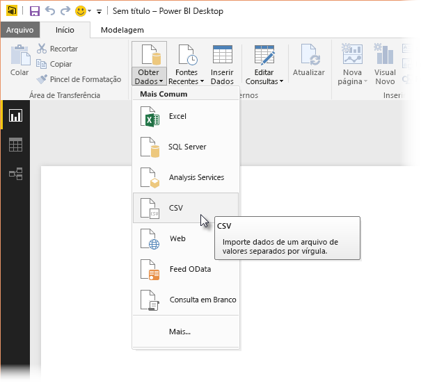
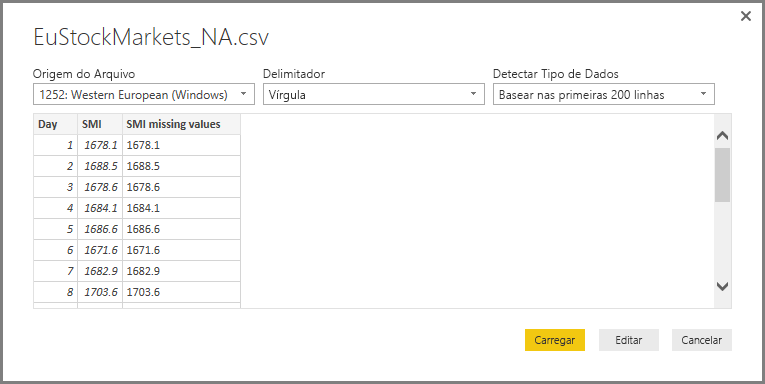
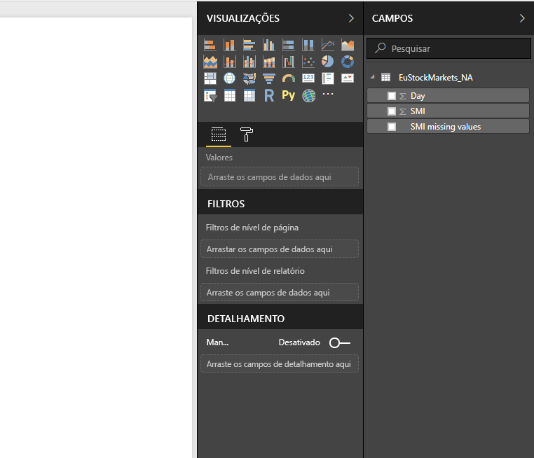
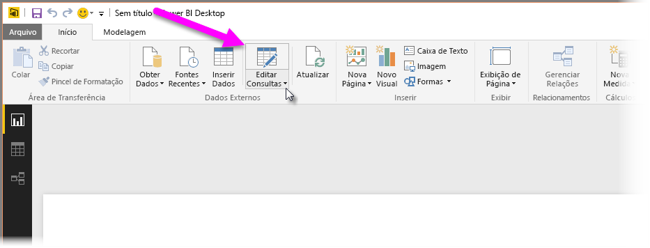
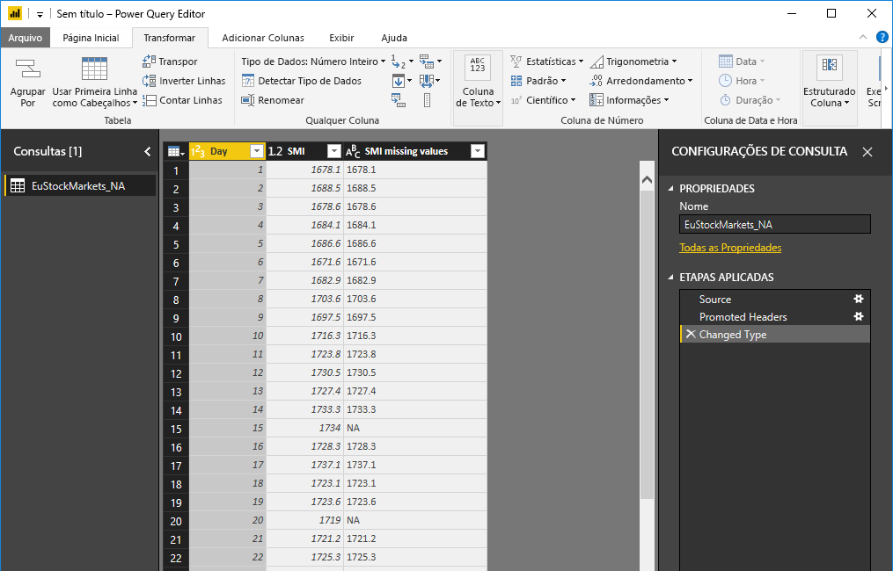
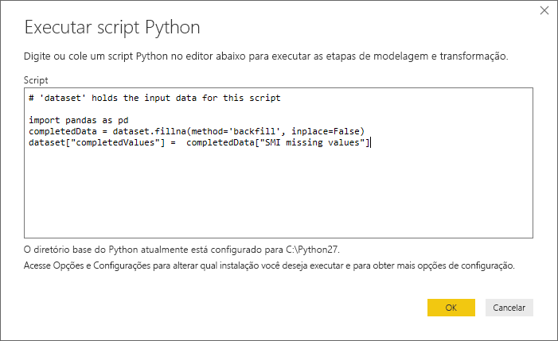
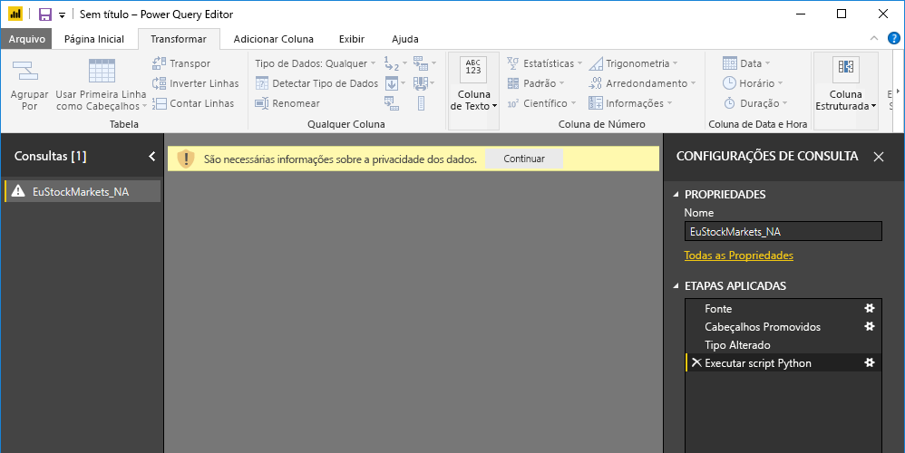
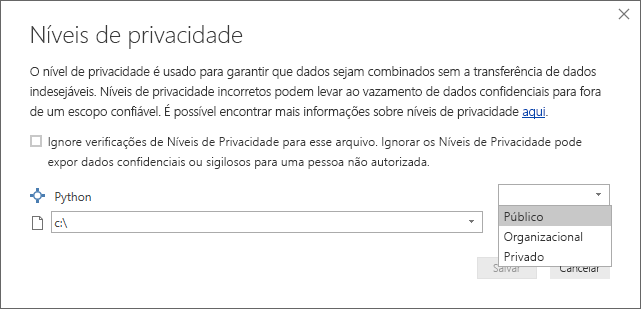
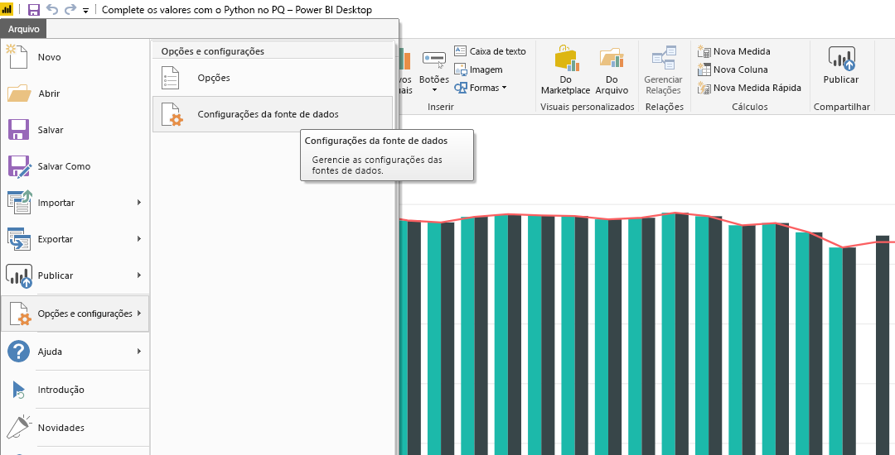
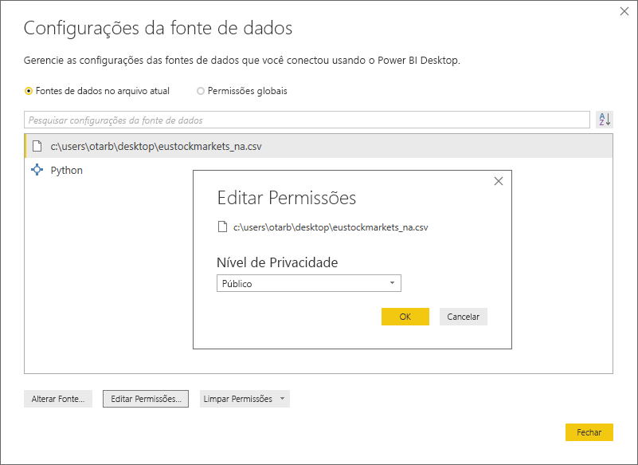

# Como usar o Python no Editor de Consultas
Você pode usar **Python**, uma linguagem de programação amplamente usada por estatísticos, cientistas de dados e analistas de dados, no **Editor de Consultas** do Power BI Desktop. Essa integração de Python ao **Editor de Consultas** permite executar a limpeza de dados usando Python e executar análise e modelagem de dados avançadas em conjuntos de dados, inclusive completar dados ausentes, fazer previsões e clustering, apenas para citar alguns exemplos. **Python** é uma linguagem poderosa e pode ser usada no **Editor de Consultas** para preparar seu modelo de dados e criar relatórios.

## Como instalar o Python
Para usar **Python** no **Editor de Consultas** do Power BI Desktop, você precisa instalar **Python** no computador local. Você pode baixar e instalar o **Python** gratuitamente em vários locais, incluindo a [página de download do Python Oficial](https://www.python.org/) e o [Anaconda](https://anaconda.org/anaconda/python/).

## Como usar o Python no Editor de Consultas
Para mostrar como usar **Python** no **Editor de Consultas**, veja um exemplo de um conjunto de dados do mercado de ações, com base em um arquivo .CSV que você pode [baixar aqui](http://download.microsoft.com/download/F/8/A/F8AA9DC9-8545-4AAE-9305-27AD1D01DC03/EuStockMarkets_NA.csv) para acompanhar o exemplo. As etapas deste exemplo são as seguintes:

1. Primeiro, carregue os dados no **Power BI Desktop**. Neste exemplo, carregue o arquivo *EuStockMarkets_NA.csv* e selecione **Obter Dados > CSV** na faixa de opções **Início** do **Power BI Desktop**.
   
   
2. Selecione o arquivo e selecione **Abrir**. O CSV será exibido na caixa de diálogo **Arquivo CSV**.
   
   
3. Depois que os dados forem carregados, você os verá no painel **Campos** no Power BI Desktop.
   
   
4. Abra o **Editor de Consultas** selecionando **Editar Consultas** na guia **Início** do **Power BI Desktop**.
   
   
5. Na guia **Transformar**, selecione **Executar Script Python**, e o editor **Executar Script Python** será exibido (mostrado na próxima etapa). Observe que as linhas 15 e 20 têm dados ausentes, assim como outras linhas que você não pode ver na imagem a seguir. As etapas a seguir mostram como Python pode (e vai) completar essas linhas para você.
   
   
6. Para este exemplo, insira o seguinte código de script:
   
       import pandas as pd
       completedData = dataset.fillna(method='backfill', inplace=False)
       dataset["completedValues"] =  completedData["SMI missing values"]
   
   > [!NOTE]
   > Instale a biblioteca *pandas* em seu ambiente Python para que o código do script anterior funcione corretamente. Para instalar o pandas, execute o comando a seguir em sua instalação do Python: |      > pip install pandas
   > 
   > 
   
   Quando colocado na caixa de diálogo **Executar Script Python**, o código é semelhante ao seguinte:
   
   
7. Ao selecionar **OK**, o **Editor de Consultas** exibirá um aviso sobre a privacidade dos dados.
   
   
8. Para que os scripts Python funcionem corretamente no serviço do Power BI, todas as fontes de dados precisam ser definidas como *públicas*. Para obter mais informações sobre as configurações de privacidade e suas implicações, confira [Níveis de privacidade](desktop-privacy-levels.md).
   
   
   
   Observe uma nova coluna no painel **Campos** chamada *completedValues*. Observe que há alguns elementos de dados ausentes, como nas linhas 15 e 18. Veja como o Python lida com isso na próxima seção.
   

Com apenas cinco linhas de script Python, o **Editor de Consultas** preencheu os valores ausentes com um modelo preditivo.

## Criar visuais de dados de script Python
Agora, podemos criar um visual para ver como o código de script Python preencheu os valores ausentes usando a biblioteca *pandas*, conforme mostrado na imagem a seguir:

Depois de concluir esse visual, bem como outros visuais interessantes criados com o **Power BI Desktop**, você pode salvar o arquivo do **Power BI Desktop** (que é salvo como um arquivo .pbix) e, em seguida, usar o modelo de dados, inclusive os scripts Python que fazem parte dele, no serviço do Power BI.

> [!NOTE]
> Quer ver um arquivo .pbix concluído com essas etapas concluídas? Você está com sorte: pode baixar o arquivo concluído do **Power BI Desktop** usado nesses exemplos [aqui](http://download.microsoft.com/download/A/B/C/ABCF5589-B88F-49D4-ADEB-4A623589FC09/Complete%20Values%20with%20Python%20in%20PQ.pbix).

Depois que você carregar o arquivo .pbix no serviço do Power BI, algumas etapas serão necessárias para habilitar a atualização de dados (no serviço) e habilitar os elementos visuais para serem atualizados no serviço (os dados precisam acessar Python para que os elementos visuais sejam atualizados). As etapas adicionais são as seguintes:

* **Habilitar atualização agendada para o conjunto de dados** – para habilitar a atualização agendada para a pasta de trabalho que contém o conjunto de dados com scripts Python, confira [Configurar a atualização agendada](refresh-scheduled-refresh.md), que também inclui informações sobre o **Gateway Pessoal**.
* **Instale o Gateway Pessoal** – você precisa de um **Gateway Pessoal** instalado no computador em que o arquivo está localizado e Python está instalado. O serviço do Power BI deve acessar essa pasta de trabalho e renderizar novamente qualquer elemento visual atualizado. Você pode obter mais informações sobre como [Instalar e configurar o Gateway Pessoal](personal-gateway.md).

## Limitações
Existem algumas limitações para consultas que incluem scripts Python criados no **Editor de Consultas**:

* Todas as configurações de fonte de dados Python devem ser definidas como *Públicas*, e todas as outras etapas em uma consulta criada no **Editor de Consultas** também devem ser públicas. Para obter as configurações de fonte de dados, no **Power BI Desktop**, selecione **Arquivo > Opções e configurações > Configurações de fonte de dados**.
  
  
  
  Na caixa de diálogo **Configurações de Fonte de Dados**, selecione a fontes de dados e, em seguida, selecione **Editar Permissões...** e verifique se o **Nível de Privacidade** está definido como *Público*.
  
      
* Para habilitar a atualização agendada do conjunto de dados ou dos elementos visuais do Python, você precisa habilitar a **Atualização agendada** e ter um **Gateway Pessoal** instalado no computador que hospeda a pasta de trabalho e a instalação do Python. Para obter mais informações sobre ambos, confira a seção anterior deste artigo, que fornece links, para saber mais sobre cada um.
* No momento, não há suporte para tabelas aninhadas (tabela de tabelas) 

Há inúmeras coisas que você pode fazer com Python e consultas personalizadas, então, explore e modele seus dados da maneira como deseja que eles sejam mostrados.

